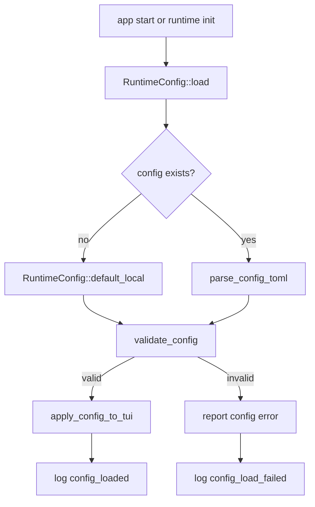

# llm-01 Config Runtime

## 설명

`.ahreumcode/config.toml`을 읽어 Local LLM Runtime의 기준 설정을 만든다. config가 없을 때는 문서화된 기본값을 적용한다. 이 단계는 LM Studio에 실제 요청을 보내지 않는다.

## 주요 함수

| Function | Role |
| --- | --- |
| `RuntimeConfig::load(project_root)` | config 파일을 읽고 검증한다. |
| `RuntimeConfig::default_local()` | LM Studio 기본 runtime 값을 만든다. |
| `parse_config_toml(raw)` | TOML을 typed config로 변환한다. |
| `validate_config(config)` | provider/model/context/mode 값을 검증한다. |
| `apply_config_to_tui(state, config)` | TUI runtime status에 config 값을 반영한다. |

## 함수 연결 흐름

## 로그 이벤트

- `config_load_started`
- `config_loaded`
- `config_default_applied`
- `config_load_failed`

## 완료 기준

- config가 없을 때 기본값이 적용된다.
- config가 있으면 TUI statusline과 `/status`에 반영된다.
- 잘못된 config는 명확한 오류로 보고된다.
- scope id `llm-01-config-runtime` 로그가 남는다.
