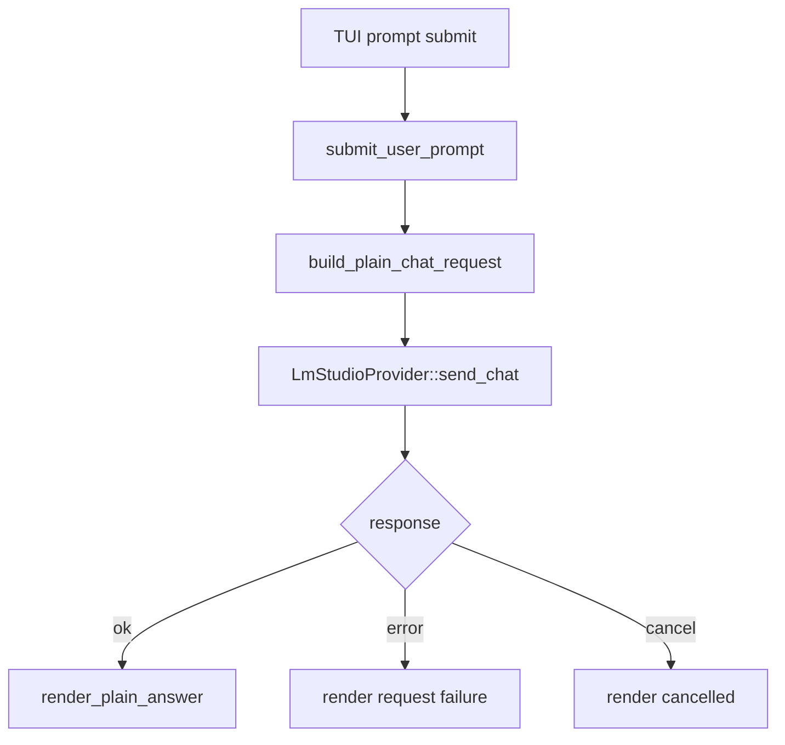

# llm-03 Plain Prompt Request

## 설명

도구 호출이나 JSON schema 없이 사용자 프롬프트를 로컬 LLM에 보내고 응답을 workspace에 표시한다. 이 단계는 "TUI에서 실제 모델 응답을 볼 수 있는가"를 확인하는 첫 runtime 단계다.

## 주요 함수

| Function | Role |
| --- | --- |
| `submit_user_prompt(prompt)` | TUI prompt submit을 runtime request로 넘긴다. |
| `build_plain_chat_request(prompt, config)` | plain chat request를 만든다. |
| `LmStudioProvider::send_chat(request)` | 로컬 LLM에 chat request를 보낸다. |
| `render_plain_answer(state, response)` | workspace에 assistant 답변을 출력한다. |
| `cancel_active_request(run_id)` | esc 취소 요청을 처리한다. |

## 함수 연결 흐름

## 로그 이벤트

- `llm_request_started`
- `llm_response_received`
- `llm_request_cancelled`
- `llm_request_failed`

## 완료 기준

- 사용자가 TUI에 입력한 프롬프트가 LM Studio에 전달된다.
- 실제 응답이 workspace에 표시된다.
- 실패/취소가 성공 응답처럼 표시되지 않는다.
- scope id `llm-03-plain-prompt-request` 로그가 남는다.
