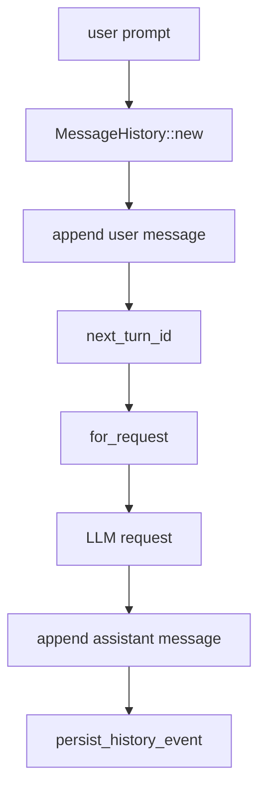

# llm-04 Message History

## 설명

사용자 입력, runtime system message, assistant 응답을 run/turn 단위로 저장한다. TUI에 보이는 workspace 출력과 LLM에 다시 전달할 내부 history는 구분한다.

## 주요 함수

| Function | Role |
| --- | --- |
| `MessageHistory::new(run_id)` | run 단위 history를 만든다. |
| `MessageHistory::append(role, content)` | message를 순서대로 추가한다. |
| `MessageHistory::next_turn_id()` | LLM 호출 turn id를 발급한다. |
| `MessageHistory::for_request(limit)` | request에 넣을 message 목록을 만든다. `None`은 전체, `Some(n)`은 마지막 n개다. |
| `persist_history_event(event)` | message event를 로그에 기록한다. |

## 함수 연결 흐름

## Tool Call Defense Coverage

`llm-04`는 24개 방어코드 전체를 구현하는 단계가 아니다. 이 단계는 이후 parser, repair loop, tool runtime이 방어 판단을 할 수 있도록 message/history/observation 저장 구조를 만든다.

직접 범위:

| Defense | llm-04 Policy |
| --- | --- |
| `6. Observation Schema` | user/system/assistant message를 role, visibility, run_id, turn_id와 함께 구조화해 기록한다. |
| `7. Truncation Contract` | history request builder가 message 수 제한을 받을 수 있게 하며, 이후 긴 observation truncation을 연결할 수 있는 구조를 둔다. |
| `14. Tool Error Taxonomy` | 실패/취소 turn을 internal system message와 로그 event로 구분해 남긴다. |
| `23. Full Output Artifact` | 실제 artifact 저장은 tool runtime 범위지만, history는 preview와 artifact reference를 분리해 받을 수 있는 방향으로 유지한다. |

비범위:

- approval UI 또는 approval persistence 구현
- path/network permission 판단
- schema prompt builder
- JSON parser/partial tool block parser
- 실제 tool 실행 결과 artifact 저장
- post-edit diagnostics 실행

로그 정책:

- `message_recorded`에는 raw content를 남기지 않는다.
- message log에는 `content_chars`, `role`, `visibility`, `run_id`, `turn_id`만 남긴다.
- TUI workspace 출력과 내부 system message는 섞지 않는다.

## 로그 이벤트

- `message_history_created`
- `message_recorded`
- `turn_id_assigned`
- `history_write_failed`

## 완료 기준

- user/assistant message가 순서대로 저장된다.
- run_id와 turn_id가 로그와 runtime 상태에서 연결된다.
- 내부 system message가 사용자 workspace 출력과 섞이지 않는다.
- scope id `llm-04-message-history` 로그가 남는다.
