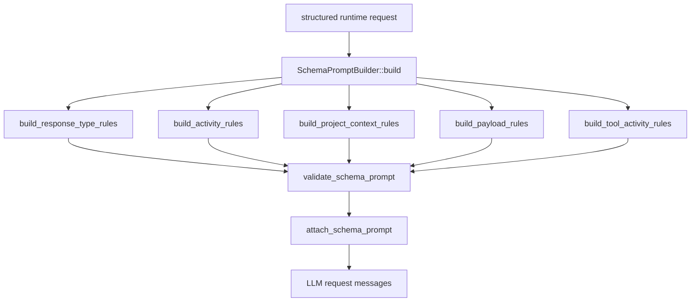

# llm-05 Schema Prompt Builder

## 설명

로컬 LLM에게 아름코드 JSON 응답 계약을 전달하는 runtime instruction을 만든다. 이 단계는 도구 실행이 아니라 모델 응답 형식을 안정화하기 위한 준비다.

## 주요 함수

| Function | Role |
| --- | --- |
| `SchemaPromptBuilder::build()` | JSON response contract instruction을 만든다. |
| `build_response_type_rules()` | answer/tool/clarify/blocked 규칙을 만든다. |
| `build_activity_rules()` | None/Explore/Change/Execute/Configure/Ask 규칙을 만든다. |
| `build_project_context_rules()` | runtime이 제공한 프로젝트 정체성/기본 맥락으로 답할 수 있는 질문은 `clarify`가 아니라 `answer`를 내도록 규칙을 만든다. |
| `build_tool_activity_rules()` | tool name별 허용 activity mapping을 만든다. |
| `build_payload_rules()` | answer code/markdown, source, patch 원문을 JSON 밖 raw payload block으로 분리하는 규칙을 만든다. |
| `attach_schema_prompt(history, prompt)` | request messages에 schema prompt를 붙인다. |
| `validate_schema_prompt(prompt)` | 필수 규칙 누락 여부를 확인한다. |

## 함수 연결 흐름

## Tool Call Defense Coverage

`llm-05`는 도구 실행 단계가 아니다. 이 단계는 로컬 LLM이 응답 계약과 tool manifest를 같은 기준으로 이해하도록 만드는 runtime instruction을 생성한다.

직접 범위:

| Defense | llm-05 Policy |
| --- | --- |
| `1. Tool Manifest Echo Check` | schema prompt에 `tool_manifest_id`, `tool_manifest_version`을 포함하고, 모델 응답에도 같은 값을 요구한다. |
| `21. Tool Argument Schema-First Gate` | tool 후보의 arguments는 typed schema를 따라야 하며, 임의 tool name/argument field를 만들지 말라는 규칙을 포함한다. |
| `22. Partial Tool Block State` | partial streaming parser 구현은 `llm-06` 이후 범위지만, 한 응답에는 하나의 완성된 후보만 허용한다는 규칙을 포함한다. |

실제 로컬 LLM 실패 반영:

- 코드/markdown 답변을 `answer.message`에 직접 넣지 말고 `answer_payload_id`와 `AHREUM_PAYLOAD format="markdown"`을 사용하라는 규칙을 schema prompt에 포함한다.
- 이 규칙은 특정 테스트 프롬프트용 예외가 아니다. 로컬 LLM이 code block, quote, newline을 JSON string 안에 넣다가 malformed JSON을 만드는 일반 실패 유형을 막기 위한 계약이다.
- schema prompt는 간단한 일반 답변과 payload answer를 모두 안내하되, 긴 예시로 모델 응답 공간을 낭비하지 않는다.
- `answer_payload_id`와 `AHREUM_PAYLOAD format="markdown"`은 code block, markdown fence, 긴 본문처럼 JSON string escape 실패 위험이 있는 답변에만 사용한다.
- payload answer 예시는 parser 계약과 동일하게 `<AHREUM_ACTION>...</AHREUM_ACTION>` 뒤에 `AHREUM_PAYLOAD`를 붙인다.
- `JSON + AHREUM_PAYLOAD`처럼 action framing이 빠진 예시는 모델이 그대로 따라 하므로 금지한다.
- `e2e-01` 실제 검증에서 프로젝트 정체성 질문이 `clarify`로 돌아온 실패를 반영한다.
- runtime이 제공한 프로젝트 정체성, workspace, 공개 목표처럼 이미 알려진 기본 맥락으로 답할 수 있으면 `response_type=answer`, `activity=None`을 사용해야 한다.
- `clarify`는 target/path/승인/사용자 선택처럼 사용자만 확정할 수 있는 정보가 빠졌을 때만 사용한다.
- `e2e-02` 실제 검증에서 `read_file`이 `activity=Execute`로 반환된 실패를 반영한다.
- schema prompt는 Explore tool과 Execute tool을 명확히 분리한다. `read_file`, `list_files`, `search_text`, `find_files`, `inspect_git`, `web_search`, `web_fetch`는 `Explore`만 사용한다.
- `run_command`만 `Execute` activity를 사용한다.

연결 방식:

- schema prompt는 `MessageHistory`에 internal system message로 붙인다.
- project runtime context도 internal system message로 붙이며, 사용자 입력 원문과 섞지 않는다.
- 사용자 입력 원문은 schema prompt와 합치거나 수정하지 않는다.
- schema prompt 내용 자체는 로그에 저장하지 않는다.
- 로그에는 manifest id/version, prompt 길이, run_id, turn_id, role, visibility만 남긴다.

비범위:

- JSON 응답 파싱
- malformed JSON repair
- 실제 tool schema 실행 검증
- raw payload block parser
- tool 실행 또는 approval

## 로그 이벤트

- `schema_prompt_built`
- `schema_prompt_attached`
- `schema_prompt_build_failed`

## 완료 기준

- JSON 응답 계약이 request에 포함된다.
- 사용자 입력 원문을 schema prompt가 훼손하지 않는다.
- runtime project context가 있는 질문에서 불필요한 `clarify`를 내지 말라는 규칙이 포함된다.
- 한 응답에 하나의 후보만 허용한다는 규칙이 포함된다.
- source/patch/file body 원문을 JSON string에 넣지 말고 `payload_id`와 raw payload block으로 분리한다는 규칙이 포함된다.
- code/markdown answer 본문을 `message`에 직접 넣지 말고 `answer_payload_id`와 raw payload block으로 분리한다는 규칙이 포함된다.
- payload block이 있으면 action JSON을 `AHREUM_ACTION`으로 감싼다는 규칙과 예시가 포함된다.
- tool name별 activity mapping이 포함된다.
- scope id `llm-05-schema-prompt-builder` 로그가 남는다.
