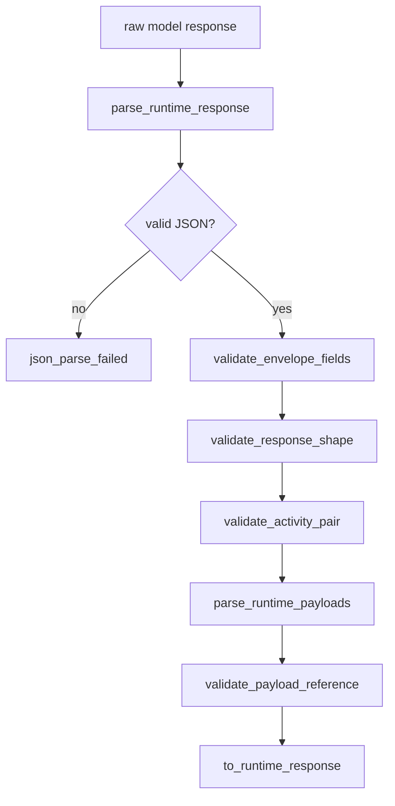

# llm-06 JSON Response Parser

## 설명

로컬 LLM raw response에서 action JSON envelope를 파싱하고 schema를 검증한다. raw payload block이 있으면 envelope와 분리해서 payload id, format, body를 검증한다. 자연어, markdown fence, unknown field, 필드 누락은 invalid response로 처리한다.

## 주요 함수

| Function | Role |
| --- | --- |
| `parse_runtime_response(raw)` | raw response를 JSON으로 파싱한다. |
| `validate_envelope_fields(value)` | unknown/required field를 검증한다. |
| `validate_response_shape(envelope)` | response_type별 허용 필드를 검증한다. |
| `validate_activity_pair(envelope)` | response_type과 activity 조합을 검증한다. |
| `split_action_and_payloads(raw)` | payload block이 있는 응답에서 `AHREUM_ACTION` framing을 요구하고 action JSON과 payload 영역을 분리한다. |
| `parse_runtime_payloads(raw)` | action envelope 밖 raw payload block을 파싱한다. |
| `validate_payload_reference(envelope, payloads)` | `payload_id`, `answer_payload_id`와 payload block의 존재/중복/format을 검증한다. |
| `to_runtime_response(envelope)` | typed RuntimeResponse로 변환한다. |
| `log_runtime_response_parsed(parsed)` | parser 성공 결과를 scope id `llm-06-json-response-parser`로 기록한다. |
| `log_runtime_response_parse_failed(error)` | parse/schema/payload 실패를 구분해서 기록한다. |

## 함수 연결 흐름

## Tool Call Defense Coverage

`llm-06`은 24개 방어 정책 중 parser가 책임질 수 있는 항목을 먼저 구현한다.

직접 범위:

| Defense | Parser Policy |
| --- | --- |
| `1. Tool Manifest Echo Check` | schema prompt에 포함된 manifest id/version과 응답의 manifest id/version을 비교하고 typed result에 보존한다. |
| `13. No Silent Normalization` | parser가 field, enum, path, payload id를 임의로 고치지 않는다. |
| `14. Tool Error Taxonomy` | JSON parse failure, schema failure, payload failure, partial response를 구분한다. |
| `21. Tool Argument Schema-First Gate` | envelope의 unknown field를 거부하고, tool arguments가 object인지 검증한다. tool별 세부 schema는 이후 tool runtime에서 연결한다. |
| `22. Partial Tool Block State` | action/payload block이 닫히지 않은 응답은 partial response로 분리한다. |

Raw payload separation 연결:

- payload block이 있으면 action JSON은 반드시 `<AHREUM_ACTION>...</AHREUM_ACTION>`으로 감싼다.
- `content`, `patch`, `file_body`, `file_content`, `source`, `source_code`, `code`, `command_body` 같은 원문 필드를 JSON arguments에 넣으면 실패한다.
- 원문이 필요한 tool 후보는 `payload_id`와 `<AHREUM_PAYLOAD ...>` block을 사용해야 한다.
- 코드/markdown/긴 설명이 필요한 `answer`는 `answer_payload_id`와 `<AHREUM_PAYLOAD format="markdown">` block을 사용해야 한다.
- `payload_id`가 있으면 같은 id의 payload block이 정확히 하나 있어야 한다.
- `answer_payload_id`가 있으면 같은 id의 markdown payload block이 정확히 하나 있어야 한다.

실제 로컬 LLM 실패 반영:

- `answer.message` 안에 code fence, 긴 markdown, escape가 필요한 코드 문자열이 들어와 JSON parse가 깨지는 경우를 parser 실패로 기록한다.
- parser는 깨진 JSON을 문자열 치환으로 성공 처리하지 않는다.
- 이 실패는 mock 문자열 통과 여부가 아니라 실제 provider response 또는 저장된 provider transcript 기준으로 검증한다.

제한적 허용:

- Markdown fence unwrapping은 응답 전체가 하나의 fence로 감싸진 경우에만 action/payload 추출 전처리로 허용한다.
- fence unwrap 결과도 동일한 schema validation을 통과해야 한다.
- unwrap은 파일 내용 payload 내부의 markdown fence에는 적용하지 않는다.

금지:

- 깨진 JSON을 문자열 치환으로 성공 처리하기
- 누락된 필드를 추측해서 채우기
- unknown field를 무시하고 진행하기
- payload block 오류를 tool candidate 성공으로 처리하기

## 로그 이벤트

- `raw_response_received`
- `json_parse_succeeded`
- `json_parse_failed`
- `schema_validation_failed`

## 완료 기준

- 정상 JSON이 typed RuntimeResponse로 변환된다.
- manifest id/version mismatch는 schema validation 실패로 처리된다.
- JSON 외 텍스트가 섞이면 실패로 처리된다.
- unknown field를 허용하지 않는다.
- code/patch 원문이 JSON string에 직접 들어간 tool candidate는 실패로 처리된다.
- code/markdown answer 본문이 JSON `message`에 직접 들어가 malformed JSON이 된 경우 실패 분류와 repair 근거가 남는다.
- `payload_id`가 있으면 raw payload block 존재/중복/format을 검증한다.
- `answer_payload_id`가 있으면 raw markdown payload block 존재/중복/format을 검증한다.
- payload block이 있는데 `<AHREUM_ACTION>` framing이 없으면 schema validation 실패로 처리한다.
- parser 성공 응답은 raw JSON 그대로가 아니라 typed message 기준으로 workspace에 표시된다.
- scope id `llm-06-json-response-parser` 로그가 남는다.

## Change History

### 2026-05-17

- Added explicit `AHREUM_ACTION` framing requirement for responses that include `AHREUM_PAYLOAD` blocks.
