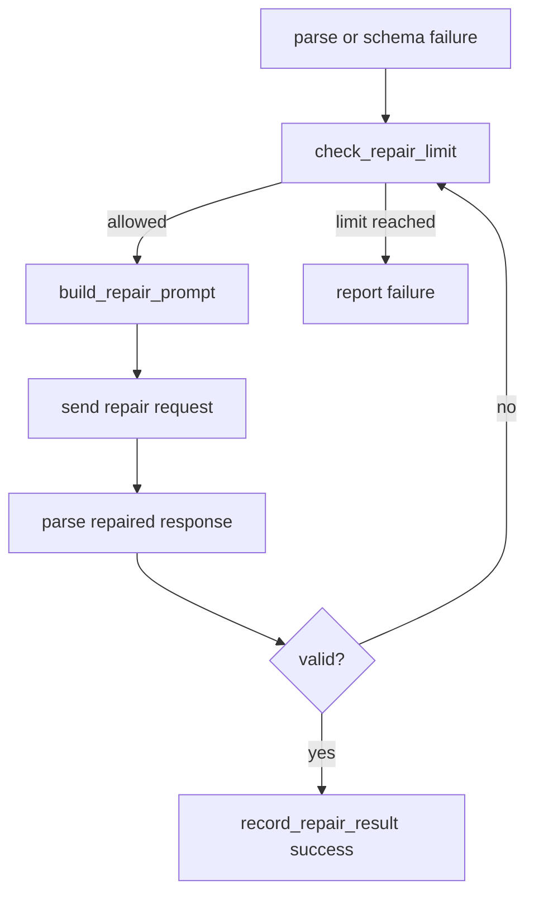

# llm-07 Repair Request Loop

## 설명

JSON 파싱 실패나 schema 불일치가 발생하면 로컬 LLM에게 실패 이유를 전달하고 같은 사용자 의도에 대해 올바른 JSON만 다시 요청한다. 반복 제한을 넘으면 실패를 사용자에게 보고한다.

## 주요 함수

| Function | Role |
| --- | --- |
| `RepairLoop::run(error, history)` | repair loop를 실행한다. |
| `build_repair_prompt(error)` | 실패 원인을 포함한 repair instruction을 만든다. |
| `increment_repair_attempt(run_id)` | repair attempt count를 증가시킨다. |
| `check_repair_limit(attempts, limits)` | 반복 제한을 확인한다. |
| `record_repair_result(result)` | repair 결과를 로그에 남긴다. |

## 함수 연결 흐름

## 로그 이벤트

- `repair_request_started`
- `repair_response_received`
- `repair_succeeded`
- `repair_limit_reached`

## 구현 정책

- 초기 repair 제한은 `docs/specs/model-response-contract.ko.md`의 open design check에 맞춰 1회로 둔다.
- 첫 응답이 parser/schema/payload/partial 실패이면 workspace에 곧바로 실패를 출력하지 않고 internal system repair instruction을 history에 추가한다.
- repair instruction은 같은 사용자 의도를 다시 수행하라고 지시하되, 사용자 입력 원문을 수정하거나 합성하지 않는다.
- repair 응답도 반드시 `llm-06` parser를 다시 통과해야 한다.
- repair 응답이 성공하면 정상 `RuntimeResponse` 표시 흐름으로 이어진다.
- repair 이후에도 실패하면 `repair_limit_reached`를 남기고 사용자에게 parse 실패를 보고한다.
- repair prompt와 assistant raw response 원문은 로그에 저장하지 않고 길이와 실패 분류만 남긴다.
- malformed assistant raw response 원문 전체를 다음 LLM request에 그대로 assistant message로 재투입하지 않는다.
- repair request에는 실패 종류, 실패 위치/메시지, 원문 길이, payload 분리 필요 여부 같은 compact diagnostic만 포함한다.
- repair 응답 content가 비어 있으면 단순 provider 실패로만 뭉치지 않고 `model_empty_response` 또는 동등한 runtime failure taxonomy로 기록한다.
- code/markdown answer의 JSON escape 실패는 `answer_payload_id`와 markdown payload 사용을 요구하는 repair instruction으로 이어져야 한다.
- payload block이 필요한 repair 응답은 action JSON을 반드시 `<AHREUM_ACTION>...</AHREUM_ACTION>`으로 감싸야 한다고 명시한다.
- repair instruction에서 `valid JSON or action block`처럼 payload framing을 애매하게 표현하지 않는다.
- parse/schema/payload 실패뿐 아니라 runtime decision gate의 recoverable validation 실패도 repair 대상으로 삼는다.
- `tool/activity mismatch` repair에서는 tool name별 activity mapping을 함께 전달한다.
- repair 제한은 전체 턴이 아니라 failure signature 단위로 적용한다. 앞선 repair가 성공했는데 다음 검증 단계에서 새로운 실패 signature가 나오면 별도 repair 대상으로 본다.
- 단일 provider 응답 체인 안에서 서로 다른 failure signature를 계속 갈아타며 repair가 이어지지 않도록 chain 제한을 별도로 둔다.
- 초기 chain 제한은 2회다. 실제 e2e-02에서 확인된 `schema 계약 보정 -> decision argument 보정` 흐름은 허용하되, `missing reason -> action framing -> missing manifest`처럼 응답 계약 실패가 연쇄로 늘어나는 흐름은 중단하기 위한 값이다.
- `read_file` 인자 누락 repair에서는 `path`, `start_line`, `max_lines`가 모두 필요하다는 점과 전체 파일 읽기 값인 `start_line=1`, `max_lines=300`을 명시한다.
- repair prompt에는 `read_file` 전체 계약 예시를 포함한다. 이 예시는 mock 통과용 응답이 아니라 provider가 필수 필드를 누락하지 않도록 하는 응답 계약 안내다.
- `AHREUM_PAYLOAD`는 code/markdown/긴 본문처럼 JSON string escape 위험이 있는 답변 또는 patch/source payload에만 사용한다.

## Tool Call Defense Coverage

직접 범위:

| Defense | llm-07 Policy |
| --- | --- |
| `8. Repeat Failure Circuit Breaker` | malformed/schema 실패 repair는 1회만 허용한다. 제한 초과 시 같은 요청을 반복하지 않는다. |
| `14. Tool Error Taxonomy` | `llm-06`의 parse/schema/payload/partial 실패 분류를 repair reason으로 전달한다. |
| `22. Partial Tool Block State` | partial action/payload block도 실행 후보로 승격하지 않고 repair 대상으로만 처리한다. |

실제 로컬 LLM 실패 반영:

- LM Studio `google/gemma-4-e4b`가 `answer.message`에 TypeScript code block과 markdown 설명을 직접 넣어 malformed JSON을 만든 사례를 repair 범위에 포함한다.
- LM Studio `google/gemma-4-e4b`가 action framing 없이 `AHREUM_PAYLOAD`만 붙여 parser 계약에 실패한 사례를 repair 범위에 포함한다.
- LM Studio `google/gemma-4-e4b`가 `read_file`을 `activity=Execute`로 반환해 runtime decision gate에서 실패한 사례를 repair 범위에 포함한다.
- LM Studio `google/gemma-4-e4b`가 repair 이후 `read_file`의 `start_line`을 누락해 `invalid_arguments`가 발생한 사례를 repair 범위에 포함한다.
- 이 사례는 목업 테스트가 아니며, 실제 로컬 LLM transcript에서 확인된 응답 계약 실패다.
- 완료 검증은 “고정 샘플 문자열을 repair한다”가 아니라 “실제 provider response 또는 저장된 transcript가 compact repair context로 변환되고, raw broken assistant content가 재투입되지 않는다”를 확인해야 한다.

비범위:

- unknown tool repair
- path/permission/safety repair
- tool 실행 후 observation 기반 repair
- 사용자 승인 UI

## 완료 기준

- invalid JSON 이후 repair request가 만들어진다.
- invalid JSON의 raw assistant content 전체가 다음 request에 그대로 포함되지 않는다.
- code/markdown answer escape 실패는 markdown payload answer로 재요청된다.
- 빈 repair 응답은 별도 runtime failure로 진단된다.
- repair 성공 시 정상 RuntimeResponse로 이어진다.
- decision validation repair 성공 시 정상 RuntimeDecision으로 이어진다.
- repair 성공 후 새 failure signature가 발생하면 새 repair attempt가 1회 허용된다.
- 같은 provider 응답 체인의 repair 총량이 chain 제한을 넘으면 더 진행하지 않는다.
- 반복 제한 초과 시 더 진행하지 않는다.
- scope id `llm-07-repair-request-loop` 로그가 남는다.
