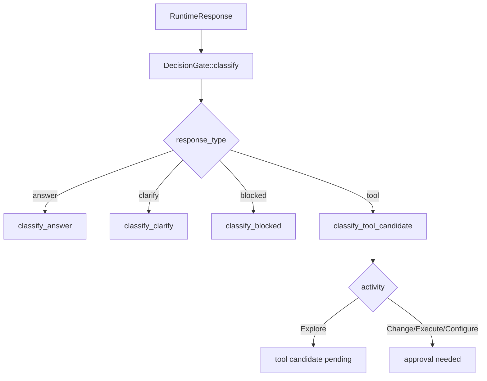

# llm-08 Runtime Decision Gate

## 설명

파싱된 RuntimeResponse를 아름코드 runtime 상태로 분류한다. 모델 응답은 후보이며, 이 단계에서 answer, user question, blocked report, tool candidate, approval-needed 상태로 나뉜다.

## 주요 함수

| Function | Role |
| --- | --- |
| `DecisionGate::classify(response)` | RuntimeResponse를 다음 runtime state로 분류한다. |
| `classify_answer(response)` | answer를 workspace 출력으로 변환한다. |
| `classify_clarify(response)` | 사용자 질문 상태로 변환한다. |
| `classify_blocked(response)` | 차단/실패 상태로 변환한다. |
| `classify_tool_candidate(response)` | tool 후보를 activity별 상태로 분류한다. |
| `validate_tool_activity(candidate)` | tool name과 activity 조합을 검증한다. |
| `validate_tool_arguments(candidate)` | 문서에 정의된 tool별 arguments schema를 검증한다. |
| `record_runtime_decision(decision)` | 결정 결과를 TUI workspace에 같은 의미로 반영한다. |

## 함수 연결 흐름

## Runtime Decision States

초기 구현 상태:

| State | Meaning |
| --- | --- |
| `answer` | workspace 답변으로 표시한다. |
| `clarify` | 사용자에게 되묻는 메시지로 표시한다. |
| `blocked` | 차단/실패 사유를 시스템 메시지로 표시한다. |
| `tool_candidate_pending` | Explore tool 후보로 분류하지만 실행하지 않는다. |
| `approval_needed` | Change/Execute/Configure 후보로 분류하고 승인 필요 상태로 표시한다. |

## Clarify Boundary

`clarify`는 모델이 모르는 내용을 편하게 되묻는 기본값이 아니다.

허용:

- 사용자가 target file/path를 확정해야 하는 경우
- Change/Execute/Configure처럼 승인 또는 사용자 선택이 필요한 경우
- 사용자 의도 자체가 여러 의미로 갈라지고, Explore로도 좁힐 수 없는 경우

비허용:

- runtime이 이미 주입한 프로젝트 정체성, workspace, 공개 목표로 답할 수 있는 질문
- 검색/읽기 없이도 기본 설명이 가능한 일반 질문
- 모델이 자신 없다는 이유만으로 되묻는 경우

`clarify`로 분류되면 TUI workspace 출력도 answer가 아니라 사용자 확인 요청으로 남아야 한다. `runtime_decision_recorded decision=clarify`인데 `workspace_output_added item_type=assistant_answer`로 남으면 실패로 본다.

`llm-08`은 다음을 수행하지 않는다.

- 실제 tool 실행
- approval UI 열기
- command safety 세부 판정
- path normalize 또는 path rewrite
- fuzzy match를 근거로 mutation 실행

## Tool Candidate Validation

초기 tool name과 arguments schema는 `docs/specs/model-response-contract.ko.md`의 `Initial Tool Names`와 `Tool Argument Schemas`를 따른다.

- unknown tool name은 `runtime_decision_failed`로 남긴다.
- tool name과 activity가 맞지 않으면 실패한다.
- tool name과 activity mismatch는 실행하지 않는다. 다만 recoverable validation 실패로 보고 repair loop에 넘길 수 있다.
- tool arguments의 unknown field는 실패한다.
- required argument 누락 또는 타입 오류는 실패한다.
- `apply_patch`는 `payload_id`가 필요하고, payload format이 `apply_patch`여야 한다.
- `apply_patch` payload가 여러 파일을 대상으로 하면 승인 상태로 승격하지 않고 사용자 확인 상태로 보낸다.

## Tool Call Defense Coverage

`llm-08`은 모델 후보를 실제 runtime decision으로 바꾸는 gate다. 이 단계에서 모델의 추측을 실행 결정으로 승격하지 않는다.

직접 범위:

| Defense | Gate Policy |
| --- | --- |
| Unique Target Requirement | Change/Execute/Configure 후보의 target이 하나로 확정되지 않으면 clarify 또는 approval-needed로 보낸다. |
| No Fuzzy Mutation | fuzzy match 결과는 실행 근거가 아니라 후보/진단 정보로만 취급한다. |
| No Silent Normalization | path나 command를 runtime이 조용히 바꿔 실행하지 않는다. 원본과 정규화 결과가 다르면 사용자에게 드러낸다. |
| Human Boundary Rule | 시스템 전체, 파일시스템 외부, 과도한 CPU/메모리, 대량 삭제/이동, 보안/권한 변경은 approval이 아니라 blocked/manual-only로 분류한다. |
| Command Capability Split | command 후보는 read-only, build/test, process, destructive/system capability로 분리해 다음 runtime에 넘긴다. |

현재 구현에서는 `run_command`를 즉시 capability 세분화하지 않고 `approval_needed`로만 분류한다. command 세부 안전 판정과 manual-only 분기는 실제 execute tool runtime에서 확정한다.

후속 tool runtime으로 넘길 항목:

- Two-Phase Mutation
- Precondition Snapshot
- Patch Impact Guard
- Dry-Run First
- Postcondition Verification

## 로그 이벤트

- `runtime_decision_started`
- `runtime_decision_recorded`
- `tool_candidate_classified`
- `runtime_decision_failed`

## 완료 기준

- LLM tool 후보가 즉시 실행되지 않는다.
- response type별 runtime state가 분리된다.
- `clarify` decision과 TUI output item type이 같은 의미로 남는다.
- Change/Execute/Configure 후보는 approval 필요 상태로 분류된다.
- tool name/activity/arguments schema mismatch는 `runtime_decision_failed`로 남는다.
- recoverable decision mismatch는 조용히 보정하지 않고 repair request로 다시 묻는다.
- decision 결과가 workspace 출력과 로그에 같은 의미로 남는다.
- scope id `llm-08-runtime-decision-gate` 로그가 남는다.
