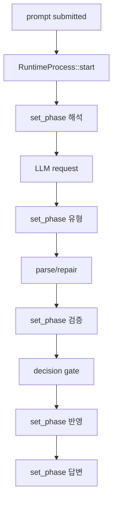

# llm-09 TUI Process Binding

## 설명

TUI working process 두 줄을 실제 Local LLM Runtime 상태와 연결한다. 샘플 출력은 제거하고, request/response/parse/repair/decision 상태가 process line과 workspace에 반영되게 한다.

## 주요 함수

| Function | Role |
| --- | --- |
| `RuntimeProcess::start(run_id)` | working process를 시작한다. |
| `RuntimeProcess::set_phase(phase)` | 현재 6단계 phase를 갱신한다. |
| `RuntimeProcess::set_detail(text)` | `[n/6]` 상세 문구를 갱신한다. |
| `RuntimeProcess::cancel()` | esc 취소를 runtime과 TUI에 반영한다. |
| `bind_runtime_event_to_tui(event)` | runtime event를 TUI state로 변환한다. |
| `WorkingProcessState::set_phase(phase, detail)` | elapsed time 기반 샘플 전환 없이 실제 runtime 이벤트로 단계를 갱신한다. |
| `set_runtime_working_phase(phase, detail)` | TUI state, TUI log, llm-09 log를 같은 의미로 묶어 기록한다. |

## 함수 연결 흐름

## 구현 정책

- `tick()` 기반 자동 단계 전환은 제거한다.
- 단계 전환은 runtime 이벤트가 발생할 때만 수행한다.
- 6단계는 고정이다.
- 빠른 처리에서도 내부 이벤트는 `해석 -> 유형 -> 검증 -> 실행 -> 반영 -> 답변` 순서로 남긴다.
- tool 실행 단계가 아직 구현되지 않은 경우에도 `실행` 단계는 "직접 실행하지 않음" 또는 "실행할 도구 없음"으로 통과한다.
- 실제 Local LLM E2E 검증은 llm-10과 로그 구조 정리 후 수행한다.

현재 phase binding:

| Phase | Runtime Event |
| --- | --- |
| `해석` | prompt submit 후 LLM 응답 대기 |
| `유형` | raw response 수신 후 parse/repair 분기 |
| `검증` | `llm-06` parser 성공 후 `llm-08` decision gate 진입 |
| `실행` | decision 결과 기준으로 직접 실행 없음/승인 필요/후속 tool stage 대기 표시 |
| `반영` | decision 또는 실패 결과를 workspace에 반영 |
| `답변` | process 종료 직전 최종 사용자 표시 준비 |

## 로그 이벤트

- `working_process_started`
- `working_process_phase_changed`
- `working_process_cancelled`
- `working_process_completed`

## 완료 기준

- 프롬프트 제출 후 실제 runtime 단계에 맞춰 process가 갱신된다.
- 통과한 단계도 순서대로 표시된다.
- 실패/취소 시 process가 일관된 상태로 종료된다.
- sample/time-based phase change가 runtime phase change로 대체된다.
- scope id `llm-09-tui-process-binding` 로그가 남는다.
