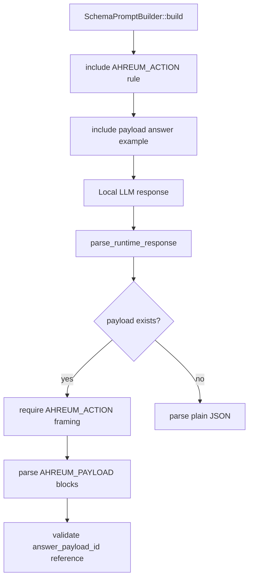

# llm-11 Response Framing Contract Alignment

## 목적

`llm-11`은 이미 존재하는 `answer_payload_id + AHREUM_PAYLOAD` 계약을 새로 만드는 작업이 아니다.

이 단계의 목적은 `llm-05` schema prompt가 모델에게 안내하는 payload 응답 예시와 `llm-06` parser가 실제로 요구하는 framing 계약을 일치시키는 것이다.

핵심 문장:

```text
JSON carries control data.
Raw payload blocks carry source/code text.
If a raw payload block exists, the action JSON is framed by AHREUM_ACTION.
```

## 범위

포함:

- schema prompt의 payload answer 예시 정정
- `AHREUM_ACTION + AHREUM_PAYLOAD` framing 규칙 명시
- `llm-05`와 `llm-06` 문서 표현 정렬
- parser contract test 또는 targeted validation 정렬
- 실제 provider transcript 또는 저장된 transcript 기준 확인

제외:

- 새 payload format 추가
- `answer_payload_id + AHREUM_PAYLOAD` 계약 재설계
- tool 실행
- mutation 실행
- parser가 깨진 응답을 조용히 보정하는 로직

## 구현 모듈/파일 후보

```text
src/llm/schema_prompt.rs
src/llm/response_parser.rs
docs/specs/implementation/llm/llm-05-schema-prompt-builder.ko.md
docs/specs/implementation/llm/llm-06-json-response-parser.ko.md
docs/specs/model-response-contract.ko.md
```

## 주요 함수

| Function | Role |
| --- | --- |
| `SchemaPromptBuilder::build()` | 모델에게 전달할 response contract와 payload framing 예시를 만든다. |
| `validate_schema_prompt(prompt)` | schema prompt에 필수 framing 규칙이 포함됐는지 확인한다. |
| `parse_runtime_response(raw)` | raw model response에서 action JSON과 payload block을 분리한다. |
| `split_action_and_payloads(raw)` | payload가 있는 응답에서 `AHREUM_ACTION` framing을 요구한다. |
| `validate_single_payload_reference(payload_id, payloads, expected_format)` | JSON의 payload reference와 raw payload block을 검증한다. |

## 흐름



## 계약

잘못된 예시:

```text
{"response_type":"answer","activity":"None","message":"short summary","answer_payload_id":"answer_001"}
<AHREUM_PAYLOAD id="answer_001" format="markdown">answer body</AHREUM_PAYLOAD>
```

올바른 예시:

```text
<AHREUM_ACTION>
{"response_type":"answer","activity":"None","message":"short summary","answer_payload_id":"answer_001"}
</AHREUM_ACTION>
<AHREUM_PAYLOAD id="answer_001" format="markdown">answer body</AHREUM_PAYLOAD>
```

정책:

- payload block이 없으면 plain JSON answer를 허용한다.
- payload block이 있으면 action JSON은 반드시 `AHREUM_ACTION`으로 감싼다.
- code/markdown/긴 answer body는 JSON `message`에 직접 넣지 않는다.
- framing 누락은 parser/contract failure로 진단한다.
- framing 누락을 문자열 조합으로 자동 성공 처리하지 않는다.

## 로그 이벤트

기존 LLM runtime 로그 scope를 사용한다.

- `schema_prompt_built`
- `schema_prompt_attached`
- `raw_response_received`
- `json_parse_succeeded`
- `schema_validation_failed`

새 log event를 추가하지 않는다. 이 단계는 새로운 runtime 상태가 아니라 기존 계약 정합성 보강이다.

## 검증 기준

- schema prompt에 payload answer 예시가 `AHREUM_ACTION + AHREUM_PAYLOAD` 형태로 들어간다.
- schema prompt validation이 payload framing 규칙 누락을 잡는다.
- payload answer parser test는 schema prompt 예시와 같은 형태를 사용한다.
- payload block이 있는데 action framing이 없으면 실패한다.
- 실제 provider transcript 또는 저장 transcript에서 code/markdown answer가 같은 계약을 따른다.
- `cargo test`는 parser/schema prompt contract 범위에서만 수행한다.

## 금지 사항

- JSON 바로 뒤에 `AHREUM_PAYLOAD`를 붙이는 형태를 정상 예시로 남기지 않는다.
- parser가 framing 없는 payload 응답을 조용히 보정하지 않는다.
- 이 작업에서 tool registry, permission, runtime dispatch를 수정하지 않는다.
- 이 작업을 `fixed-*` correction lane으로 취급하지 않는다.

## Change History

### 2026-05-17

- Created `llm-11` after identifying that the issue is missing Local LLM Runtime contract alignment, not a new fixed correction item.
