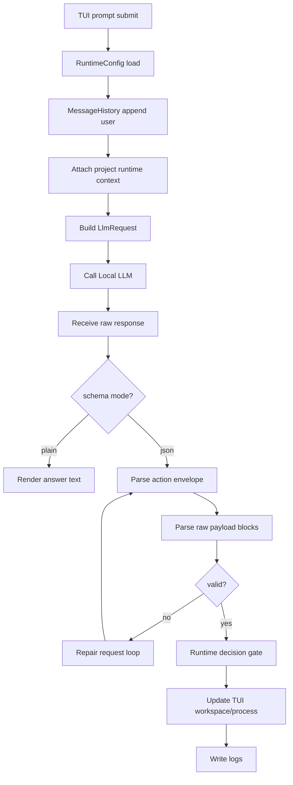
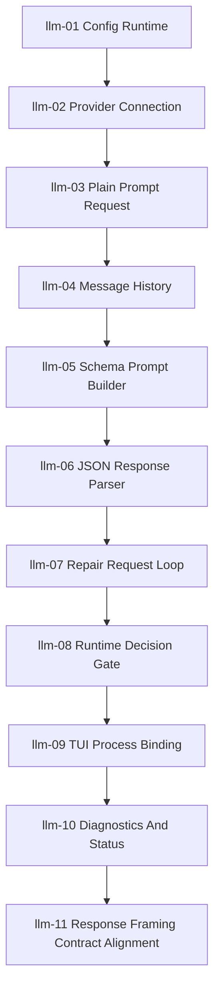

# Local LLM Runtime Technical Spec Korean Draft

## 목적

이 문서는 아름코드 Local LLM Runtime 구현 단위의 상위 기술 스펙이다.

Local LLM Runtime의 목적은 TUI에서 받은 사용자 입력을 로컬 LLM에 전달하고, 응답을 검증 가능한 runtime 결과로 바꾸고, 그 과정을 TUI와 로그에 연결하는 것이다. 로컬 LLM은 실행 주체가 아니라 다음 행동 후보를 제안하는 구성요소다. 최종 판단, 검증, 재요청, 사용자 질문, 중단은 아름코드 runtime이 담당한다.

## 범위

포함:

- project-local config load
- LM Studio OpenAI-compatible endpoint connection
- plain prompt request/response
- message history
- schema prompt builder
- JSON response parser
- repair request loop
- runtime decision gate
- TUI working process binding
- diagnostics/status/logging

제외:

- 실제 file read/search/list 도구 실행
- 파일 생성/수정/삭제
- shell command 실행
- web search/fetch 실행
- approval 이후 도구 실행
- long-term context compaction
- persona 대화 내용 생성

## 문서 구조

상위 문서:

- `docs/specs/implementation/local-llm-runtime-technical-spec.ko.md`

섹션 문서:

| ID | Document | Summary |
| --- | --- | --- |
| `llm-01` | `docs/specs/implementation/llm/llm-01-config-runtime.ko.md` | config 기반 runtime 설정 |
| `llm-02` | `docs/specs/implementation/llm/llm-02-provider-connection.ko.md` | LM Studio 연결 확인 |
| `llm-03` | `docs/specs/implementation/llm/llm-03-plain-prompt-request.ko.md` | plain prompt 요청/응답 |
| `llm-04` | `docs/specs/implementation/llm/llm-04-message-history.ko.md` | message history |
| `llm-05` | `docs/specs/implementation/llm/llm-05-schema-prompt-builder.ko.md` | JSON schema prompt builder |
| `llm-06` | `docs/specs/implementation/llm/llm-06-json-response-parser.ko.md` | JSON response parser |
| `llm-07` | `docs/specs/implementation/llm/llm-07-repair-request-loop.ko.md` | repair request loop |
| `llm-08` | `docs/specs/implementation/llm/llm-08-runtime-decision-gate.ko.md` | runtime decision gate |
| `llm-09` | `docs/specs/implementation/llm/llm-09-tui-process-binding.ko.md` | TUI process binding |
| `llm-10` | `docs/specs/implementation/llm/llm-10-diagnostics-and-status.ko.md` | diagnostics/status |
| `llm-11` | `docs/specs/implementation/llm/llm-11-response-framing-contract-alignment.ko.md` | response framing contract alignment |

## 모듈/파일 후보

초기 Rust 모듈 후보:

```text
src/config/
  mod.rs
  schema.rs
  loader.rs

src/llm/
  mod.rs
  provider.rs
  lm_studio.rs
  request.rs
  response.rs
  history.rs
  schema_prompt.rs
  parser.rs
  payload.rs
  repair.rs
  decision.rs
  diagnostics.rs

src/runtime/
  mod.rs
  run.rs
  phase.rs

src/tui/
  state.rs
  workspace.rs
  working_process.rs
```

주의:

- 파일명은 구현 후보이며, 실제 코드 작성 중 의미가 더 분명한 이름이 있으면 문서와 함께 조정한다.
- LLM provider, parser, decision gate, TUI 렌더링을 한 파일에 섞지 않는다.
- config default 문자열은 여러 파일에 흩뿌리지 않는다.
- HTTP transport 실패와 model response 실패를 같은 오류로 합치지 않는다.
- action JSON parser와 raw payload parser를 분리한다.
- code/patch/file body 원문은 JSON arguments에 직접 넣지 않는다.

## 공통 데이터 구조 후보

```rust
struct RuntimeConfig {
    provider: ProviderConfig,
    workspace: WorkspaceConfig,
    mode: PermissionMode,
    persona: PersonaConfig,
    limits: RuntimeLimits,
}

struct ProviderConfig {
    name: String,
    provider_type: ProviderType,
    base_url: String,
    model: String,
    context_tokens: u32,
    api_key_env: Option<String>,
}

struct LlmRuntime {
    config: RuntimeConfig,
    provider: Box<dyn LlmProvider>,
    history: MessageHistory,
    project_context: ProjectRuntimeContext,
}

struct LlmRequest {
    run_id: RunId,
    turn_id: TurnId,
    messages: Vec<LlmMessage>,
}

enum RuntimeResponse {
    Answer(AnswerResponse),
    ToolCandidate(ToolCandidate),
    Clarify(ClarifyResponse),
    Blocked(BlockedResponse),
}

struct RuntimePayload {
    id: PayloadId,
    format: PayloadFormat,
    body: String,
}

struct ProjectRuntimeContext {
    identity_summary: String,
    workspace_root: PathBuf,
    public_goal: Option<String>,
}
```

의미:

- `RuntimeConfig`는 실행 설정을 보관한다.
- `LlmProvider`는 LM Studio 같은 OpenAI-compatible endpoint를 감싼다.
- `MessageHistory`는 화면 출력과 별개로 LLM turn 근거를 보관한다.
- `RuntimeResponse`는 파싱된 모델 응답이며, 실행 결과가 아니다.
- `RuntimePayload`는 JSON envelope 밖의 raw payload block이며, code/patch 원문 escaping 실패를 줄이기 위해 별도 parser로 검증한다.
- `answer`의 code/markdown/긴 본문도 raw payload block으로 분리한다. `message`는 짧은 설명이고, 실제 답변 본문은 `answer_payload_id`가 가리키는 markdown payload가 담당할 수 있다.
- `ProjectRuntimeContext`는 모델이 프로젝트 정체성, 목적, 현재 workspace 기준 정보를 되물을 필요 없이 답할 수 있도록 runtime이 주입하는 최소 제품 맥락이다.

## 전체 흐름



## 섹션 연결 순서



## 주요 함수 목록

| Function | Role |
| --- | --- |
| `RuntimeConfig::load()` | project-local config를 읽고 기본값을 적용한다. |
| `LmStudioProvider::health_check()` | LM Studio endpoint와 모델 접근 상태를 확인한다. |
| `LmStudioProvider::send_chat()` | OpenAI-compatible chat request를 보낸다. |
| `MessageHistory::append()` | user/system/assistant message를 turn 순서대로 저장한다. |
| `ProjectRuntimeContext::load()` | 아름코드 정체성, workspace, 공개 목표 같은 기본 runtime 맥락을 로드한다. |
| `attach_project_context()` | 모델이 되묻지 않아도 되는 프로젝트 기준 정보를 internal system message로 request에 붙인다. |
| `SchemaPromptBuilder::build()` | JSON 응답 계약을 request message로 만든다. |
| `validate_schema_prompt()` | schema prompt가 parser framing 계약을 정확히 안내하는지 확인한다. |
| `parse_runtime_response()` | raw model response를 typed response로 변환한다. |
| `parse_runtime_payloads()` | action envelope 밖의 raw payload block을 format별로 검증한다. |
| `RepairLoop::repair()` | invalid response를 대상으로 재요청을 수행한다. |
| `DecisionGate::classify()` | response를 answer/ask/tool-candidate/blocked 상태로 분류한다. |
| `RuntimeProcess::set_phase()` | TUI working process의 현재 단계를 갱신한다. |
| `LlmDiagnostics::snapshot()` | 최근 runtime 상태를 status/health용으로 요약한다. |

## 실제 로컬 LLM 실패 반영

2026-05-15 LM Studio `google/gemma-4-e4b` 수동 검증에서 `answer.message` 안에 TypeScript code block과 markdown 설명이 직접 들어가 JSON parse가 실패하고, repair 응답이 empty content로 끝나는 흐름이 확인됐다.

2026-05-17 `e2e-01-plain-answer` 실제 TUI 검증에서 다음 실패가 확인됐다.

```text
prompt: 아름코드가 지금 어떤 프로젝트인지 한 문단으로 설명해줘.
expected: response_type=answer, activity=None
actual: response_type=clarify, activity=Ask
```

이 실패는 연결 문제가 아니라 runtime context와 clarify policy 문제다. 모델이 프로젝트 정체성에 대한 기준 정보를 받지 못하면, 답할 수 있는 질문도 되묻는 후보로 낼 수 있다.

구현 범위 반영:

- `llm-05`: code/markdown answer payload separation을 schema prompt에 포함한다.
- `llm-05`: 프로젝트 정체성처럼 runtime이 알고 있는 기본 정보에 대해서는 `clarify`를 쓰지 말고 `answer`를 내도록 응답 규칙을 포함한다.
- `llm-06`: `answer_payload_id`와 markdown payload block을 parser 검증 대상으로 포함한다.
- `llm-07`: malformed assistant raw response 전체를 repair request에 재투입하지 않고 compact diagnostic만 전달한다.
- `llm-08`: `clarify` decision과 workspace 출력 타입이 같은 의미로 남도록 분류한다.
- `llm-10`: empty repair response와 parse/repair 실패 원인을 status/diagnostics에서 구분해 보여준다.
- `llm-11`: `llm-05` schema prompt와 `llm-06` parser 사이의 payload framing 계약 누락을 정렬한다.

검증 원칙:

- 이 사례는 목업 테스트로 대체하지 않는다.
- 실제 provider response 또는 저장된 provider transcript replay로 request, parser, repair, diagnostics, TUI 표시가 서로 맞는지 확인한다.
- `e2e-01`은 프롬프트를 바꾸지 않고 같은 문장으로 재검증한다.

## 로그 이벤트

대표 로그 파일:

```text
.ahreumcode/logs/sessions/<date>/<session_id>/llm.jsonl
.ahreumcode/logs/sessions/<date>/<session_id>/events.jsonl
.ahreumcode/logs/sessions/<date>/<session_id>/errors.jsonl
```

대표 이벤트:

- `config_load_started`
- `llm_health_check_started`
- `llm_request_started`
- `llm_response_received`
- `message_recorded`
- `schema_prompt_built`
- `json_parse_succeeded`
- `json_parse_failed`
- `repair_request_started`
- `runtime_decision_recorded`
- `working_process_phase_changed`
- `llm_status_snapshot_recorded`

## 공통 검증 기준

검증은 `docs/tasks/local-llm-runtime-todo.ko.md`의 번호별 검증 범위를 따른다.

정책:

- `llm-01` 중에는 `llm-01`만 검증한다.
- LM Studio 통신이 필요한 단계는 실제 로컬 서버 상태를 명시한다.
- 로컬 LLM의 응답을 임의로 보정하지 않는다.
- 로그 이벤트가 없으면 해당 번호는 완료가 아니다.
- 샘플 출력은 실제 runtime 결과와 구분한다.
- 작은 helper마다 테스트 파일을 증식하지 않는다.

## Tool Call Defense Checklist

도구 호출 방어 정책의 원본은 `docs/specs/model-response-contract.ko.md`의 `Tool Call Defense Rules`를 따른다.

구현 전에 다음 24개 항목을 빠짐없이 확인한다.

| No | Defense | Runtime Responsibility |
| --- | --- | --- |
| 1 | Tool Manifest Echo Check | `llm-05`, `llm-06` |
| 2 | Two-Phase Mutation | tool runtime, approval runtime |
| 3 | Precondition Snapshot | tool runtime |
| 4 | Patch Impact Guard | tool runtime, approval runtime |
| 5 | Unique Target Requirement | `llm-08`, tool runtime |
| 6 | Observation Schema | `llm-04`, `llm-07`, tool runtime |
| 7 | Truncation Contract | tool runtime, history runtime |
| 8 | Repeat Failure Circuit Breaker | `llm-07` |
| 9 | Command Capability Split | execute tool runtime |
| 10 | Shell-Free Command Schema | execute tool runtime |
| 11 | Dry-Run First | change/execute tool runtime |
| 12 | Postcondition Verification | tool runtime |
| 13 | No Silent Normalization | parser, decision gate, tool runtime |
| 14 | Tool Error Taxonomy | `llm-06`, `llm-07`, `llm-10` |
| 15 | Human Boundary Rule | `llm-08`, approval runtime |
| 16 | Approval Persistence Broad Prefix Deny List | approval runtime |
| 17 | Command Original Vs Parsed Display | approval runtime, execute tool runtime |
| 18 | Hidden/Unicode Character Marker | parser, approval runtime, tool runtime |
| 19 | External Path Permission Branch | permission runtime, tool runtime |
| 20 | Network/Web Permission Branch | permission runtime, web tool runtime |
| 21 | Tool Argument Schema-First Gate | `llm-06`, tool runtime |
| 22 | Partial Tool Block State | parser, TUI runtime |
| 23 | Full Output Artifact | tool runtime, history runtime |
| 24 | Post-Edit Diagnostics Hook | tool runtime, diagnostics runtime |

1~15는 초기 상위 방어 원칙이고, 16~24는 Codex/opencode/Cline 벤치마킹 후 추가 확정한 방어코드다. 우선 구현 대상이 좁혀지더라도 나머지 항목을 문서에서 제거하지 않는다. 후순위 항목은 `deferred`로 남기고, 구현 시점에 해당 task 문서로 승격한다.

## 금지 사항

- LLM 응답을 실행 권한으로 취급하지 않는다.
- JSON parse 실패를 문자열 휴리스틱으로 성공 처리하지 않는다.
- source/patch 원문을 JSON string 안에 넣도록 요구하지 않는다.
- raw payload block parse 실패를 tool candidate 성공으로 취급하지 않는다.
- 한 응답에서 여러 tool candidate를 처리하지 않는다.
- provider/model/base_url/context 기본값을 여러 곳에 하드코딩하지 않는다.
- TUI component가 HTTP request를 직접 보내지 않는다.
- network failure, timeout, model error, schema error를 같은 오류로 합치지 않는다.
- config로 hard safety를 우회하지 않는다.

## Change History

### 2026-05-14

- Created parent Local LLM Runtime technical specification and `llm-01` through `llm-10` routing.

### 2026-05-17

- Added `llm-11-response-framing-contract-alignment` after identifying the missing `llm-05`/`llm-06` framing alignment.
