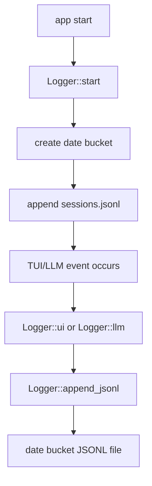

# log-01 Daily Bucket Layout

## 목적

`log-01`은 실행마다 session directory를 만드는 구조를 날짜 단위 JSONL bucket 구조로 바꾼다.

목표는 로그를 줄이는 것이 아니다. 로컬 LLM 실패를 진단할 충분한 로그를 유지하면서, 장기 사용 시 폴더 수가 폭증하지 않도록 저장 구조를 정리하는 것이다.

핵심 원칙:

```text
로그는 충분히 남긴다.
폴더는 과도하게 늘리지 않는다.
session_id와 run_id는 유지한다.
검증은 실제 로그 파일 구조와 JSONL record 기준으로 한다.
```

## 범위

포함:

- 날짜 bucket directory 생성
- `session.json` 대신 `sessions.jsonl`에 session start/end record append
- `ui.jsonl`, `llm.jsonl`, `errors.jsonl` 날짜 bucket 저장
- 모든 record에 `session_id` 유지
- 기존 `LogEvent` envelope 유지
- 파일 쓰기 실패를 `io::Result`로 전파

제외:

- log retention 삭제 정책
- log viewer 또는 `/logs` UI
- full artifact 저장소 고도화
- 로그 압축
- redaction 고도화
- 기존 per-session directory 마이그레이션

## 목표 구조

```text
.ahreumcode/logs/
  sessions/
    2026-05-15/
      sessions.jsonl
      ui.jsonl
      llm.jsonl
      errors.jsonl
```

의미:

- 날짜 폴더는 유지한다.
- session별 폴더는 만들지 않는다.
- `session_id`는 각 JSONL record 안에 남긴다.
- 날짜 bucket 안에서 session별 필터링이 가능해야 한다.

## 구현 모듈/파일 후보

```text
src/logging/
  mod.rs
  event.rs
  writer.rs

src/tui/
  app.rs
```

역할:

- `writer.rs`: 날짜 bucket path 계산과 JSONL append
- `event.rs`: 공통 event envelope
- `mod.rs`: `Logger::start`, `Logger::ui`, `Logger::llm`, `Logger::errors`
- `app.rs`: smoke 출력과 log path 표시 연결

## 데이터 구조 후보

```rust
struct Logger {
    session_id: SessionId,
    bucket_dir: PathBuf,
}

struct LogBucket {
    date: String,
    path: PathBuf,
}

struct LogEvent {
    ts: DateTime<Local>,
    session_id: String,
    run_id: Option<String>,
    turn_id: Option<u32>,
    scope_id: String,
    level: LogLevel,
    event: String,
    data: serde_json::Value,
}
```

## 함수 후보

### `Logger::start`

역할:

- 현재 날짜 기준 bucket directory를 만든다.
- `sessions.jsonl`에 session start record를 append한다.
- session directory를 만들지 않는다.

### `Logger::bucket_path`

역할:

- 날짜 bucket path를 반환한다.
- smoke 출력에서 `log_dir` 대신 bucket path를 표시할 수 있게 한다.

### `Logger::append_jsonl`

역할:

- 지정 category 파일에 JSONL record를 append한다.
- 실패 시 panic하지 않고 `io::Result`로 돌려준다.

### `Logger::ui` / `Logger::llm` / `Logger::error`

역할:

- 기존 호출부가 category별 JSONL에 record를 남기도록 유지한다.
- 모든 record에 `session_id`를 포함한다.

## 함수 연결 흐름



## 로그 이벤트

scope:

```text
log-01-daily-bucket-layout
```

event 후보:

- `log_session_started`
- `log_bucket_created`
- `log_record_appended`
- `log_write_failed`

필수 data 후보:

- `session_id`
- `bucket_dir`
- `file`
- `event_name`
- `write_status`

## 완료 기준

- intro smoke 실행 후 session folder가 생성되지 않는다.
- 날짜 bucket 아래 `sessions.jsonl`, `ui.jsonl`이 생성된다.
- main smoke 실행 후 같은 날짜 bucket의 `sessions.jsonl`, `ui.jsonl`, `llm.jsonl`에 record가 append된다.
- 서로 다른 실행의 record는 `session_id`로 구분된다.
- `.ahreumcode/logs/`는 git 대상이 아니다.
- `cargo test`가 통과한다.

## 금지 사항

- session 식별자를 없애지 않는다.
- 로그 category를 모두 하나의 거대한 파일로 합치지 않는다.
- 기존 `Logger::ui`, `Logger::llm` 호출부를 대규모로 흔들지 않는다.
- redaction 정책을 약화하지 않는다.
- 기존 per-session directory를 강제로 마이그레이션하지 않는다.

## Change History

### 2026-06-02

- Added detailed implementation spec for `log-01-daily-bucket-layout` based on `docs/tasks/logging-runtime-todo.ko.md`.
