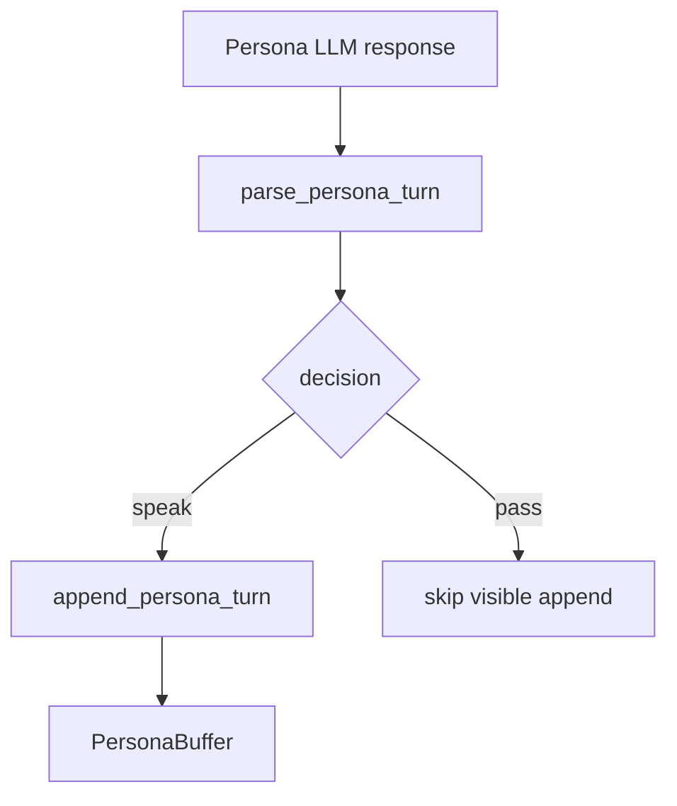

# persona-runtime-01 Contract Removal

## 목적

`persona-runtime-01-contract-removal`은 기존 batch JSON 대본 생성 경로를 실제 앱 runtime path에서 제거한다.

기존 방식은 한 번의 LLM 요청으로 `팀장/팀원` 전체 대화를 JSON 배열로 받아 PersonaBuffer에 일괄 append했다. 이 방식은 협업이 아니라 대본 생성이므로, 앱의 persona 응답 단위를 단일 speaker turn으로 바꾼다.

## 범위

포함:

- 실제 앱 경로에서 multi-speaker script array 응답 제거
- persona LLM 응답 단위를 single speaker message로 변경
- `speak`/`pass` outcome 계약 준비
- 기존 batch parser를 레거시 테스트 경로로 제한
- `parse_persona_turn` 기반 runtime path 확정

제외:

- 고정 팀 상태 모델 전체 구현
- speaker별 history 고도화
- team task lifecycle
- 실제 tool/evidence/final-answer 권한 부여

## 구현 모듈/파일 후보

```text
src/tui/
  persona_runtime.rs
  persona_prompt.rs
  persona_buffer.rs
```

## 함수 후보

### `parse_persona_turn`

역할:

- local LLM의 persona 응답을 단일 speaker turn으로 파싱한다.
- `speaker`, `decision`, `body`, `peer_messages` 계약을 확인한다.
- multi-speaker array를 앱 runtime 경로에서 허용하지 않는다.

### `append_persona_turn`

역할:

- `speak` outcome만 PersonaBuffer에 append한다.
- `pass` outcome은 visible message로 만들지 않는다.

## 함수 연결 흐름



## 로그 이벤트

scope:

```text
persona-runtime-01-contract-removal
```

event 후보:

- `persona_turn_response_received`
- `persona_turn_parsed`
- `persona_turn_parse_failed`
- `persona_script_contract_rejected`

## 완료 기준

- 앱의 persona LLM 응답 단위가 `Vec<PersonaMessage>` 대본이 아니라 단일 speaker message다.
- 실제 앱 경로는 `parse_persona_turn`을 사용한다.
- batch parser는 레거시 테스트 또는 삭제 대상 경로로만 남는다.
- persona visible message는 `speak` 결과에만 추가된다.

## 금지 사항

- 한 번의 LLM 요청으로 여러 speaker 대사를 생성하지 않는다.
- runtime log를 사람 이름 대사로 번역하지 않는다.
- persona에게 tool/evidence/final-answer 권한을 주지 않는다.

## Change History

### 2026-06-02

- Added detailed implementation spec for `persona-runtime-01-contract-removal`.
