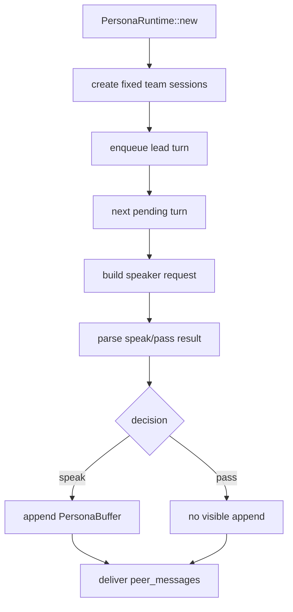

# persona-runtime-01 Fixed Foundation

## 목적

`persona-runtime-01-fixed-foundation`은 기존 구조 땜질이 아니라 벤치마킹형 persona runtime으로 갈 수 있는 새 틀을 만든다.

초기 목표는 파일 mailbox, tmux, worktree, 외부 subagent가 아니다. TUI 안에서 닫힌 in-memory fixed-team runtime을 만드는 것이다.

## 범위

포함:

- `PersonaRuntime`
- `PersonaSession`
- `PersonaTurn`
- `PersonaPeerMessage`
- fixed team session
- turn queue
- peer message transport
- speak/pass outcome 구분

제외:

- 파일 기반 mailbox
- 병렬 subagent 실행
- 멤버별 worktree
- 무제한 전문가 생성
- persona tool 권한

## 고정 팀

| Speaker | 역할 |
| --- | --- |
| `팀장` | 조율, 소집, 종합 |
| `지윤(기획/설계)` | 요구사항, 범위, 구조 |
| `민호(구현)` | 구현 경로, 기술 선택, 변경 단위 |
| `서연(검증)` | 확인 기준, 실패 가능성, 테스트 관점 |
| `하준(문서)` | 사용자 전달, 기록, 결정 사항 정리 |

## 데이터 구조 후보

```rust
struct PersonaRuntime {
    mode: PersonaRuntimeMode,
    session: Option<PersonaSession>,
}

struct PersonaSession {
    speakers: HashMap<PersonaSpeakerId, PersonaSpeakerSession>,
    pending_turns: VecDeque<PersonaTurn>,
}

struct PersonaTurn {
    speaker: PersonaSpeakerId,
    stage: PersonaStage,
}

struct PersonaPeerMessage {
    to: PersonaSpeakerId,
    body: String,
}
```

## 함수 연결 흐름



## 로그 이벤트

scope:

```text
persona-runtime-01-fixed-foundation
```

event 후보:

- `persona_runtime_created`
- `persona_fixed_team_initialized`
- `persona_turn_enqueued`
- `persona_turn_dequeued`
- `persona_peer_message_delivered`

## 완료 기준

- fixed team session과 speaker별 session이 존재한다.
- turn queue가 speaker turn을 보관한다.
- peer message 전달 틀이 있다.
- 의견이 없는 role은 pass outcome으로 처리하고 UI에 표시하지 않는다.
- persona가 tool/evidence/final-answer authority를 갖지 않는다.

## 금지 사항

- 작업별 전문가를 동적으로 생성하지 않는다.
- persona를 runtime event relay로 만들지 않는다.
- pass 결과를 억지 visible message로 만들지 않는다.

## Change History

### 2026-06-02

- Added detailed implementation spec for `persona-runtime-01-fixed-foundation`.
