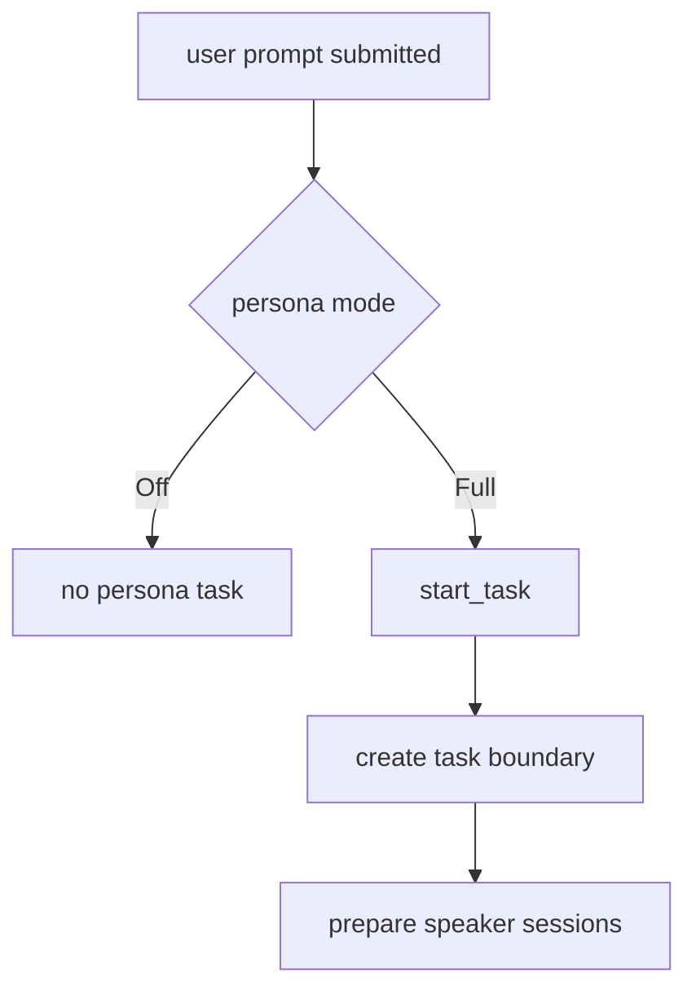

# persona-runtime-02 State Model

## 목적

`persona-runtime-02`는 speaker별 history와 현재 작업 boundary를 저장할 수 있는 최소 상태 모델을 만든다.

`/persona off`에서는 persona kickoff turn을 만들지 않고, `/persona full`일 때만 task boundary와 speaker session을 유지한다.

## 범위

포함:

- persona runtime mode
- speaker별 session history
- current task boundary
- `/persona off` no-op behavior
- persona task reset boundary

제외:

- 실제 speaker LLM request scheduling
- team task lifecycle
- main runtime follow-up intent 연결

## 데이터 구조 후보

```rust
enum PersonaRuntimeMode {
    Off,
    Full,
}

struct PersonaTaskBoundary {
    task_id: PersonaTaskId,
    user_request_summary: String,
    stage: PersonaStage,
}

struct PersonaSpeakerSession {
    speaker: PersonaSpeakerId,
    history: Vec<PersonaMessageRecord>,
    inbox: Vec<PersonaPeerMessage>,
}
```

## 함수 후보

### `PersonaRuntime::start_task`

역할:

- `Full` mode일 때 current task boundary를 만든다.
- `Off` mode일 때 kickoff turn을 만들지 않는다.

### `PersonaRuntime::clear_task`

역할:

- 새 작업 시작 또는 persona off 전환 시 task boundary를 정리한다.
- 이전 speaker session이 새 task authority가 되지 않게 한다.

## 함수 연결 흐름



## 로그 이벤트

scope:

```text
persona-runtime-02-state-model
```

event 후보:

- `persona_task_started`
- `persona_task_cleared`
- `persona_mode_off_skipped`
- `persona_speaker_history_recorded`

## 완료 기준

- speaker별 history와 현재 task boundary를 저장할 수 있다.
- `/persona off`에서는 persona kickoff turn을 만들지 않는다.
- persona task state가 main runtime evidence authority로 쓰이지 않는다.

## 금지 사항

- 이전 task의 persona chatter가 새 tool choice authority가 되지 않는다.
- persona off 상태에서 local LLM persona request를 보내지 않는다.

## Change History

### 2026-06-02

- Added detailed implementation spec for `persona-runtime-02-state-model`.
