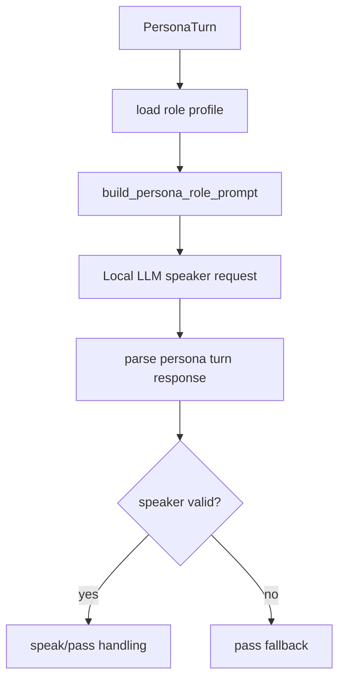

# persona-runtime-03 Role Prompts

## 목적

`persona-runtime-03`은 fixed team speaker별 role prompt와 출력 계약을 정의한다.

각 speaker는 자기 역할 관점에서만 말해야 하며, tool/evidence/final-answer authority가 없다는 규칙을 공통으로 적용한다.

## 범위

포함:

- `팀장`, `지윤`, `민호`, `서연`, `하준` role profile
- speaker-local system prompt
- `speak`/`pass` output contract
- `peer_messages` 필드 계약
- 권한 경계 prompt

제외:

- runtime scheduling
- 실제 tool execution
- persona가 final answer 작성
- prompt-specific visible text denylist

## 출력 계약 후보

```json
{
  "speaker": "team_lead",
  "decision": "speak",
  "body": "짧은 팀 토론 발화",
  "peer_messages": [
    {
      "to": "planning",
      "body": "요구 범위 관점에서 확인할 점만 요청"
    }
  ]
}
```

정책:

- `decision`은 `speak` 또는 `pass`.
- `pass`는 UI에 표시하지 않는다.
- `peer_messages`는 다음 speaker에게 전달되는 구조 메시지이며 사용자에게 직접 표시하지 않는다.
- persona visible body는 tool/command/function/internal operation name을 언급하지 않는다.

## 함수 후보

### `build_persona_role_prompt`

역할:

- speaker role profile, 권한 경계, task summary, speaker-local history를 조합한다.
- multi-speaker script 생성을 요구하지 않는다.

### `parse_persona_speaker_id`

역할:

- transport id와 display label을 호환 범위 안에서 해석한다.
- unknown speaker를 거부한다.

## 함수 연결 흐름



## 로그 이벤트

scope:

```text
persona-runtime-03-role-prompts
```

event 후보:

- `persona_role_prompt_built`
- `persona_speaker_parsed`
- `persona_unknown_speaker_rejected`
- `persona_turn_contract_failed`

## 완료 기준

- 각 speaker는 자기 역할만 말한다.
- tool/evidence/final-answer authority 없음이 prompt에 반영된다.
- 출력 계약은 `speak/pass`와 `peer_messages`를 포함한다.
- speaker별 prompt는 자기 history와 자기에게 전달된 peer message만 사용한다.

## 금지 사항

- 하나의 prompt로 여러 사람 대본을 생성하지 않는다.
- persona가 파일 값, 패키지명, 버전, 설정값을 단정하지 않는다.
- prompt-specific 문구 차단으로 runtime을 보정하지 않는다.

## Change History

### 2026-06-02

- Added detailed implementation spec for `persona-runtime-03-role-prompts`.
