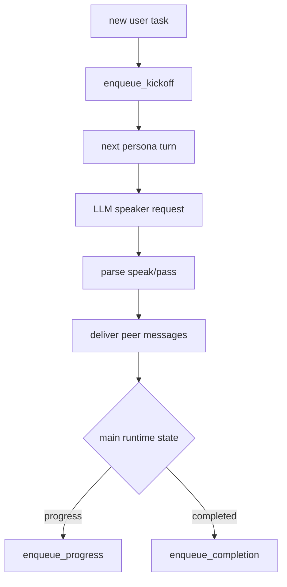

# persona-runtime-04 Turn Scheduler

## 목적

`persona-runtime-04`는 kickoff/progress/follow-up/completion을 speaker별 LLM 턴으로 실행하는 scheduler를 구현한다.

고정 팀은 고정 발언 슬롯이 아니다. 팀장 또는 runtime state가 필요한 speaker를 깨우고, 할 말이 없는 speaker는 pass할 수 있어야 한다.

## 범위

포함:

- pending turn queue
- kickoff lead turn
- progress lead turn
- follow-up lead turn
- completion closure turn
- stale pending turn 제거
- `speak`만 PersonaBuffer 표시

제외:

- batch persona script generation
- persona tool execution
- 모든 멤버 강제 발언

## 데이터 구조 후보

```rust
enum PersonaStage {
    Kickoff,
    Progress,
    FollowUp,
    Completion,
}

enum PersonaTurnKind {
    LeadSummon,
    MemberResponse,
    LeadSummary,
    CompletionClosure,
}
```

## 함수 후보

### `enqueue_kickoff`

역할:

- 새 task 시작 시 팀장 첫 turn을 만든다.
- 팀장 `peer_messages` 이후 필요한 teammate만 깨운다.

### `enqueue_progress`

역할:

- main runtime 상태 변화가 있을 때 같은 task boundary 안에서 progress turn을 만든다.
- runtime log를 그대로 사람 대사로 번역하지 않는다.

### `enqueue_completion`

역할:

- main runtime이 answer/blocked/failure에 도달하면 stale pending turn을 제거한다.
- final closure turn만 남긴다.

## 함수 연결 흐름



## 로그 이벤트

scope:

```text
persona-runtime-04-turn-scheduler
```

event 후보:

- `persona_kickoff_enqueued`
- `persona_progress_enqueued`
- `persona_followup_enqueued`
- `persona_completion_enqueued`
- `persona_stale_turns_removed`
- `persona_turn_completed`

## 완료 기준

- 앱 persona 요청 경로가 `PersonaRuntime` pending turn queue를 사용한다.
- kickoff는 팀장 첫 turn 뒤 메인 작업을 시작한다.
- progress는 main runtime 상태 변화마다 같은 task boundary 안에서 처리된다.
- completion은 stale pending turn을 제거하고 closure로 닫는다.
- `pass`는 UI에 표시되지 않는다.

## 금지 사항

- 멤버를 고정 순서로 모두 발언시키지 않는다.
- completion 이후 오래된 kickoff/progress 발화를 UI에 반영하지 않는다.
- persona가 main runtime을 완전히 막지 않는다.

## Change History

### 2026-06-02

- Added detailed implementation spec for `persona-runtime-04-turn-scheduler`.
