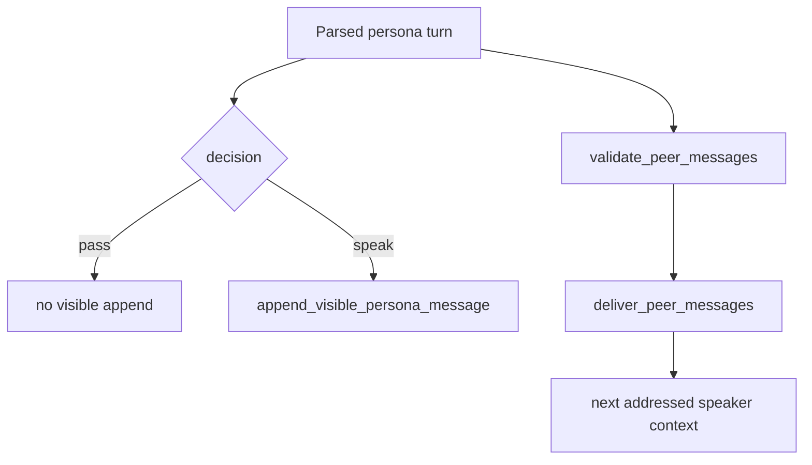

# persona-runtime-05 UI Append

## 목적

`persona-runtime-05`는 speaker별 응답이 도착할 때마다 `speak` 응답만 PersonaBuffer에 append하고, `peer_messages`를 다음 speaker turn context로 전달한다.

persona UI는 system log가 아니라 social team conversation이다.

## 범위

포함:

- `speak` 응답만 visible append
- `pass` 응답은 표시하지 않음
- `peer_messages` 필수 계약 검증
- fixed teammate에게 보낸 메시지만 전달
- 자기 자신/unknown recipient/패스 중 peer message 거부
- speaker label style 유지

제외:

- left workspace event 표시
- tool/validation/permission 상태 표시
- runtime log를 persona 대사로 번역

## 함수 후보

### `append_visible_persona_message`

역할:

- speaker display label, role, body를 PersonaBuffer에 append한다.
- speaker name style과 role display 정책을 유지한다.

### `deliver_peer_messages`

역할:

- fixed teammate 대상 peer message를 해당 speaker inbox에 넣는다.
- unknown/self recipient를 거부한다.

### `validate_peer_messages`

역할:

- `peer_messages`가 실행 지시가 아니라 자문 요청 경계에 머무르는지 계약을 확인한다.
- prompt-specific 문구 denylist로 처리하지 않는다.

## 함수 연결 흐름



## 로그 이벤트

scope:

```text
persona-runtime-05-ui-append
```

event 후보:

- `persona_visible_message_appended`
- `persona_pass_skipped`
- `persona_peer_message_validated`
- `persona_peer_message_delivered`
- `persona_peer_message_rejected`

## 완료 기준

- `speak` 응답만 PersonaBuffer에 표시된다.
- `pass`는 표시되지 않는다.
- `peer_messages`는 다음 speaker prompt에 주입된다.
- batch 대본, 자기 자신, unknown recipient, pass 중 peer message는 거부된다.
- persona panel에 tool schema, validation detail, risk label을 표시하지 않는다.

## 금지 사항

- persona panel을 system log lane으로 쓰지 않는다.
- runtime event name을 사람 이름 대사로 바꾸지 않는다.
- 모든 fixed member를 강제로 표시하지 않는다.

## Change History

### 2026-06-02

- Added detailed implementation spec for `persona-runtime-05-ui-append`.
