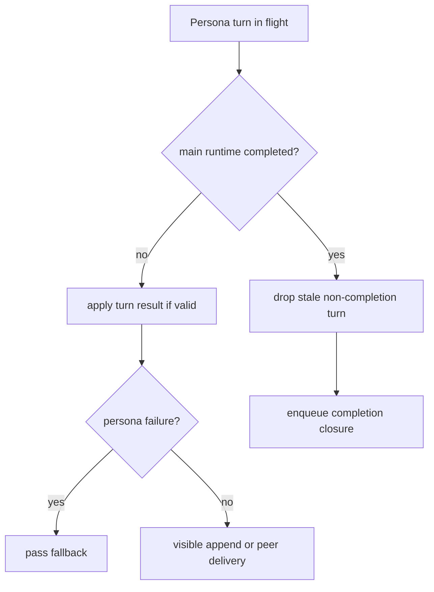

# persona-runtime-06 Main Runtime Boundary

## 목적

`persona-runtime-06-main-runtime-boundary`는 persona와 메인 LLM/tool loop의 동시 실행, 실패, 취소, completion 연결을 정리한다.

persona는 협업 레이어이며, main runtime의 tool/evidence/final-answer authority를 대체하지 않는다.

## 범위

포함:

- persona 실패를 main 작업 실패로 승격하지 않음
- persona parse 실패를 해당 speaker pass로 처리
- 첫 팀장 kickoff 이후 main runtime 시작
- progress/completion을 같은 task boundary에서 처리
- main answer 이후 stale persona turn 제거

제외:

- persona tool execution
- persona final answer 작성
- persona가 evidence body 읽기
- system log raw text를 persona prompt authority로 사용

## 권한 경계

```text
Persona has no tool permission.
Persona has no evidence authority.
Persona has no final-answer authority.
```

## 함수 후보

### `handle_persona_turn_failure`

역할:

- persona LLM 실패 또는 parse 실패를 pass로 처리한다.
- main runtime을 차단하지 않는다.

### `sync_persona_with_main_state`

역할:

- main runtime state summary를 persona task boundary에 전달한다.
- raw observation body나 final answer 내용을 persona가 대신 말하게 하지 않는다.

### `drop_stale_persona_turns`

역할:

- main runtime completion 이후 오래된 non-completion turn을 제거한다.

## 함수 연결 흐름



## 로그 이벤트

scope:

```text
persona-runtime-06-main-runtime-boundary
```

event 후보:

- `persona_failure_pass_fallback`
- `persona_main_state_summary_updated`
- `persona_stale_turn_dropped`
- `persona_completion_boundary_applied`

## 완료 기준

- persona 실패가 main 작업을 망치지 않는다.
- main runtime evidence/final answer를 persona가 대신 말하지 않는다.
- completion 이후 오래된 persona 발화가 UI에 나타나지 않는다.
- persona runtime은 main runtime 상태 요약만 사용한다.

## 금지 사항

- persona가 tool observation body를 인용하지 않는다.
- persona가 최종 답변처럼 사용자에게 사실 값을 단정하지 않는다.
- persona 실패를 full run failure로 처리하지 않는다.

## Change History

### 2026-06-02

- Added detailed implementation spec for `persona-runtime-06-main-runtime-boundary`.
