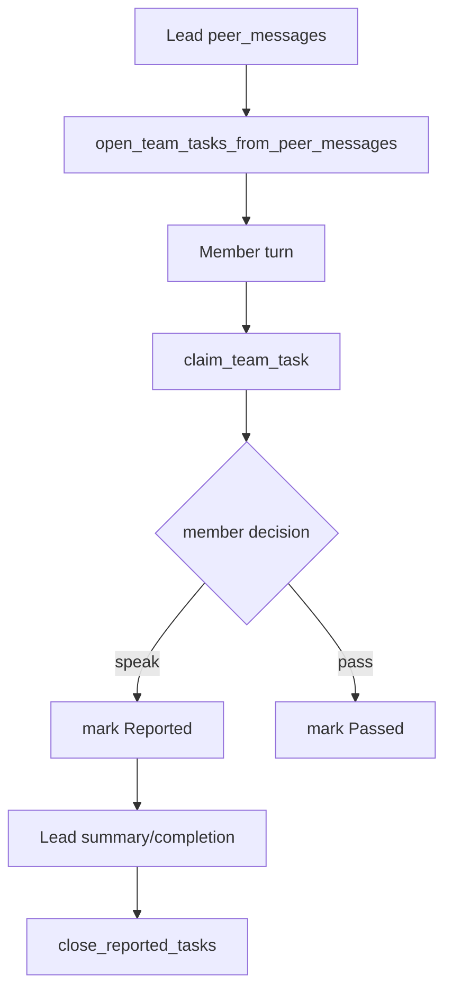

# persona-runtime-06 Team Task Boundary

## 목적

`persona-runtime-06-team-task-boundary`는 parser-level 문구 차단 대신 구조화된 team task 상태로 persona 협업 경계를 만든다.

visible text denylist나 same-turn repair prompt로 persona 발화를 고치는 방식은 사용하지 않는다.

## 범위

포함:

- 팀장 `peer_messages`에서 in-memory team task 생성
- 호출된 멤버 task claim
- 멤버 `speak` 결과를 reported로 기록
- 멤버 `pass` 결과를 passed로 기록
- 팀장 summary/completion에서 reported task close

제외:

- 특정 한국어 동사 기반 차단
- prompt-specific persona repair
- tool execution assignment
- 외부 mailbox/task file

## 데이터 구조 후보

```rust
enum PersonaTeamTaskStatus {
    Open,
    Claimed,
    Reported,
    Passed,
    Closed,
}

struct PersonaTeamTask {
    id: PersonaTeamTaskId,
    owner: PersonaSpeakerId,
    requested_by: PersonaSpeakerId,
    status: PersonaTeamTaskStatus,
    summary: String,
}
```

## 함수 후보

### `open_team_tasks_from_peer_messages`

역할:

- 팀장 peer message를 team task로 등록한다.
- visible text의 특정 문구가 아니라 구조 필드로 처리한다.

### `claim_team_task`

역할:

- 호출된 member turn이 자기 inbox의 task를 claim한다.

### `complete_team_task_from_turn`

역할:

- `speak`면 reported, `pass`면 passed로 상태를 갱신한다.

### `close_reported_tasks`

역할:

- 팀장 summary/completion에서 reported task를 close한다.

## 함수 연결 흐름



## 로그 이벤트

scope:

```text
persona-runtime-06-team-task-boundary
```

event 후보:

- `persona_team_task_opened`
- `persona_team_task_claimed`
- `persona_team_task_reported`
- `persona_team_task_passed`
- `persona_team_task_closed`

## 완료 기준

- 팀장 peer message가 in-memory team task를 만든다.
- 호출된 멤버가 task를 claim한다.
- speak/pass 결과에 따라 task state가 갱신된다.
- persona text denylist나 same-turn repair prompt 없이 협업 흐름이 유지된다.

## 금지 사항

- 특정 visible body 문구로 persona를 통과/거부하지 않는다.
- 팀원에게 구현/작성/검증 완료를 지시하지 않는다.
- team task를 실제 tool assignment로 해석하지 않는다.

## Change History

### 2026-06-02

- Added detailed implementation spec for `persona-runtime-06-team-task-boundary`.
