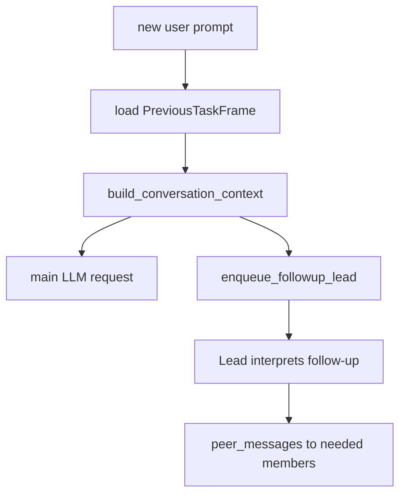

# persona-runtime-07 Follow Up Intent

## 목적

`persona-runtime-07`은 후속 사용자 발화를 이전 작업의 복구/이어가기/불만으로 처리할 수 있게 persona context와 main intent frame 연결을 정리한다.

핵심은 특정 문구 매칭이 아니다. 이전 task frame을 구조적으로 제공하고, 현재 발화가 관련 있는지 LLM과 controller가 판단하게 한다.

## 범위

포함:

- 이전 task user request 보관
- 이전 task state summary 보관
- `<AHREUM_CONVERSATION_CONTEXT>` 내부 system message
- persona `FollowUp` stage
- `FollowUpLead` turn
- 필요한 고정 팀원만 peer message로 깨우기

제외:

- 특정 한국어 문구 감지
- 이전 task의 파일 값/패키지 버전을 persona가 단정
- 무관한 새 요청에 이전 target 강제 상속

## 데이터 구조 후보

```rust
struct PreviousTaskFrame {
    user_request: String,
    state_summary: String,
    final_status: PreviousTaskStatus,
}

enum PersonaStage {
    FollowUp,
}
```

## 함수 후보

### `build_conversation_context`

역할:

- 이전 task request와 state summary를 bounded internal message로 만든다.
- 현재 요청이 무관하면 무시하라고 명시한다.

### `enqueue_followup_lead`

역할:

- 기존 persona task/session history를 보존한 상태에서 팀장 follow-up turn을 만든다.
- 필요한 멤버만 peer message로 깨운다.

## 함수 연결 흐름



## 로그 이벤트

scope:

```text
persona-runtime-07-follow-up-intent
```

event 후보:

- `conversation_context_attached`
- `persona_followup_lead_enqueued`
- `persona_followup_context_used`
- `persona_followup_context_ignored`

## 완료 기준

- 이전 task frame을 구조적으로 다음 요청에 전달한다.
- 관련 여부는 문구 매칭이 아니라 현재 발화 의미로 판단한다.
- 무관한 요청은 이전 tool target을 강제로 상속하지 않는다.
- persona follow-up은 필요한 멤버만 깨운다.

## 금지 사항

- `중간에 끊겼는데?` 같은 특정 문구만 special case 처리하지 않는다.
- 이전 persona chatter를 tool choice authority로 사용하지 않는다.
- persona가 이전 tool observation의 사실 값을 대신 답하지 않는다.

## Change History

### 2026-06-02

- Added detailed implementation spec for `persona-runtime-07-follow-up-intent`.
