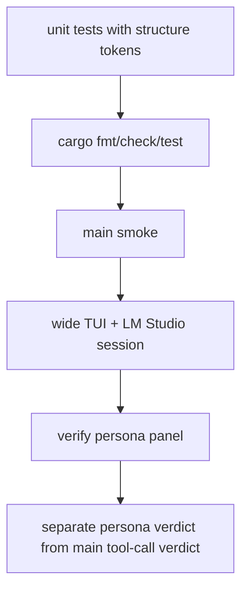

# persona-runtime-08 Verification

## 목적

`persona-runtime-08`은 persona runtime이 batch 대본 생성이 아니라 speaker별 turn, peer message, pass 계약으로 동작하는지 검증한다.

검증은 mock happy path만으로 완료하지 않는다. 구조 토큰 기반 단위 검증과 실제 TUI + LM Studio 검증을 함께 사용한다.

## 범위

포함:

- persona runtime 단위 테스트
- persona prompt/parser 계약 검증
- persona 대본성 한국어 테스트 문구 제거
- actual wide TUI + LM Studio 검증
- persona layer와 main tool-call 검증 범위 분리

제외:

- full main tool-call quality acceptance
- 특정 prompt 문구 기반 통과
- mock LLM happy path만으로 완료 처리

## 검증 대상

| 대상 | 확인 |
| --- | --- |
| speaker turn | 한 응답이 한 speaker만 담당 |
| peer message | addressed teammate에게만 전달 |
| pass | UI에 표시되지 않음 |
| kickoff | 팀장이 먼저 등장 |
| completion | stale turn 제거 후 closure |
| authority | persona가 tool/evidence/final answer를 소유하지 않음 |

## 함수 후보

### `run_persona_runtime_unit_tests`

역할:

- 구조 토큰 기반 테스트로 runtime 상태와 queue를 확인한다.
- 대본성 persona 한국어 문구를 테스트 success 조건으로 삼지 않는다.

### `verify_actual_wide_tui_persona`

역할:

- persona full panel이 가능한 wide terminal에서 실제 LM Studio와 함께 검증한다.
- kickoff, addressed member, pass, completion 흐름을 확인한다.

## 검증 흐름



## 로그 이벤트

scope:

```text
persona-runtime-08-verification
```

검증에서 확인할 event 후보:

- `persona_turn_enqueued`
- `persona_turn_response_received`
- `persona_visible_message_appended`
- `persona_pass_skipped`
- `persona_completion_boundary_applied`

## 완료 기준

- `cargo fmt --check`가 통과한다.
- persona runtime 관련 단위 테스트가 통과한다.
- 전체 `cargo test`가 통과한다.
- `cargo run -- --scene main --smoke`가 통과한다.
- 실제 wide TUI + LM Studio 세션에서 `팀장` kickoff first가 확인된다.
- addressed teammates가 응답하거나 pass한다.
- persona layer 검증을 main tool-call quality 검증으로 과장하지 않는다.

## 금지 사항

- mock LLM happy path만으로 완료 처리하지 않는다.
- 특정 한국어 대사 문구를 테스트 성공 조건으로 쓰지 않는다.
- persona 검증 결과를 full tool-call acceptance로 주장하지 않는다.
- 자동화 PTY 환경 실패를 제품 실패와 섞지 않는다.

## Change History

### 2026-06-02

- Added detailed implementation spec for `persona-runtime-08-verification`.
