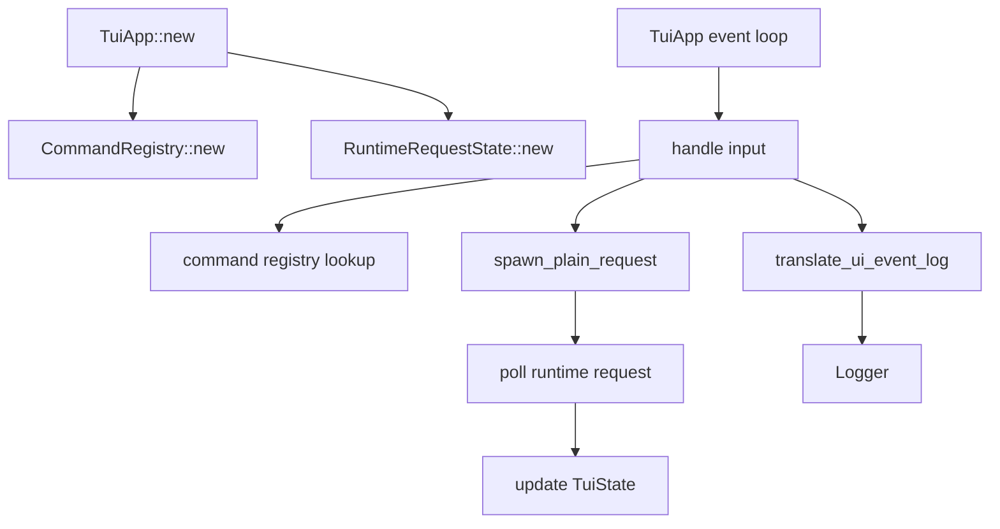

# refactor-01 TUI App Orchestration Split

## 목적

`refactor-01`은 TUI 동작을 그대로 유지하면서 `app.rs`에 집중된 orchestration 책임을 분리한다.

이 작업은 기능 추가가 아니다. 다음 Local LLM defense, tool execution, E2E 검증이 `app.rs`에 더 많은 책임을 붙이지 않도록 구조 부채를 줄이는 작업이다.

핵심 원칙:

```text
동작은 그대로 둔다.
구조만 분리한다.
자의적 재설계는 하지 않는다.
다음 구현 단계의 검증 비용을 줄일 때만 수행한다.
```

## 범위

포함:

- `CommandRegistry`를 render path에서 매번 생성하지 않는 구조
- local LLM request orchestration 분리
- repair request orchestration 분리
- UI log-event translation 분리
- terminal lifecycle과 top-level event loop는 `app.rs`에 유지
- scene/component rendering 구조 유지

제외:

- 새 command 추가
- 새 defense 정책 추가
- tool 실행 구현
- full LLM E2E
- 화면 레이아웃 변경
- 문구 변경
- 대규모 파일 rename

## 구현 모듈/파일 후보

```text
src/tui/
  app.rs
  command_registry.rs
  event_log.rs
  runtime_request.rs
```

역할:

- `app.rs`: terminal lifecycle, top-level event loop, state 연결
- `command_registry.rs`: command metadata와 handler lookup
- `event_log.rs`: UI event를 log event로 변환
- `runtime_request.rs`: active request state, chat worker spawn, repair request message 구성

## 함수 후보

### `CommandRegistry::new`

역할:

- command registry를 실행 단위에서 한 번 만든다.
- render/input path에서 매번 생성하지 않는다.

### `translate_ui_event_log`

역할:

- TUI event를 logging event로 변환한다.
- logging 의미가 `app.rs`에 누적되지 않게 한다.

### `spawn_plain_request`

역할:

- local LLM plain request worker를 구성한다.
- `app.rs`는 요청 시작과 poll만 담당한다.

### `build_repair_request_messages`

역할:

- repair request message 구성을 runtime request boundary로 분리한다.
- 화면 문구나 policy를 바꾸지 않는다.

## 함수 연결 흐름



## 로그 이벤트

scope:

```text
refactor-01-tui-app-orchestration-split
```

리팩토링 자체가 새 제품 로그를 만들지는 않는다. 기존 로그 event의 의미와 scope는 유지한다.

확인 대상:

- 기존 UI log event가 사라지지 않는다.
- 기존 LLM request/repair log event가 유지된다.
- log bucket 구조가 유지된다.

## 완료 기준

- 제품 동작, 화면 문구, slash command 정책이 바뀌지 않는다.
- `CommandRegistry`가 render/input path에서 반복 생성되지 않는다.
- UI event log translation이 별도 모듈로 분리된다.
- runtime request worker 경계가 `app.rs` 밖으로 이동한다.
- `/exit`, `/quit` epilogue 흐름이 유지된다.
- 기존 log bucket 구조가 유지된다.
- `cargo fmt --check`가 통과한다.
- `cargo test`가 통과한다.
- `cargo run -- --scene intro --smoke`가 통과한다.
- `cargo run -- --scene main --smoke`가 통과한다.
- `cargo run -- --scene epilogue --smoke`가 통과한다.

## 금지 사항

- 리팩토링 중 새 slash command를 추가하지 않는다.
- 리팩토링 중 새 LLM 정책을 추가하지 않는다.
- 화면 문구를 바꾸지 않는다.
- 테스트 파일을 대량 추가하지 않는다.
- 광범위한 rename/reformat을 하지 않는다.

## Change History

### 2026-06-02

- Added detailed implementation spec for `refactor-01` based on `docs/tasks/refactor-todo.ko.md`.
