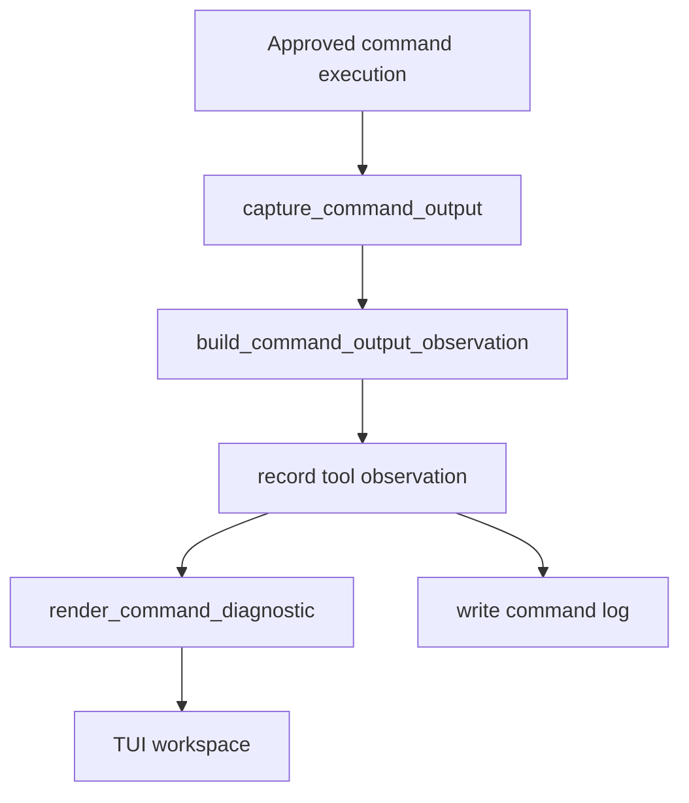

# refactor-02 Terminal Output Isolation

## 목적

`refactor-02`는 외부 process stderr 또는 host diagnostic 출력이 TUI 화면을 오염시키지 않도록 출력 경계를 정리하는 후보 작업이다.

이 작업은 Execute tool이나 child process 실행이 본격화될 때 필요해지는 구조 부채 대응이다. 현재 host process 자체의 diagnostic을 고치는 작업이 아니며, 제품 화면과 command output observation의 경계를 명확히 하는 데 목적이 있다.

## 범위

포함 후보:

- child process stdout/stderr capture 정책
- command output을 workspace diagnostic component로만 표시
- terminal restore 이후 epilogue 출력과 runtime diagnostic 출력 경계
- command output preview/artifact 연결
- stderr가 prompt/statusline을 깨지 않게 하는 렌더링 경계

제외:

- 현재 host process의 macOS malloc diagnostic 자체 수정
- Execute tool이 열리기 전 강제 구현
- command execution capability 확장
- shell parser 구현
- TUI 화면 문구 변경

## 구현 모듈/파일 후보

```text
src/tool/
  command_runtime.rs
  observation.rs

src/tui/
  runtime_workspace.rs
  terminal.rs

src/logging/
  writer.rs
```

역할:

- `command_runtime.rs`: child process stdout/stderr capture
- `observation.rs`: command output preview/artifact metadata
- `runtime_workspace.rs`: command diagnostic 표시
- `terminal.rs`: terminal enter/restore boundary

## 함수 후보

### `capture_command_output`

역할:

- child process stdout/stderr를 terminal raw output으로 흘리지 않는다.
- output을 observation builder로 전달한다.

### `build_command_output_observation`

역할:

- stdout/stderr preview, artifact, exit code를 observation으로 만든다.
- 긴 output은 preview/artifact 정책을 따른다.

### `render_command_diagnostic`

역할:

- command output을 workspace diagnostic component에만 표시한다.
- prompt/statusline 레이아웃을 깨지 않게 한다.

## 함수 연결 흐름



## 로그 이벤트

scope:

```text
refactor-02-terminal-output-isolation
```

후보 event:

- `command_output_captured`
- `command_output_artifact_written`
- `terminal_output_boundary_applied`

## 완료 기준 후보

- 외부 command stderr가 prompt/statusline을 깨지 않는다.
- diagnostic output은 workspace/log surface에만 표시된다.
- terminal restore 이후 epilogue 출력이 command output과 섞이지 않는다.
- 기존 command execution observation이 유지된다.
- 제품 문구와 정책은 바뀌지 않는다.

## 금지 사항

- host process diagnostic 자체를 임의로 숨기거나 수정하지 않는다.
- command output을 raw terminal로 흘리지 않는다.
- 리팩토링 명목으로 Execute capability를 새로 열지 않는다.
- 긴 output을 전체 표시해 TUI를 깨지 않는다.

## Change History

### 2026-06-02

- Added candidate technical spec for `refactor-02` based on `docs/tasks/refactor-todo.ko.md`.
