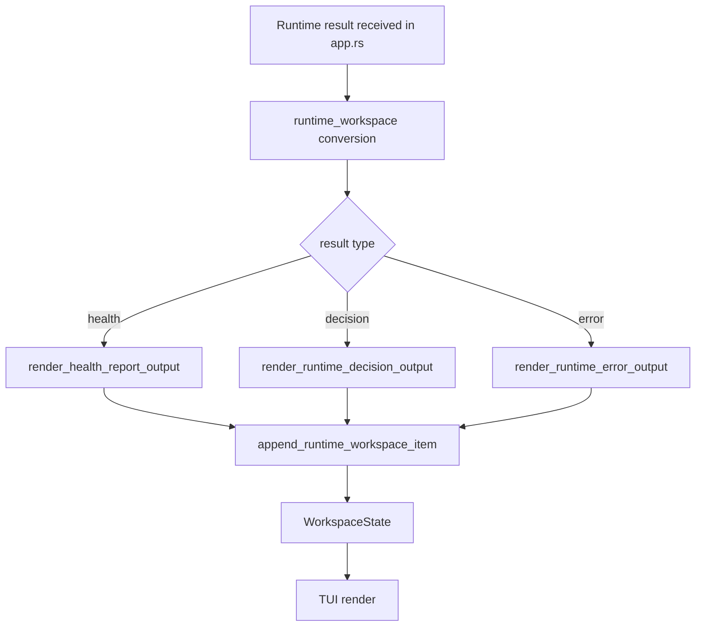

# refactor-03 TUI Runtime Boundary Followup

## 목적

`refactor-03`은 guardrail audit에서 확인된 `app.rs` 책임 집중을 줄이기 위한 후속 리팩토링이다.

목표는 새 tool capability나 UI 정책을 여는 것이 아니다. runtime/LLM/tool 결과를 workspace 출력 이벤트로 변환하는 책임을 별도 모듈로 옮겨, `app.rs`가 event loop와 request polling 중심 역할을 유지하게 한다.

## 범위

포함:

- runtime/LLM/tool 결과를 workspace output으로 변환하는 책임 분리
- health report, diagnostics snapshot, plain chat failure 출력 경계
- runtime decision, decision error, parse error 출력 경계
- tool loop limit 출력 경계
- `app.rs`의 event loop, request polling, phase transition 유지

제외:

- 새 tool capability 추가
- policy 변경
- 화면 레이아웃 변경
- statusline 변경
- permission policy 변경
- 광범위한 rename/reformat

## 구현 모듈/파일 후보

```text
src/tui/
  app.rs
  runtime_workspace.rs
  workspace.rs
```

역할:

- `app.rs`: event loop, request polling, phase transition, logging 연결
- `runtime_workspace.rs`: runtime 결과를 workspace item/event로 변환
- `workspace.rs`: workspace state와 rendering

## 함수 후보

### `render_health_report_output`

역할:

- health report를 workspace output으로 변환한다.
- statusline이나 policy 의미를 바꾸지 않는다.

### `render_runtime_decision_output`

역할:

- parsed runtime decision을 workspace item으로 변환한다.
- answer/tool/clarify/blocked 의미를 보존한다.

### `render_runtime_error_output`

역할:

- parse error, decision error, tool loop limit을 workspace diagnostic으로 변환한다.
- 실패를 성공처럼 표시하지 않는다.

### `append_runtime_workspace_item`

역할:

- 변환된 workspace item을 state에 append한다.
- app event loop는 변환 세부 사항을 몰라도 되게 한다.

## 함수 연결 흐름



## 로그 이벤트

scope:

```text
refactor-03-tui-runtime-boundary-followup
```

리팩토링 자체가 새 제품 log event를 추가하지 않는다.

확인 대상:

- 기존 parse/decision/tool loop log event 유지
- workspace 출력 의미 유지
- statusline runtime state 유지

## 완료 기준

- 화면 문구와 statusline이 바뀌지 않는다.
- 기존 prompt submit, answer, tool observation flow가 유지된다.
- runtime-to-workspace rendering 책임이 `runtime_workspace.rs`로 분리된다.
- fixed 작업의 계약 정정과 섞이지 않는다.
- `cargo fmt --check`가 통과한다.
- `cargo test tui::runtime_workspace`가 통과한다.
- `cargo test`가 통과한다.
- `cargo run -- --scene intro --smoke`가 통과한다.
- `cargo run -- --scene main --smoke`가 통과한다.
- `cargo run -- --scene epilogue --smoke`가 통과한다.

## 금지 사항

- 리팩토링 중 새 tool capability를 열지 않는다.
- policy나 permission 의미를 바꾸지 않는다.
- 화면 레이아웃이나 문구를 바꾸지 않는다.
- app.rs 책임 집중을 이유로 대규모 rewrite를 하지 않는다.

## Change History

### 2026-06-02

- Added detailed implementation spec for `refactor-03` based on `docs/tasks/refactor-todo.ko.md` and guardrail audit routing.
