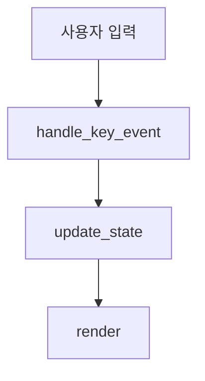

# Technical Spec Index Korean Draft

## 목적

이 문서는 구현 단위별 기술 스펙 문서의 작성 규칙과 라우팅을 정의한다.

기술 스펙 문서의 용도:

- 구현자가 실제 코드를 작성하기 전 흐름을 이해한다.
- 블로그 글로 전환할 수 있을 만큼 설명력이 있어야 한다.
- 프로젝트 공식 document로 공개해도 부끄럽지 않은 수준을 목표로 한다.
- 전 프로젝트처럼 600번대 문서/시나리오로 증식하지 않도록 구현 단위별로 닫힌 번호 체계를 유지한다.

## Document Rule

구현 단위마다 문서를 따로 둔다.

예:

```text
docs/specs/implementation/tui-technical-spec.ko.md
docs/specs/implementation/tui/tui-01-intro-scene.ko.md
docs/specs/implementation/tui/tui-02-epilogue-scene.ko.md
docs/specs/implementation/llm-technical-spec.ko.md
docs/specs/implementation/loop-technical-spec.ko.md
docs/specs/implementation/tool-technical-spec.ko.md
docs/specs/implementation/config-policy-technical-spec.ko.md
docs/specs/implementation/session-context-technical-spec.ko.md
```

규칙:

- 구현 단위 문서는 자기 번호를 `01`부터 시작한다.
- 다른 구현 단위 번호를 이어받지 않는다.
- 한 문서 안에서 번호는 `01~10` 범위를 넘기지 않는다.
- 10개를 넘겨야 할 것 같으면 기능을 더 넣지 말고 구현 단위를 다시 나눈다.
- 빈 번호를 만들지 않는다.
- 문서 수를 늘리는 것이 목적이 아니라, 구현 단위의 의미를 보존하는 것이 목적이다.
- 구현 단위의 상위 문서가 무거워질 경우, 상위 문서는 전체 구조와 라우팅만 맡고 번호별 상세 스펙은 하위 섹션 문서로 분리한다.
- 하위 섹션 문서는 현재 작업 번호에 해당하는 문서만 읽는다.

## Required Sections

각 구현 단위 기술 스펙은 다음 구조를 가진다.

```text
1. 목적
2. 범위
3. 모듈/파일 후보
4. 공통 데이터 구조
5. 01~10 세부 구현 스펙
6. 주요 함수 목록
7. 함수 연결 흐름
8. 로그 이벤트
9. 검증 기준
10. 금지 사항
```

각 세부 구현 스펙은 다음을 포함한다.

```text
번호와 이름
짧은 설명
주요 함수
함수별 역할
함수 연결 flowchart
로그 이벤트
완료 기준
```

## Flowchart Rule

flowchart는 Mermaid 형식을 기본으로 한다.

예:



주의:

- flowchart는 구현을 과장하지 않는다.
- 실제 함수와 연결되지 않는 장식용 도식은 만들지 않는다.
- 함수 이름은 구현 후보이며, 코드 작성 중 더 좋은 이름이 생기면 문서도 함께 갱신한다.

## Current Technical Specs

| Unit | Document | Status |
| --- | --- | --- |
| TUI parent | `docs/specs/implementation/tui-technical-spec.ko.md` | draft |
| TUI sections | `docs/specs/implementation/tui/tui-01-*.ko.md` through `tui-10-*.ko.md` | draft |
| Local LLM Runtime parent | `docs/specs/implementation/local-llm-runtime-technical-spec.ko.md` | draft |
| Local LLM Runtime sections | `docs/specs/implementation/llm/llm-01-*.ko.md` through `llm-11-*.ko.md` | draft |
| Tool Runtime parent | `docs/specs/implementation/tool-runtime-technical-spec.ko.md` | draft |
| Tool Runtime sections | `docs/specs/implementation/tool/tool-01-*.ko.md` | draft |
| Guardrail correction tasks | `docs/tasks/guardrail-fix-todo.ko.md` | active |

## TUI Section Specs

| ID | Document |
| --- | --- |
| `tui-01` | `docs/specs/implementation/tui/tui-01-intro-scene.ko.md` |
| `tui-02` | `docs/specs/implementation/tui/tui-02-epilogue-scene.ko.md` |
| `tui-03` | `docs/specs/implementation/tui/tui-03-main-scene-layout.ko.md` |
| `tui-04` | `docs/specs/implementation/tui/tui-04-command-area-basic-actions.ko.md` |
| `tui-05` | `docs/specs/implementation/tui/tui-05-approval-area.ko.md` |
| `tui-06` | `docs/specs/implementation/tui/tui-06-working-process-area.ko.md` |
| `tui-07` | `docs/specs/implementation/tui/tui-07-workspace-output-layout.ko.md` |
| `tui-08` | `docs/specs/implementation/tui/tui-08-persona-message-detail.ko.md` |
| `tui-09` | `docs/specs/implementation/tui/tui-09-complex-commands.ko.md` |
| `tui-10` | `docs/specs/implementation/tui/tui-10-modal-expanded-form.ko.md` |

## Local LLM Runtime Section Specs

| ID | Document |
| --- | --- |
| `llm-01` | `docs/specs/implementation/llm/llm-01-config-runtime.ko.md` |
| `llm-02` | `docs/specs/implementation/llm/llm-02-provider-connection.ko.md` |
| `llm-03` | `docs/specs/implementation/llm/llm-03-plain-prompt-request.ko.md` |
| `llm-04` | `docs/specs/implementation/llm/llm-04-message-history.ko.md` |
| `llm-05` | `docs/specs/implementation/llm/llm-05-schema-prompt-builder.ko.md` |
| `llm-06` | `docs/specs/implementation/llm/llm-06-json-response-parser.ko.md` |
| `llm-07` | `docs/specs/implementation/llm/llm-07-repair-request-loop.ko.md` |
| `llm-08` | `docs/specs/implementation/llm/llm-08-runtime-decision-gate.ko.md` |
| `llm-09` | `docs/specs/implementation/llm/llm-09-tui-process-binding.ko.md` |
| `llm-10` | `docs/specs/implementation/llm/llm-10-diagnostics-and-status.ko.md` |
| `llm-11` | `docs/specs/implementation/llm/llm-11-response-framing-contract-alignment.ko.md` |

## Non-Goals

- 기술 스펙을 시나리오 번호로 대체하지 않는다.
- 테스트 목록을 기술 스펙 번호마다 자동 생성하지 않는다.
- 코드보다 앞서 거대한 추상화를 확정하지 않는다.
- 블로그용 설명을 이유로 제품 구현을 과장하지 않는다.

## Guardrail Correction Specs

`fixed-*` 작업은 일반 기능 구현 스펙이 아니다.

사용 조건:

- 이미 작성된 코드가 문서화된 계약이나 구조 규정을 위반했다.
- 위반 증거가 감사 문서에 남아 있다.
- 수정 목적은 새 기능이 아니라 계약 정합성 회복이다.

작성 규칙:

- 기존 감사 문서를 고쳐 문제를 축소하지 않는다.
- 별도 case 문서에 원인과 재발 방지 규칙을 기록한다.
- `fixed-*` todo에는 수정 범위, 비범위, 완료 기준을 쓴다.
- schema/parser/decision/permission/runtime/UI/log가 걸린 수정은 contract matrix를 먼저 맞춘다.
- fixed 작업을 명목으로 새 capability를 열지 않는다.

## Change History

### 2026-05-17

- Added routing and rules for `fixed-*` guardrail correction tasks.
- Added the rule that fixed tasks restore documented contracts and must not introduce new product capability.
- Added `llm-11` routing for Local LLM Runtime response framing contract alignment.

### 2026-05-15

- Added routing for Tool Runtime parent and `tool-01` section technical spec.

### 2026-05-14

- Added routing for Local LLM Runtime parent and section technical specs.

### 2026-05-12

- Added the parent/section split rule for heavy implementation specs.
- Added routing for TUI section technical specs.

### 2026-05-11

- Created technical specification index and writing rules.
