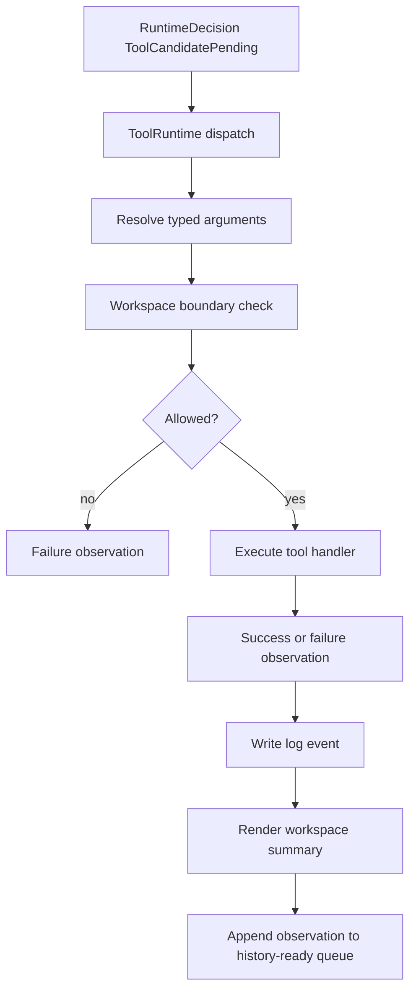
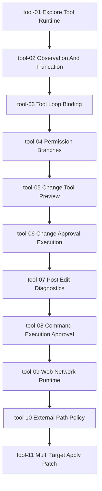

# Tool Runtime Technical Spec Korean Draft

## 목적

이 문서는 아름코드 Tool Runtime 구현 단위의 상위 기술 스펙이다.

Tool Runtime의 목적은 Local LLM Runtime이 만든 tool candidate를 실제 작업으로 실행하고, 그 결과를 observation으로 정리해 TUI, log, message history에 연결하는 것이다.

## 범위

포함:

- Explore tool 실행
- workspace path boundary
- typed observation
- output preview
- log event
- TUI workspace 표시
- 이후 LLM loop에 observation을 전달할 수 있는 데이터 구조

제외:

- mutation 직접 실행
- shell command 실행
- web/network 실행
- full LLM E2E
- long-term session context compaction

## 문서 구조

상위 문서:

- `docs/specs/implementation/tool-runtime-technical-spec.ko.md`

섹션 문서:

| ID | Document | Summary |
| --- | --- | --- |
| `tool-01` | `docs/specs/implementation/tool/tool-01-explore-tool-runtime.ko.md` | Explore tool runtime |
| `tool-02` | `docs/specs/implementation/tool/tool-02-observation-and-truncation.ko.md` | Observation preview and artifact truncation |
| `tool-03` | `docs/specs/implementation/tool/tool-03-tool-loop-binding.ko.md` | Tool observation to next LLM turn loop |
| `tool-04` | `docs/specs/implementation/tool/tool-04-permission-branches.ko.md` | Permission allow, approval, and deny branches |
| `tool-05` | `docs/specs/implementation/tool/tool-05-change-tool-preview.ko.md` | apply_patch preview and approval target |
| `tool-06` | `docs/tasks/tool-runtime-todo.ko.md` | approved change execution |
| `tool-07` | `docs/tasks/tool-runtime-todo.ko.md` | post-edit diagnostics observation |
| `tool-08` | `docs/tasks/tool-runtime-todo.ko.md` | command execution approval |
| `tool-09` | `docs/tasks/tool-runtime-todo.ko.md` | web/network runtime |
| `tool-10` | `docs/tasks/tool-runtime-todo.ko.md` | external path policy |
| `tool-11` | `docs/tasks/tool-runtime-todo.ko.md` | multi-target apply_patch preview/execution |

`tool-06` 이후 섹션은 별도 section 문서로 분리하지 않고 `docs/tasks/tool-runtime-todo.ko.md`의 완료 기록에 implementation boundary와 검증 결과를 유지한다.

후속 번호는 `docs/tasks/tool-runtime-todo.ko.md`의 `Tool Runtime And Defense Mapping` 표를 따른다. 24개 방어코드는 별도 대형 구현으로 한 번에 열지 않고, 해당 tool runtime capability가 열리는 번호에 같이 삽입한다.

## 모듈/파일 후보

초기 Rust 모듈 후보:

```text
src/tool/
  mod.rs
  registry.rs
  observation.rs
  runtime.rs
  path.rs
  explore.rs

src/tui/
  app.rs
  workspace.rs

src/llm/
  history.rs
  decision.rs
```

의미:

- `registry.rs`는 tool name과 runtime handler mapping을 소유한다.
- `observation.rs`는 tool 실행 결과의 typed data를 소유한다.
- `runtime.rs`는 tool dispatch와 공통 실행 boundary를 담당한다.
- `path.rs`는 workspace path resolution과 boundary check를 담당한다.
- `explore.rs`는 list/search/read/git status 같은 Explore handler를 담당한다.

주의:

- tool 실행부는 TUI widget을 직접 호출하지 않는다.
- tool 실행부는 LLM provider를 직접 호출하지 않는다.
- path를 조용히 normalize하지 않는다.
- 실행 실패는 자유문장만 남기지 않고 typed observation으로 남긴다.

## 공통 데이터 구조 후보

```rust
struct ToolRuntime {
    workspace_root: PathBuf,
    limits: ToolRuntimeLimits,
}

struct ToolCall {
    activity: Activity,
    tool_name: ToolName,
    arguments: ToolArguments,
    run_id: RunId,
    turn_id: TurnId,
}

enum ToolObservation {
    Success(ToolSuccessObservation),
    Failure(ToolFailureObservation),
}

struct ToolSuccessObservation {
    tool_name: String,
    target: Option<String>,
    preview: Vec<String>,
    truncated: bool,
    artifact: Option<String>,
}

struct ToolFailureObservation {
    tool_name: String,
    target: Option<String>,
    error_kind: ToolErrorKind,
    message: String,
    recoverable: bool,
}
```

## 전체 흐름



## 섹션 연결 순서



## Multi-Target Change Boundary

복수 파일 생성/수정은 여러 tool call을 한 응답에 허용하는 문제가 아니다.

계약은 다음과 같다.

```text
One response = one action candidate
One Change action = one apply_patch payload
One apply_patch payload = one or more target operations
```

따라서 Tool Runtime은 `apply_patch` payload를 target 단위로 파싱하되, 승인과 실행은 payload 전체를 하나의 atomic change로 다룬다.

필수 경계:

- 각 target path를 독립적으로 workspace boundary 검증한다.
- target path 중복을 거부한다.
- target 수, 전체 additions/deletions, target별 additions/deletions를 runtime limit과 비교한다.
- `Update File`은 해당 target의 사전 read/evidence가 있어야 한다.
- `Add File`은 기존 파일 충돌을 조용히 덮어쓰지 않는다.
- 실행 전 모든 target precondition을 확인한다.
- 실행 결과는 전체 성공 또는 전체 실패만 허용한다.
- 실패 observation은 실패 target과 실패 kind를 보존한다.

이 경계는 `tool-11-multi-target-apply-patch`에서 열린다.

## 로그 이벤트 후보

공통 scope:

```text
tool-01-explore-tool-runtime
```

공통 event 후보:

- `tool_call_received`
- `tool_argument_resolved`
- `tool_path_boundary_checked`
- `tool_execution_started`
- `tool_execution_succeeded`
- `tool_execution_failed`
- `tool_observation_recorded`
- `tool_workspace_summary_rendered`

## 검증 기준

- 각 번호의 todo 완료 기준을 따른다.
- `cargo test`가 통과해야 한다.
- main smoke가 유지되어야 한다.
- 실제 workspace 파일을 대상으로 한 확인이 가능해야 한다.
- observation log가 남아야 한다.

## 금지 사항

- LLM 응답을 바로 파일 시스템 작업으로 실행하지 않는다.
- path를 조용히 수정해서 실행하지 않는다.
- tool 실패를 LLM 실패와 같은 오류로 뭉치지 않는다.
- Explore 구현 중 Change/Execute/Configure 실행을 같이 구현하지 않는다.
- 단순 helper마다 테스트 파일을 늘리지 않는다.

## Change History

### 2026-05-15

- Created parent Tool Runtime technical spec.
- Added routing to `tool-01-explore-tool-runtime`.

### 2026-05-17

- Added routing to `tool-02-observation-and-truncation`.
- Added routing to `tool-03-tool-loop-binding`.
- Added routing to `tool-04-permission-branches`.
- Added routing to `tool-05-change-tool-preview`.

### 2026-05-19

- Added routing placeholders for `tool-06` through `tool-10`.
- Linked follow-up tool runtime routing to the defense-code mapping in `docs/tasks/tool-runtime-todo.ko.md`.

### 2026-05-20

- Marked `tool-06` through `tool-10` as implemented via `docs/tasks/tool-runtime-todo.ko.md`.
- Tool runtime line is complete through approved patch execution, post-edit diagnostics, bounded command execution, web/network runtime, and external path policy.
- Implementation commit: `cff3112 Complete persona and tool runtime`.

### 2026-05-22

- Added `tool-11` as the next Tool Runtime capability for multi-target `apply_patch`.
- Clarified that multi-file changes keep the one-candidate-per-response contract and expand only the patch payload target model.
- Recorded atomic preview/execution boundaries for multi-target change handling.
