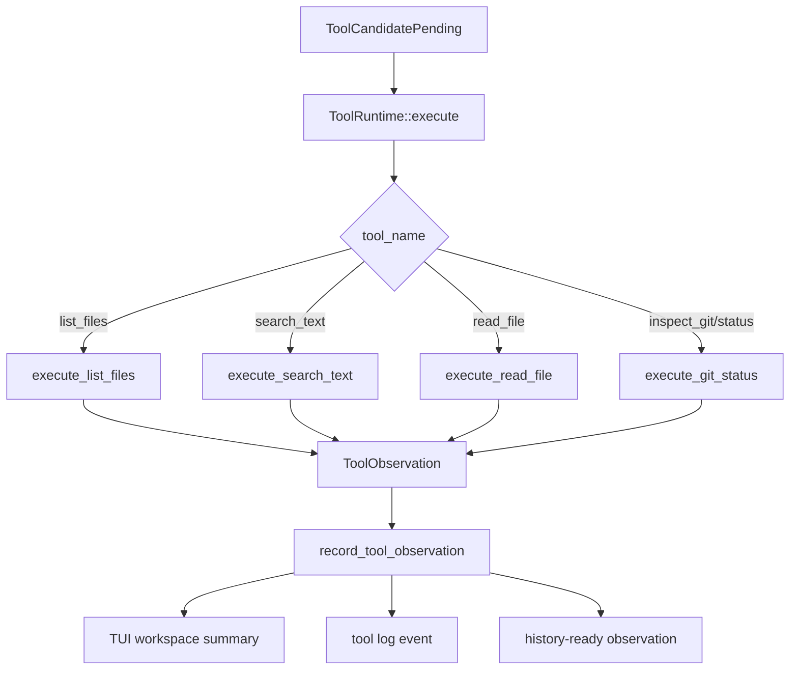

# tool-01 Explore Tool Runtime

## 목적

`tool-01`은 Explore 계열 도구를 실제 workspace 대상으로 실행하고 observation을 남기는 첫 Tool Runtime 구현이다.

목표는 "파일을 읽을 수 있다"가 아니다. 목표는 모델이 제안한 Explore 후보를 runtime이 검증하고 실행한 뒤, 그 결과를 다음 판단 근거로 사용할 수 있는 구조를 만드는 것이다.

## 범위

포함:

- `list_files`
- `search_text`
- `read_file`
- `inspect_git` 중 `status`
- workspace-relative path resolution
- workspace boundary check
- typed observation
- TUI workspace summary
- log event

제외:

- `find_files`
- `web_search`
- `web_fetch`
- `run_command`
- `apply_patch`
- mutation 실행
- full LLM E2E

## 구현 모듈/파일

```text
src/tool/
  mod.rs
  observation.rs
  path.rs
  explore.rs
  runtime.rs
```

역할:

- `observation.rs`: success/failure observation 타입과 formatter
- `path.rs`: workspace-relative path resolution과 boundary check
- `explore.rs`: list/search/read/git status handler
- `runtime.rs`: tool dispatch와 tool call envelope
- `src/tui/app.rs`: decision 이후 tool execution 연결, workspace/log/history-ready observation 기록

## 주요 데이터 구조

```rust
enum ExploreTool {
    ListFiles,
    SearchText,
    ReadFile,
    InspectGitStatus,
}

struct WorkspacePath {
    raw: String,
    resolved: PathBuf,
    display: String,
}

enum ToolErrorKind {
    InvalidArguments,
    PathOutsideWorkspace,
    PathNotFound,
    NotAFile,
    NotADirectory,
    IoError,
    GitError,
}

struct ToolObservation {
    status: ObservationStatus,
    tool_name: String,
    target_raw: Option<String>,
    target_resolved: Option<String>,
    preview: Vec<String>,
    truncated: bool,
    error_kind: Option<ToolErrorKind>,
    message: String,
}
```

## 함수 후보

### `ToolRuntime::execute`

역할:

- `RuntimeDecision::ToolCandidatePending` 또는 equivalent tool call을 받는다.
- tool name을 Explore handler로 dispatch한다.
- observation을 반환한다.

### `resolve_workspace_path`

역할:

- raw workspace-relative path를 absolute path로 해석한다.
- workspace root 밖으로 나가면 실패한다.
- 원본 path와 resolved path를 observation/log에 남길 수 있게 한다.

### `execute_list_files`

역할:

- directory entry를 읽는다.
- `max_depth`, `max_entries`를 지킨다.
- 결과 preview를 observation으로 만든다.

### `execute_search_text`

역할:

- workspace 내부 파일에서 literal search를 수행한다.
- `use_regex=true`는 `tool-01`에서 지원 여부를 명확히 결정한다.
- `max_results`를 지킨다.

### `execute_read_file`

역할:

- 지정 파일의 `start_line`, `max_lines` 범위를 읽는다.
- 파일 전체를 읽은 것처럼 표시하지 않는다.

### `execute_git_status`

역할:

- `git status --short` 수준의 상태 요약을 observation으로 만든다.
- git repository가 아니면 failure observation으로 남긴다.

### `record_tool_observation`

역할:

- observation을 TUI workspace, log, history-ready queue에 연결한다.
- 자유문장만 저장하지 않는다.

## 함수 연결 흐름



## 로그 이벤트

scope:

```text
tool-01-explore-tool-runtime
```

event 후보:

- `tool_call_received`
- `tool_argument_resolved`
- `tool_path_boundary_checked`
- `tool_execution_started`
- `tool_execution_succeeded`
- `tool_execution_failed`
- `tool_observation_recorded`
- `tool_workspace_summary_rendered`

필수 data 후보:

- `run_id`
- `turn_id`
- `tool_name`
- `activity`
- `target_raw`
- `target_resolved`
- `status`
- `error_kind`
- `preview_line_count`
- `truncated`

## 완료 기준

- Explore tool candidate를 실제 handler로 dispatch할 수 있다.
- `list_files`, `search_text`, `read_file`, `inspect_git/status`가 observation을 반환한다.
- workspace 밖 path는 실행하지 않는다.
- TUI workspace에 tool observation summary가 표시된다.
- log에 tool observation이 남는다.
- `cargo fmt --check`가 통과한다.
- `cargo test`가 통과한다.
- `cargo run -- --scene main --smoke`가 통과한다.

## 금지 사항

- path를 조용히 보정해서 실행하지 않는다.
- 실패를 성공처럼 workspace에 표시하지 않는다.
- search/read 결과가 잘렸는데 전체를 읽은 것처럼 기록하지 않는다.
- `run_command`를 사용해 read/search/list를 우회 구현하지 않는다.
- mutation tool 코드를 같이 넣지 않는다.

## Change History

### 2026-05-15

- Created `tool-01` technical spec for Explore tool runtime.

### 2026-05-17

- Implemented `src/tool` Explore runtime with `list_files`, `search_text`, `read_file`, and `inspect_git/status`.
- Preserved tool arguments in `RuntimeDecision::ToolCandidatePending` so approved Explore candidates can execute real workspace tools.
- Connected Explore observations to TUI workspace activity/evidence output, LLM history-ready internal message, and `tool-01-explore-tool-runtime` log events.
- Verified with `cargo fmt --check`, `cargo test`, and `cargo run -- --scene main --smoke`.
