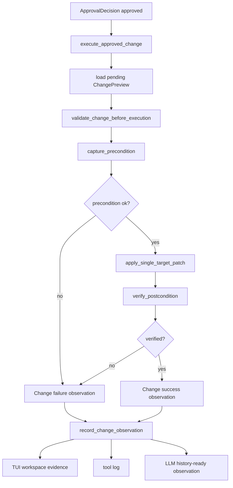

# tool-06 Change Approval Execution

## 목적

`tool-06`은 approval surface에서 사용자가 승인한 `apply_patch` preview만 실제 workspace에 적용한다.

이 단계의 목적은 모델이 만든 Change 후보를 곧바로 파일 시스템에 반영하는 것이 아니다. `tool-05`에서 만든 preview와 approval decision을 연결하고, 적용 직전에도 target, patch grammar, workspace boundary, precondition을 다시 확인한 뒤, 성공/실패를 typed observation으로 남기는 것이다.

핵심 원칙:

```text
preview 없는 mutation은 실행하지 않는다.
approval 없는 mutation은 실행하지 않는다.
approval 이후에도 실행 직전 검증을 다시 한다.
```

## 범위

포함:

- approval result와 pending change preview 연결
- 승인 전 patch 적용 금지
- 승인 후 patch grammar, target, workspace boundary 재검증
- target precondition snapshot 기록
- single-file Add/Update/Delete patch 적용
- 적용 후 postcondition 확인
- 성공/실패 typed observation 생성
- TUI workspace evidence 반영
- tool/log/history observation 연결

제외:

- multi-target patch 적용
- shell command 실행
- formatter/build/test 자동 실행
- post-edit diagnostics 자동 수정
- fuzzy target selection
- 실패한 patch를 임의로 다른 patch로 보정

## 관련 방어코드

| Code | Defense | 적용 의미 |
| ---: | --- | --- |
| 2 | Two-Phase Mutation | preview와 execution을 분리한다. |
| 3 | Precondition Snapshot | 적용 전 파일 상태를 기록한다. |
| 4 | Patch Impact Guard | target과 additions/deletions를 제한한다. |
| 5 | Unique Target Requirement | `tool-06`은 single target만 실행한다. |
| 6 | Observation Schema | 성공/실패를 typed observation으로 남긴다. |
| 12 | Postcondition Verification | 적용 후 실제 파일 상태를 확인한다. |
| 13 | No Silent Normalization | path/patch/payload를 조용히 고치지 않는다. |
| 14 | Tool Error Taxonomy | 실패 원인을 분류한다. |
| 21 | Tool Argument Schema-First Gate | 실행 직전에도 argument 계약을 확인한다. |

## 구현 모듈/파일

```text
src/tool/
  change.rs
  observation.rs
  path.rs
  runtime.rs

src/tui/
  app.rs
  runtime_workspace.rs

src/llm/
  history.rs
```

역할:

- `change.rs`: approved patch execution과 pre/postcondition 검증
- `observation.rs`: change success/failure observation 구조
- `path.rs`: workspace-relative target guard
- `runtime.rs`: Change execution dispatch
- `runtime_workspace.rs`: workspace evidence 출력
- `history.rs`: 다음 LLM turn에 전달할 observation message 보관

## 데이터 구조 후보

```rust
struct ApprovedChangeExecution {
    run_id: RunId,
    turn_id: TurnId,
    approval_id: ApprovalId,
    preview: ChangePreview,
}

struct ChangePrecondition {
    target_path: String,
    existed: bool,
    byte_len: Option<u64>,
    modified_at: Option<SystemTime>,
    content_hash: Option<String>,
}

enum ChangeExecutionStatus {
    Applied,
    Failed(ChangeErrorKind),
}

struct ChangeExecutionObservation {
    target_path: String,
    operation: PatchOperation,
    status: ChangeExecutionStatus,
    precondition: ChangePrecondition,
    postcondition_verified: bool,
    message: String,
}
```

## 함수 후보

### `execute_approved_change`

역할:

- approval result와 pending `ChangePreview`를 연결한다.
- 승인되지 않았거나 stale approval이면 실행하지 않는다.
- 실행 전 재검증을 수행하고 observation을 반환한다.

### `validate_change_before_execution`

역할:

- patch grammar, target path, workspace boundary를 다시 확인한다.
- `ChangePreview`와 payload target이 일치하는지 검증한다.
- `tool-05` 이후 approval 대기 중 payload가 바뀐 경우 실행하지 않는다.

### `capture_precondition`

역할:

- target 파일 존재 여부, 길이, mtime, content hash를 기록한다.
- `Update File`과 `Delete File`은 기존 파일 상태가 예상과 맞는지 확인한다.
- `Add File`은 기존 파일 충돌을 조용히 overwrite하지 않는다.

### `apply_single_target_patch`

역할:

- single Add/Update/Delete patch를 실제 파일 시스템에 적용한다.
- patch apply 실패를 자유문장이 아니라 `ChangeErrorKind`로 분류한다.

### `verify_postcondition`

역할:

- 적용 후 파일 상태가 operation과 일치하는지 확인한다.
- 성공했다고 말하기 전에 실제 파일 상태를 다시 본다.

### `record_change_observation`

역할:

- workspace evidence, tool log, LLM history-ready queue에 observation을 연결한다.
- 실패 observation도 다음 LLM turn의 근거가 되게 한다.

## 함수 연결 흐름



## 로그 이벤트

scope:

```text
tool-06-change-approval-execution
```

event 후보:

- `change_execution_requested`
- `change_execution_revalidated`
- `change_precondition_captured`
- `change_precondition_failed`
- `change_patch_apply_started`
- `change_patch_apply_succeeded`
- `change_patch_apply_failed`
- `change_postcondition_verified`
- `change_observation_recorded`

필수 data 후보:

- `run_id`
- `turn_id`
- `approval_id`
- `payload_id`
- `target_path`
- `operation`
- `additions`
- `deletions`
- `precondition_status`
- `postcondition_verified`
- `error_kind`

## 완료 기준

- 승인되지 않은 change 후보는 파일 시스템에 반영되지 않는다.
- 승인된 change도 precondition이 달라졌으면 적용하지 않는다.
- 적용 성공 시 실제 파일 상태와 observation/log가 일치한다.
- 적용 실패는 `permission_error`, `path_error`, `schema_error`, `execution_error` 등 taxonomy로 구분된다.
- runtime이 path, patch, payload를 조용히 바꿔 적용하지 않는다.
- TUI workspace와 LLM history에 success/failure observation이 남는다.
- `cargo fmt --check`가 통과한다.
- `cargo test`가 통과한다.
- `cargo run -- --scene main --smoke`가 통과한다.

## 금지 사항

- approval 없이 patch를 적용하지 않는다.
- approval 후 payload를 다시 해석해 다른 target에 적용하지 않는다.
- precondition mismatch를 무시하지 않는다.
- 실패한 patch를 fuzzy edit로 자동 전환하지 않는다.
- 일부 성공을 전체 성공처럼 기록하지 않는다.
- post-edit diagnostics를 이 단계에서 자동 수정으로 연결하지 않는다.

## Change History

### 2026-06-02

- Added missing detailed technical specification for `tool-06` without modifying the existing parent or task documents.
- Derived scope, defense mapping, completion criteria, and implementation notes from `docs/tasks/tool-runtime-todo.ko.md`.
