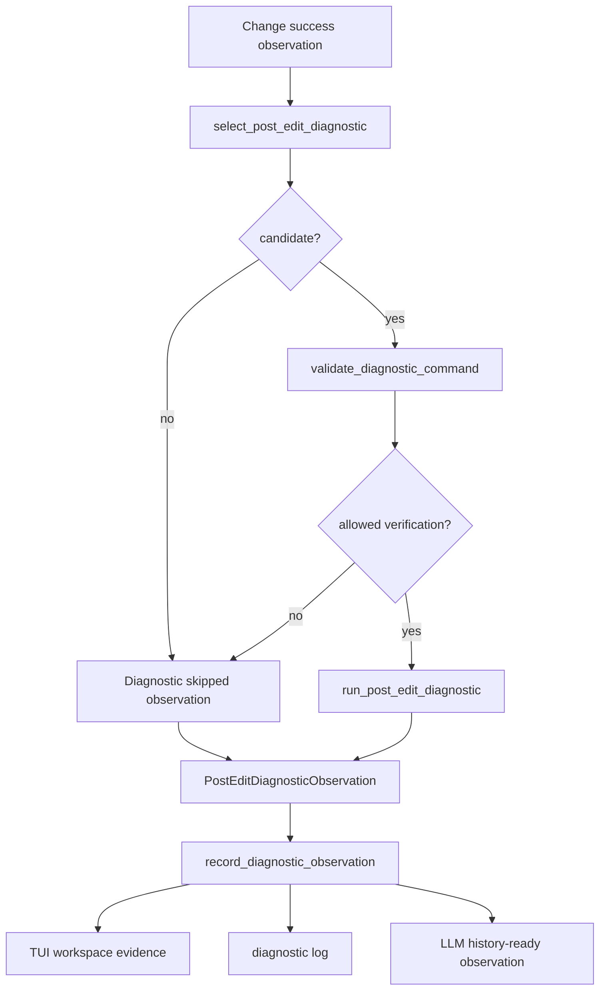

# tool-07 Post Edit Diagnostics

## 목적

`tool-07`은 파일 변경 적용 후 진단 결과를 observation으로 남긴다.

이 단계의 목적은 변경 후 자동으로 더 많은 수정을 수행하는 것이 아니다. 사용 가능한 project command가 명확할 때만 최소 진단 후보를 선택하고, 실행 결과를 observation으로 기록해 사용자가 변경 신뢰도를 판단할 수 있게 한다.

핵심 원칙:

```text
diagnostics는 evidence다.
diagnostics 실패는 자동 수정 명령이 아니다.
명령이 불명확하면 추측하지 않는다.
```

## 범위

포함:

- 변경 대상과 관련된 최소 진단 후보 선택
- 사용 가능한 project command가 명확할 때만 진단 실행 후보 생성
- Rust/Cargo 대상의 `cargo check` 진단 후보
- 진단 실행 결과 typed observation
- 긴 진단 출력 preview/artifact 분리
- TUI workspace와 log 연결

제외:

- 임의 command 추론
- 전체 test/build 반복 실행
- 진단 실패 자동 수정
- shell command capability 확장
- LSP 서버 통합
- formatter 자동 실행

## 관련 방어코드

| Code | Defense | 적용 의미 |
| ---: | --- | --- |
| 12 | Postcondition Verification | 변경 적용 후 실제 상태를 확인한 뒤 진단한다. |
| 24 | Post-Edit Diagnostics Hook | 진단 결과를 observation으로 남기되 자동 수정하지 않는다. |

## 구현 모듈/파일

```text
src/tool/
  diagnostics.rs
  command_policy.rs
  observation.rs

src/tui/
  runtime_workspace.rs

src/logging/
  writer.rs
```

역할:

- `diagnostics.rs`: 변경 대상 기반 진단 후보 선택과 실행 결과 변환
- `command_policy.rs`: 진단 명령이 bounded/safe verification인지 확인
- `observation.rs`: `post_edit_diagnostics` observation 구조
- `runtime_workspace.rs`: workspace evidence 출력
- `writer.rs`: diagnostic log event 기록

## 데이터 구조 후보

```rust
struct DiagnosticCandidate {
    command: Vec<String>,
    cwd: PathBuf,
    reason: String,
    related_targets: Vec<String>,
}

enum DiagnosticStatus {
    Passed,
    Failed,
    Skipped(DiagnosticSkipReason),
}

enum DiagnosticSkipReason {
    NoKnownProjectCommand,
    TargetNotCovered,
    UnsupportedProjectType,
    RequiresUserApproval,
}

struct PostEditDiagnosticObservation {
    status: DiagnosticStatus,
    command: Option<Vec<String>>,
    related_targets: Vec<String>,
    preview: Vec<String>,
    artifact_path: Option<String>,
    message: String,
}
```

## 함수 후보

### `select_post_edit_diagnostic`

역할:

- 변경 target과 workspace evidence를 보고 최소 진단 후보를 고른다.
- `Cargo.toml`이 있고 Rust/Cargo 파일 변경이면 `cargo check` 후보를 만든다.
- 확인되지 않은 lint/test/formatter 명령을 만들지 않는다.

### `validate_diagnostic_command`

역할:

- 진단 명령이 command policy상 bounded verification인지 확인한다.
- destructive, external, high-load 명령은 진단 후보로 승격하지 않는다.

### `run_post_edit_diagnostic`

역할:

- 선택된 진단 명령을 실행한다.
- stdout/stderr/exit code를 observation으로 변환한다.
- command timeout과 실패를 taxonomy로 남긴다.

### `record_diagnostic_observation`

역할:

- TUI workspace, log, LLM history-ready queue에 진단 observation을 연결한다.
- 실패를 자동 추가 수정으로 연결하지 않는다.

## 함수 연결 흐름



## 로그 이벤트

scope:

```text
tool-07-post-edit-diagnostics
```

event 후보:

- `post_edit_diagnostic_selected`
- `post_edit_diagnostic_skipped`
- `post_edit_diagnostic_started`
- `post_edit_diagnostic_completed`
- `post_edit_diagnostic_failed`
- `post_edit_diagnostic_observation_recorded`

필수 data 후보:

- `run_id`
- `turn_id`
- `related_targets`
- `command`
- `cwd`
- `status`
- `exit_code`
- `skip_reason`
- `preview_line_count`
- `artifact_path`

## 완료 기준

- 변경 후 진단 결과가 있으면 observation으로 남는다.
- 진단 결과만으로 추가 파일 수정을 자동 수행하지 않는다.
- command가 불명확하면 사용자에게 명시적으로 묻거나 skip observation을 남긴다.
- Rust/Cargo 대상 외에는 다른 명령을 추측하지 않는다.
- 긴 진단 출력은 preview/artifact 정책을 따른다.
- TUI workspace와 log에서 진단 상태를 확인할 수 있다.
- `cargo fmt --check`가 통과한다.
- `cargo test`가 통과한다.
- `cargo run -- --scene main --smoke`가 통과한다.

## 금지 사항

- 진단 실패를 자동 patch 생성으로 연결하지 않는다.
- 확인되지 않은 test/lint/format 명령을 만들지 않는다.
- 전체 테스트를 기본 진단으로 반복 실행하지 않는다.
- 진단 출력을 final answer 성공 근거로 과장하지 않는다.
- command policy를 우회해 shell 문자열을 실행하지 않는다.

## Change History

### 2026-06-02

- Added missing detailed technical specification for `tool-07` without modifying existing documents.
- Derived diagnostic scope and completion criteria from `docs/tasks/tool-runtime-todo.ko.md`.
