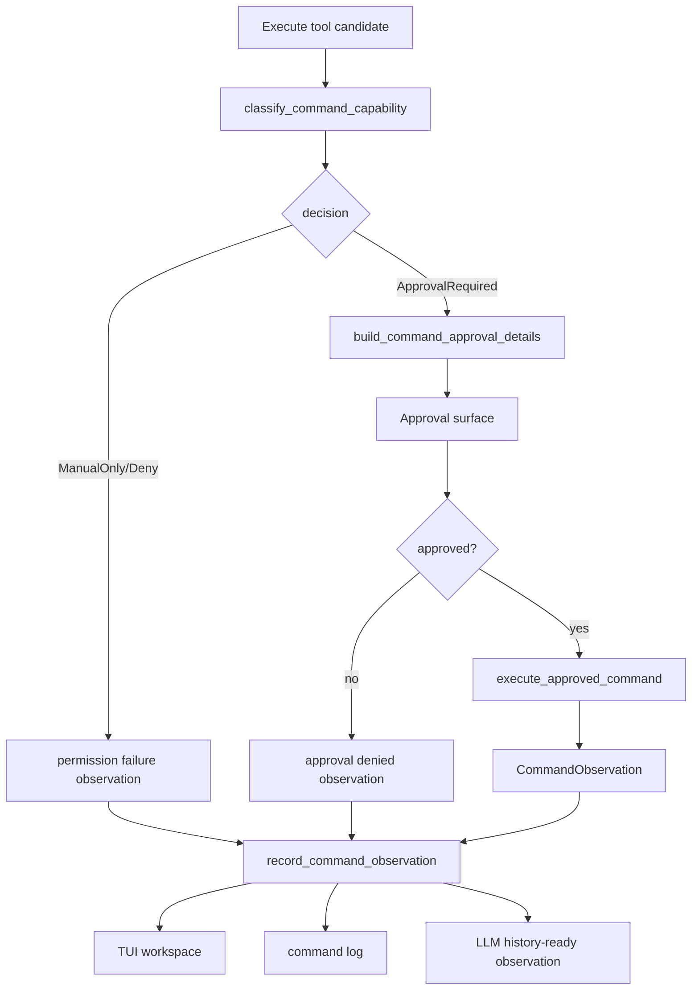

# tool-08 Command Execution Approval

## 목적

`tool-08`은 bounded command 후보를 approval 이후 실행하고, command 원문/파싱 결과/권한 판단/실행 결과를 observation으로 남긴다.

이 단계의 목적은 shell 자유 실행을 여는 것이 아니다. `argv` 기반 command 후보만 다루고, capability policy와 ManualOnly 경계를 통과한 safe verification 계열만 사용자 승인 뒤 실행한다.

핵심 원칙:

```text
shell string은 실행 계약이 아니다.
argv와 capability policy가 실행 경계다.
ManualOnly는 approval보다 우선한다.
```

## 범위

포함:

- argv 기반 command 후보 실행
- capability policy 기반 approval/deny/manual-only 분기
- approval 화면에 original command와 parsed argv 표시
- broad persistent approval prefix 차단
- hidden/unicode marker 감지
- cwd boundary 확인
- timeout 적용
- 실행 결과 typed observation 생성
- command log event 기록

제외:

- raw shell script 실행
- pipe/redirect/substitution 자동 실행
- destructive/system/high-load command 실행
- 외부 서비스 변경 command 자동 실행
- broad persistent approval 허용
- background daemon 실행

## 관련 방어코드

| Code | Defense | 적용 의미 |
| ---: | --- | --- |
| 9 | Command Capability Split | command 위험도를 capability로 분류한다. |
| 10 | Shell-Free Command Schema | shell string 대신 argv 계약을 사용한다. |
| 11 | Dry-Run First | dry-run 없는 mutation command는 실행하지 않는다. |
| 15 | Human Boundary Rule | 고위험 작업은 직접 실행하지 않는다. |
| 16 | Approval Persistence Broad Prefix Deny List | broad prefix 영구 승인을 막는다. |
| 17 | Command Original Vs Parsed Display | 승인 화면에 원문과 해석 결과를 함께 보여준다. |
| 18 | Hidden/Unicode Character Marker | 혼동 문자를 위험 표식으로 남긴다. |

## 구현 모듈/파일

```text
src/tool/
  command_policy.rs
  command_runtime.rs
  permission.rs
  observation.rs

src/tui/
  approval_surface.rs
  runtime_workspace.rs

src/logging/
  writer.rs
```

역할:

- `command_policy.rs`: argv를 capability로 분류하고 ManualOnly/approval 여부 결정
- `command_runtime.rs`: 승인된 argv command 실행
- `permission.rs`: approval/deny/manual-only branch 연결
- `observation.rs`: command success/failure observation
- `approval_surface.rs`: original/parsed command와 risk 표시

## 데이터 구조 후보

```rust
struct CommandCandidate {
    original: String,
    argv: Vec<String>,
    cwd: PathBuf,
    timeout_ms: u64,
    reason: String,
}

enum CommandCapability {
    ReadOnly,
    BuildTest,
    Mutation,
    ProcessControl,
    DestructiveFilesystem,
    SystemLevel,
    ExternalService,
    HighLoad,
    Unknown,
}

enum CommandDecision {
    ApprovalRequired(CommandApprovalDetails),
    ManualOnly(CommandManualOnlyReason),
    Denied(CommandDenyReason),
}

struct CommandObservation {
    argv: Vec<String>,
    cwd: String,
    exit_code: Option<i32>,
    status: ObservationStatus,
    preview: Vec<String>,
    artifact_path: Option<String>,
    error_kind: Option<ToolErrorKind>,
}
```

## 함수 후보

### `classify_command_capability`

역할:

- argv와 cwd를 command capability로 분류한다.
- destructive/system/high-load/external-service/process-control 명령은 ManualOnly로 보낸다.
- 단순 command name denylist가 아니라 capability policy로 판단한다.

### `build_command_approval_details`

역할:

- approval surface에 original command, parsed argv, cwd, timeout, risk marker를 전달한다.
- hidden/unicode character 여부를 표시한다.
- persistent approval 가능 여부를 계산한다.

### `execute_approved_command`

역할:

- approval 이후에도 command policy를 다시 평가한다.
- 승인된 argv만 실행한다.
- stdout/stderr/exit code를 observation으로 만든다.

### `record_command_observation`

역할:

- command result를 TUI workspace, log, LLM history-ready queue에 연결한다.

## 함수 연결 흐름



## 로그 이벤트

scope:

```text
tool-08-command-execution-approval
```

event 후보:

- `command_candidate_received`
- `command_capability_classified`
- `command_manual_only_selected`
- `command_approval_requested`
- `command_approval_resolved`
- `command_execution_started`
- `command_execution_completed`
- `command_execution_failed`
- `command_observation_recorded`

필수 data 후보:

- `run_id`
- `turn_id`
- `original_command`
- `parsed_argv`
- `cwd`
- `capability`
- `decision`
- `timeout_ms`
- `exit_code`
- `hidden_character_marker`
- `persistent_approval_allowed`
- `error_kind`

## 완료 기준

- ManualOnly command는 approval surface에 올라가지 않는다.
- 승인 화면에는 모델 원문과 runtime 해석 결과가 함께 보인다.
- 실행 직전에도 command policy를 다시 평가한다.
- 실행 결과와 실패가 typed observation/log로 남는다.
- shell pipe/redirect/substitution은 자동 실행되지 않는다.
- destructive/system/high-load/external-service command는 직접 실행되지 않는다.
- `cargo fmt --check`가 통과한다.
- `cargo test`가 통과한다.
- `cargo run -- --scene main --smoke`가 통과한다.

## 금지 사항

- raw shell string을 실행하지 않는다.
- approval을 받았다는 이유로 ManualOnly 경계를 우회하지 않는다.
- `rm`, `sudo`, `kill` 같은 문자열 일부만 보는 휴리스틱에 의존하지 않는다.
- broad persistent approval prefix를 저장하지 않는다.
- mutation command를 dry-run 없이 실행하지 않는다.
- command output 실패를 final answer 성공 근거로 사용하지 않는다.

## Change History

### 2026-06-02

- Added missing detailed technical specification for `tool-08`.
- Derived command safety, approval, and observation requirements from `docs/tasks/tool-runtime-todo.ko.md` and permission policy documents.
