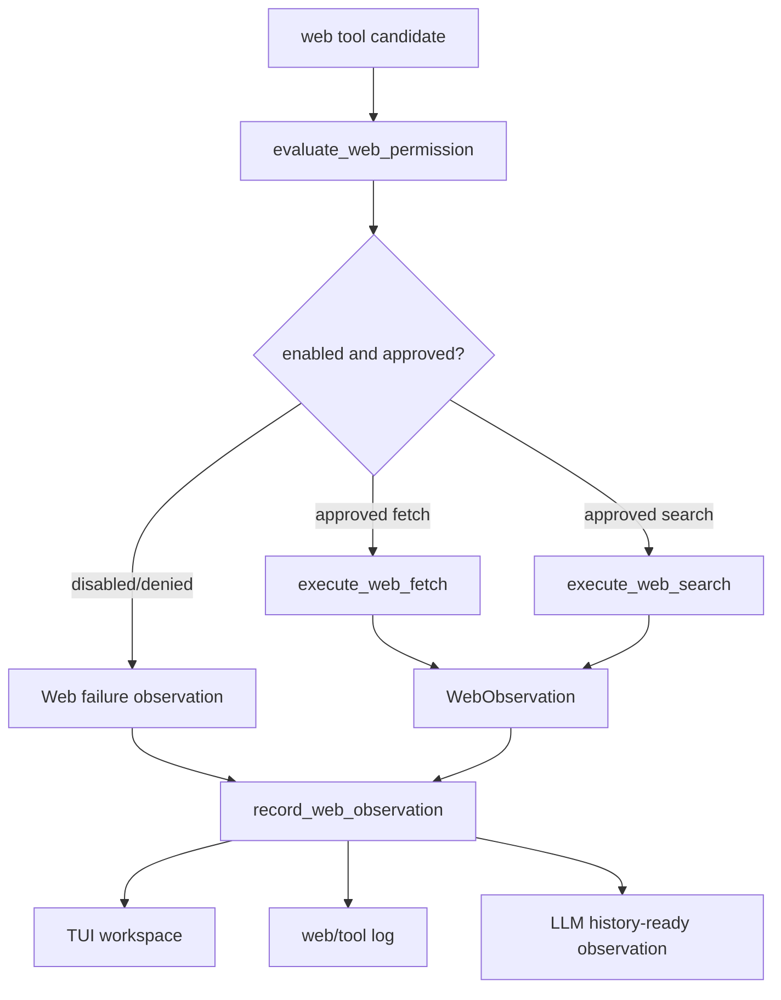

# tool-09 Web Network Runtime

## 목적

`tool-09`는 web/network 도구를 local file Explore와 분리된 permission branch로 실행한다.

웹 검색과 fetch는 Explore 성격을 가질 수 있지만, 로컬 파일 read와 같은 권한으로 다루면 안 된다. network는 외부 요청이고, timeout, HTTP status, provider/network failure, privacy 위험을 별도로 다뤄야 한다.

핵심 원칙:

```text
web은 Explore일 수 있지만 local read가 아니다.
web.enabled는 무승인 실행을 뜻하지 않는다.
network 결과는 preview/artifact observation으로 남긴다.
```

## 범위

포함:

- `web.enabled` 설정 확인
- `web_search`, `web_fetch` registry/schema 등록
- web/network approval branch 유지
- fetch/search 결과 preview와 artifact 분리
- timeout/network/http status error taxonomy
- web result typed observation
- web log event 기록

제외:

- 브라우저 자동 조작
- 외부 서비스 상태 변경
- credential 필요한 요청
- 웹 결과를 workspace 파일로 자동 저장
- 로그인 세션/cookie 사용
- 무제한 crawling

## 관련 방어코드

| Code | Defense | 적용 의미 |
| ---: | --- | --- |
| 6 | Observation Schema | web 결과도 typed observation으로 남긴다. |
| 14 | Tool Error Taxonomy | timeout/network/http 오류를 분리한다. |
| 20 | Network/Web Permission Branch | local read와 다른 permission branch를 탄다. |
| 23 | Full Output Artifact | 긴 web 결과를 preview와 artifact로 분리한다. |

## 구현 모듈/파일

```text
src/tool/
  web.rs
  registry.rs
  permission.rs
  observation.rs

src/config/
  schema.rs

src/tui/
  approval_surface.rs
  runtime_workspace.rs

src/logging/
  writer.rs
```

역할:

- `web.rs`: web_search/web_fetch 실행과 결과 변환
- `registry.rs`: web tool schema와 activity mapping
- `permission.rs`: web enabled/approval/deny branch
- `schema.rs`: `[web] enabled` 설정
- `observation.rs`: web success/failure observation

## 데이터 구조 후보

```rust
struct WebFetchArgs {
    url: String,
    max_bytes: usize,
}

struct WebSearchArgs {
    query: String,
    max_results: usize,
}

enum WebErrorKind {
    DisabledByConfig,
    PermissionDenied,
    InvalidUrl,
    Timeout,
    NetworkError,
    HttpStatus,
    TooLarge,
}

struct WebObservation {
    tool_name: String,
    target: String,
    status: ObservationStatus,
    preview: Vec<String>,
    artifact_path: Option<String>,
    error_kind: Option<WebErrorKind>,
}
```

## 함수 후보

### `evaluate_web_permission`

역할:

- `web.enabled` 설정을 확인한다.
- disabled이면 실행하지 않고 deny observation으로 보낸다.
- enabled여도 local Explore allow path가 아니라 approval branch로 보낸다.

### `execute_web_fetch`

역할:

- URL schema를 검증한다.
- timeout과 size limit을 적용한다.
- HTTP status와 network failure를 taxonomy로 분류한다.

### `execute_web_search`

역할:

- query와 max_results를 검증한다.
- 검색 결과를 preview/artifact observation으로 변환한다.

### `record_web_observation`

역할:

- web 결과를 TUI workspace, log, LLM history-ready queue에 연결한다.
- web 결과를 workspace 파일로 자동 저장하지 않는다.

## 함수 연결 흐름



## 로그 이벤트

scope:

```text
tool-09-web-network-runtime
```

event 후보:

- `web_candidate_received`
- `web_permission_evaluated`
- `web_approval_requested`
- `web_request_started`
- `web_request_completed`
- `web_request_failed`
- `web_observation_recorded`

필수 data 후보:

- `run_id`
- `turn_id`
- `tool_name`
- `url_or_query_summary`
- `web_enabled`
- `approval_result`
- `status`
- `http_status`
- `error_kind`
- `total_bytes`
- `artifact_path`

## 완료 기준

- web disabled 상태에서는 실행하지 않고 failure observation을 남긴다.
- web enabled 상태에서도 local read와 별도 permission branch를 탄다.
- 긴 web 결과는 preview와 artifact로 분리된다.
- timeout/network/http status 오류가 taxonomy로 구분된다.
- 웹 결과를 workspace 파일에 자동 저장하지 않는다.
- TUI workspace와 log에 web observation이 남는다.
- `cargo fmt --check`가 통과한다.
- `cargo test`가 통과한다.
- `cargo run -- --scene main --smoke`가 통과한다.

## 금지 사항

- `web.enabled=true`를 무승인 network 실행으로 해석하지 않는다.
- credential, cookie, login session을 사용하지 않는다.
- web 결과를 자동으로 파일에 저장하지 않는다.
- browser automation이나 외부 서비스 상태 변경을 열지 않는다.
- local file Explore와 web Explore를 같은 permission branch로 합치지 않는다.

## Change History

### 2026-06-02

- Added missing detailed technical specification for `tool-09`.
- Derived web/network branch and observation requirements from `docs/tasks/tool-runtime-todo.ko.md`, configuration policy, and permission policy.
