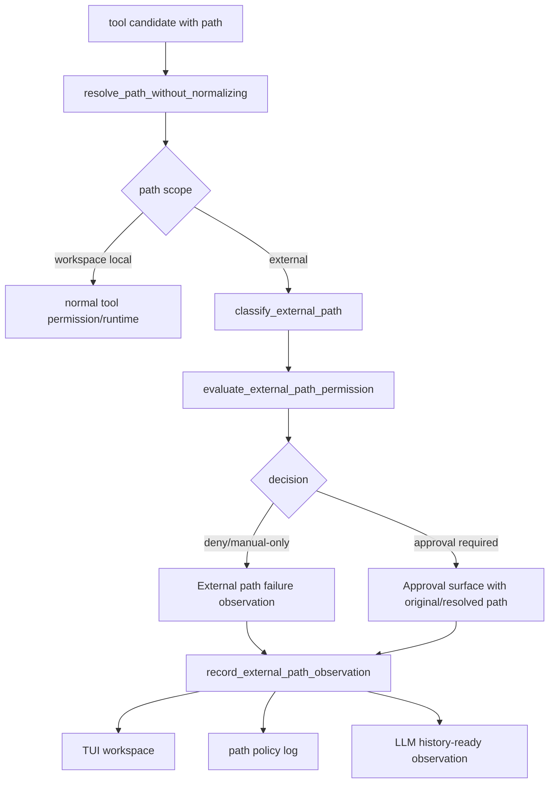

# tool-10 External Path Policy

## 목적

`tool-10`은 workspace 밖 path 접근을 workspace 내부 접근과 분리한다.

모델이 만든 path가 workspace 밖을 가리키면, runtime이 이를 조용히 workspace 내부 path로 보정하거나 local read처럼 실행하면 안 된다. 원본 path와 resolved path를 보존하고, external path permission branch, sensitive path deny, ManualOnly guidance로 분리해야 한다.

핵심 원칙:

```text
workspace 밖 접근은 local workspace 접근이 아니다.
path를 조용히 normalize하지 않는다.
민감 경로는 approval이 아니라 deny/manual-only로 흐른다.
```

## 범위

포함:

- workspace 외부 read/write 후보 분류
- external path approval/manual-only branch
- original path와 resolved path 표시
- sensitive/system path deny
- failure observation taxonomy
- LLM history-ready observation 연결

제외:

- 외부 경로 broad allow
- 홈 디렉터리 전체 접근
- 시스템/보안/credential 파일 접근
- path fuzzy correction
- 외부 경로 write capability
- 외부 경로 persistent permission 저장

## 관련 방어코드

| Code | Defense | 적용 의미 |
| ---: | --- | --- |
| 13 | No Silent Normalization | path를 조용히 보정하지 않는다. |
| 14 | Tool Error Taxonomy | external/sensitive path 오류를 분류한다. |
| 15 | Human Boundary Rule | high-impact 외부 접근을 직접 실행하지 않는다. |
| 19 | External Path Permission Branch | workspace 밖 접근을 별도 branch로 둔다. |

## 구현 모듈/파일

```text
src/tool/
  path.rs
  permission.rs
  observation.rs
  runtime.rs

src/tui/
  approval_surface.rs
  runtime_workspace.rs

src/logging/
  writer.rs
```

역할:

- `path.rs`: original/resolved path, workspace boundary, sensitive marker 계산
- `permission.rs`: external path branch와 manual-only/deny 판단
- `observation.rs`: external path failure observation
- `runtime.rs`: 실행 직전 path boundary 재확인
- `approval_surface.rs`: 필요 시 original/resolved path 표시

## 데이터 구조 후보

```rust
struct PathResolution {
    original_path: String,
    resolved_path: PathBuf,
    scope: PathScope,
    sensitive: bool,
}

enum PathScope {
    WorkspaceLocal,
    WorkspaceExternal,
}

enum ExternalPathDecision {
    DenySensitive,
    ManualOnly,
    ApprovalRequired,
}

enum ExternalPathErrorKind {
    OutsideWorkspace,
    SensitiveExternalPath,
    UnsupportedExternalWrite,
    InvalidPath,
}
```

## 함수 후보

### `resolve_path_without_normalizing`

역할:

- 원본 path를 보존한 채 resolved path를 계산한다.
- workspace 밖 여부를 판단한다.
- path를 workspace 내부 후보로 조용히 바꾸지 않는다.

### `classify_external_path`

역할:

- `/etc`, `/private/etc`, `/System`, `.ssh`, `.aws`, `.env`, keychain 등 민감 경로를 표시한다.
- 민감 경로는 approval이 아니라 deny/manual-only로 보낸다.

### `evaluate_external_path_permission`

역할:

- workspace 내부 path는 기존 tool branch로 보낸다.
- workspace 외부 path는 external path branch로 분리한다.
- write/delete/update 외부 path는 초기 범위에서 실행하지 않는다.

### `record_external_path_observation`

역할:

- original/resolved/sensitive 정보를 failure observation과 log에 남긴다.
- 다음 LLM turn이 path 실패를 근거로 workspace-local 탐색을 선택할 수 있게 한다.

## 함수 연결 흐름



## 로그 이벤트

scope:

```text
tool-10-external-path-policy
```

event 후보:

- `path_resolution_started`
- `path_resolution_completed`
- `external_path_detected`
- `sensitive_external_path_detected`
- `external_path_permission_evaluated`
- `external_path_observation_recorded`

필수 data 후보:

- `run_id`
- `turn_id`
- `tool_name`
- `original_path`
- `resolved_path`
- `path_scope`
- `sensitive`
- `decision`
- `error_kind`

## 완료 기준

- workspace 밖 path는 workspace 내부 path처럼 조용히 처리되지 않는다.
- approval 또는 manual-only 판단에 original path와 resolved path가 드러난다.
- sensitive path는 approval이 아니라 deny/manual-only로 흐른다.
- external path deny도 `ToolObservation`으로 history에 기록된다.
- path fuzzy correction은 수행되지 않는다.
- 외부 path broad allow는 열리지 않는다.
- `cargo fmt --check`가 통과한다.
- `cargo test`가 통과한다.
- `cargo run -- --scene main --smoke`가 통과한다.

## 금지 사항

- workspace 밖 path를 workspace 내부 후보로 조용히 바꾸지 않는다.
- 홈 디렉터리 전체 접근을 허용하지 않는다.
- credential, keychain, `.ssh`, `.aws`, `.env` 원문을 읽지 않는다.
- 외부 path write/delete/update를 이 단계에서 열지 않는다.
- external path 실패를 모델 실패로만 뭉개지 않는다.

## Change History

### 2026-06-02

- Added missing detailed technical specification for `tool-10`.
- Derived external path branch and sensitive path policy from `docs/tasks/tool-runtime-todo.ko.md` and permission policy documents.
