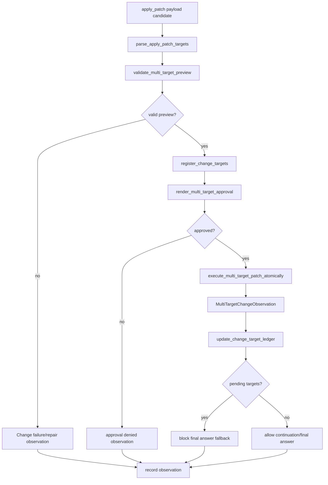

# tool-11 Multi Target Apply Patch

## 목적

`tool-11`은 하나의 `apply_patch` payload 안에 여러 Add/Update/Delete target이 있는 변경을 하나의 atomic change proposal로 다룬다.

이 단계는 여러 tool call을 허용하는 작업이 아니다. `One local LLM response = one next action candidate` 규칙은 유지한다. 확장되는 것은 하나의 Change 후보 안에 들어 있는 patch payload target model이다.

계약:

```text
One response       = one action candidate
One Change action  = one apply_patch payload
One patch payload  = one or more file targets
```

## 발견 근거

2026-05-22 실제 TUI + qwen3-4b 검증에서 html/css/js 분리 웹게임 생성 요청이 실패했다.

모델은 하나의 `apply_patch` payload 안에 세 target을 담았다.

```text
index.html
styles.css
game.js
```

하지만 현재 runtime은 다음 오류로 차단했다.

```text
apply_patch target count must be exactly one, got 3
```

따라서 multi-target change는 prompt keyword나 특정 파일명 special case가 아니라, patch payload 계약으로 열어야 하는 capability다.

## 범위

포함:

- `apply_patch` payload target list 구조적 파싱
- target별 operation/path/additions/deletions preview metadata
- target path 중복 거부
- 모든 target의 workspace-relative boundary 검증
- 전체 target 수와 additions/deletions runtime limit 검증
- target별 operation precondition 검증
- approval surface에 전체 요약과 target별 요약 표시
- 승인 후 실행 직전 모든 target precondition 재확인
- 전체 성공 또는 전체 실패 observation
- target별 결과를 포함한 success/failure observation
- known change target ledger와 final answer 차단

제외:

- 사용자 프롬프트 키워드 기반 파일 묶음 추론
- `index.html/styles.css/game.js` 같은 특정 파일명 조합 special case
- 실패한 multi-target payload를 여러 single-target 후보로 조용히 분해 실행
- fuzzy patch/edit
- 부분 성공을 성공으로 기록하는 실행
- 자동 formatter/build/test 실행
- LLM이 제시하지 않은 target을 runtime이 생성해 장부에 넣기

## 관련 방어코드

| Code | Defense | 적용 의미 |
| ---: | --- | --- |
| 2 | Two-Phase Mutation | multi-target도 preview/approval/execution을 분리한다. |
| 3 | Precondition Snapshot | target별 precondition을 기록한다. |
| 4 | Patch Impact Guard | 전체/target별 영향도를 제한한다. |
| 5 | Unique Target Requirement | target path 중복을 거부한다. |
| 6 | Observation Schema | target별 결과를 typed observation으로 남긴다. |
| 8 | Repeat Failure Circuit Breaker | 같은 change candidate 반복을 막는다. |
| 12 | Postcondition Verification | 전체 target 적용 결과를 확인한다. |
| 13 | No Silent Normalization | target path/payload를 조용히 고치지 않는다. |
| 14 | Tool Error Taxonomy | 실패 target과 kind를 보존한다. |
| 21 | Tool Argument Schema-First Gate | payload reference와 patch document를 검증한다. |
| 23 | Full Output Artifact | 긴 preview/diff는 artifact로 분리한다. |

## 구현 모듈/파일 후보

```text
src/tool/
  change.rs
  patch.rs
  observation.rs
  runtime.rs

src/tui/
  approval_surface.rs
  runtime_request.rs
  runtime_workspace.rs

src/llm/
  response_parser.rs
  decision.rs
  history.rs
```

역할:

- `patch.rs`: multi-target patch parser와 target metadata
- `change.rs`: atomic multi-target execution과 rollback/failure boundary
- `runtime_request.rs`: known change target ledger와 final answer gate
- `approval_surface.rs`: 전체/target별 approval details 표시
- `observation.rs`: target list 포함 change observation

## 데이터 구조 후보

```rust
struct MultiTargetPatchPreview {
    payload_id: String,
    targets: Vec<PatchTargetPreview>,
    total_additions: usize,
    total_deletions: usize,
}

struct PatchTargetPreview {
    operation: PatchOperation,
    path: String,
    additions: usize,
    deletions: usize,
}

struct ChangeTargetLedger {
    pending: Vec<ChangeTarget>,
    completed: Vec<ChangeTarget>,
    failed: Vec<ChangeTargetFailure>,
}

struct ChangeTarget {
    operation: PatchOperation,
    path: String,
}

struct MultiTargetChangeObservation {
    payload_id: String,
    status: ObservationStatus,
    targets: Vec<PatchTargetResult>,
    failed_target: Option<String>,
    error_kind: Option<ToolErrorKind>,
}
```

## 함수 후보

### `parse_apply_patch_targets`

역할:

- 하나의 patch document에서 Add/Update/Delete target list를 추출한다.
- target별 operation, path, additions, deletions를 계산한다.
- target path 중복과 malformed target header를 거부한다.

### `validate_multi_target_preview`

역할:

- target 수, 전체 additions/deletions, target별 additions/deletions limit을 확인한다.
- 모든 target이 workspace-relative인지 검증한다.
- target별 operation precondition 후보를 만든다.

### `register_change_targets`

역할:

- approval이 필요한 `apply_patch` 후보의 target list를 known change target ledger에 올린다.
- runtime이 LLM이 제시하지 않은 target을 invent하지 않게 한다.

### `execute_multi_target_patch_atomically`

역할:

- 승인 후 실행 직전 모든 target precondition을 재확인한다.
- 전체 payload를 하나의 atomic change로 적용한다.
- 하나라도 실패하면 전체 failure observation으로 끝낸다.

### `update_change_target_ledger`

역할:

- 성공한 observation의 target만 ledger에서 완료 처리한다.
- 일부 target이 빠졌으면 pending으로 남긴다.
- pending target이 있으면 final answer fallback을 차단한다.

### `render_multi_target_approval`

역할:

- approval surface에 전체 변경 요약과 target별 요약을 표시한다.
- 긴 patch body는 preview/artifact 정책을 따른다.

## 함수 연결 흐름



## Target Ledger 계약

복합 작업은 tool call 하나의 성공만으로 전체 완료를 판단하면 안 된다.

`tool-11`은 known change target ledger를 둔다.

정책:

- `apply_patch` 후보의 target list를 known change target ledger에 올린다.
- 복합 작업이 아직 target ledger로 표현되지 않았으면 모델이 `plan` 응답으로 `plan_items`를 먼저 선언할 수 있다.
- `plan`은 tool 실행 목록이 아니며 `tool_name`, `arguments`, `payload_id`, patch/body/command 원문을 담지 않는다.
- runtime은 `plan_items`의 `read/create/update/delete` target만 장부로 등록한다.
- 성공한 `apply_patch` observation에 포함된 target만 ledger에서 완료 처리한다.
- known change target이 남아 있으면 final answer와 completed-tool fallback을 차단한다.
- `AHREUM_TARGET_PROGRESS`에 pending change target을 표시한다.

## 로그 이벤트

scope:

```text
tool-11-multi-target-apply-patch
```

event 후보:

- `multi_target_patch_candidate_received`
- `multi_target_patch_parsed`
- `multi_target_patch_validation_failed`
- `change_targets_registered`
- `multi_target_approval_requested`
- `multi_target_execution_started`
- `multi_target_execution_succeeded`
- `multi_target_execution_failed`
- `change_target_ledger_updated`
- `final_answer_blocked_pending_change_targets`

필수 data 후보:

- `run_id`
- `turn_id`
- `payload_id`
- `target_count`
- `targets`
- `total_additions`
- `total_deletions`
- `failed_target`
- `error_kind`
- `pending_change_targets`

## 완료 기준

- multi-target patch preview가 target별 metadata를 보존한다.
- approval 화면에서 전체 변경과 각 target 변경을 확인할 수 있다.
- 승인 전에는 파일 시스템에 변화가 없다.
- 승인 후 모든 target이 성공한 경우에만 success observation을 남긴다.
- 하나라도 실패하면 전체 change가 failure observation으로 끝난다.
- known change target이 남아 있으면 final answer와 completed-tool fallback이 차단된다.
- `AHREUM_TARGET_PROGRESS`에 pending change target이 표시된다.
- 기존 single-target change 흐름은 regression 없이 유지된다.
- 실사용 검증에서 html/css/js 분리 웹게임 생성 요청이 세 파일 생성까지 도달한다.
- 기존 파일 읽기 후 복수 파일 수정 요청이 `Update File` precondition을 지킨다.
- `cargo fmt --check`가 통과한다.
- `cargo test --bin ahreumcode tui::runtime_request::tests`가 통과한다.
- `cargo test`가 통과한다.

## 금지 사항

- 사용자 prompt keyword로 숨은 파일 목록을 추론하지 않는다.
- 특정 파일명/확장자 조합을 special case 처리하지 않는다.
- 실패한 multi-target payload를 여러 single-target tool call로 조용히 분해하지 않는다.
- 부분 성공을 success observation으로 기록하지 않는다.
- LLM이 제시하지 않은 target을 runtime이 생성하지 않는다.
- 테스트 전용 mock behavior로 completed ledger를 통과시키지 않는다.

## Change History

### 2026-06-02

- Added missing detailed technical specification for `tool-11`.
- Derived multi-target apply_patch contract, target ledger, anti-heuristic restrictions, and validation criteria from `docs/tasks/tool-runtime-todo.ko.md` and `docs/specs/model-response-contract.ko.md`.
