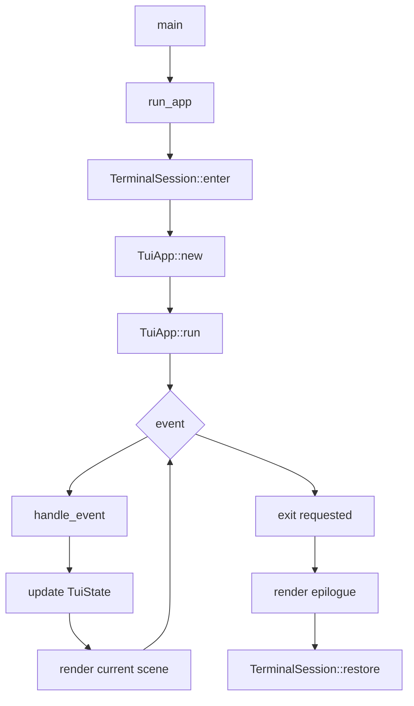
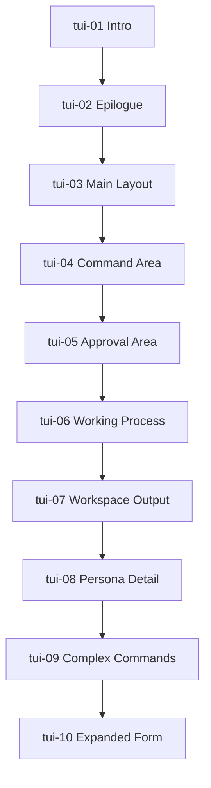

# TUI Technical Spec Korean Draft

## 목적

이 문서는 아름코드 TUI 구현 단위의 상위 기술 스펙이다.

상위 문서는 TUI의 전체 구조, 공통 모듈, 공통 상태, 섹션 라우팅, 검증 경계를 정의한다. 각 구현 번호의 상세 함수, 흐름, 로그 이벤트, 완료 기준은 하위 섹션 문서에 둔다.

TUI 구현의 목적은 "코어가 언젠가 붙을 화면"을 만드는 것이 아니다. 사용자가 프로그램을 실행하고, 입력하고, 상태를 보고, 명령을 선택하고, 승인하고, 작업 결과를 확인할 수 있는 실제 터미널 작업면을 만드는 것이다.

## 범위

포함:

- intro scene
- epilogue scene
- main scene layout
- command surface
- approval surface
- working process area
- workspace output layout
- persona messenger detail
- complex command picker
- modal/expanded form
- TUI runtime log event

제외:

- local LLM HTTP 통신
- JSON response loop
- real tool execution
- permission engine 내부 판단
- long-term session/context 압축

## 문서 구조

TUI 기술 스펙은 상위 문서와 섹션 문서로 나눈다.

상위 문서:

- `docs/specs/implementation/tui-technical-spec.ko.md`

섹션 문서:

| ID | Document | Summary |
| --- | --- | --- |
| `tui-01` | `docs/specs/implementation/tui/tui-01-intro-scene.ko.md` | 시작 인트로 화면 |
| `tui-02` | `docs/specs/implementation/tui/tui-02-epilogue-scene.ko.md` | 종료 에필로그 화면 |
| `tui-03` | `docs/specs/implementation/tui/tui-03-main-scene-layout.ko.md` | 메인 화면 전체 레이아웃 |
| `tui-04` | `docs/specs/implementation/tui/tui-04-command-area-basic-actions.ko.md` | 기본 슬래시 커맨드 영역 |
| `tui-05` | `docs/specs/implementation/tui/tui-05-approval-area.ko.md` | 사용자 승인 영역 |
| `tui-06` | `docs/specs/implementation/tui/tui-06-working-process-area.ko.md` | 6단계 작업 진행 영역 |
| `tui-07` | `docs/specs/implementation/tui/tui-07-workspace-output-layout.ko.md` | 워크스페이스 출력 레이아웃 |
| `tui-08` | `docs/specs/implementation/tui/tui-08-persona-message-detail.ko.md` | 페르소나 메시지창 세부 구현 |
| `tui-09` | `docs/specs/implementation/tui/tui-09-complex-commands.ko.md` | 단계형 복합 커맨드 |
| `tui-10` | `docs/specs/implementation/tui/tui-10-modal-expanded-form.ko.md` | 사용자 정의 expanded form |

구현자는 현재 작업 번호의 섹션 문서만 상세히 읽는다. 예를 들어 `tui-01` 작업 중에는 이 상위 문서와 `tui-01-intro-scene.ko.md`를 읽는다.

## 모듈/파일 후보

초기 Rust 모듈 후보:

```text
src/main.rs
src/app.rs

src/logging/
  mod.rs
  event.rs
  writer.rs

src/tui/
  mod.rs
  app.rs
  event.rs
  layout.rs
  state.rs
  style.rs

src/tui/scenes/
  intro.rs
  epilogue.rs
  main.rs

src/tui/components/
  header.rs
  statusline.rs
  prompt.rs
  command_surface.rs
  approval_surface.rs
  working_process.rs
  workspace.rs
  persona.rs
  modal.rs
```

주의:

- 파일명은 구현 후보이며, 실제 코드 작성 중 의미가 더 분명한 이름이 있으면 조정한다.
- UI/로그/config/LLM/tool/policy를 한 파일에 섞지 않는다.
- 같은 의미의 스타일, 명령 이름, 상태 이름은 중복 정의하지 않는다.

## 공통 데이터 구조 후보

```rust
struct TuiApp {
    state: TuiState,
    logger: Logger,
}

struct TuiState {
    scene: Scene,
    workspace: WorkspaceState,
    prompt: PromptState,
    command_surface: CommandSurfaceState,
    approval: Option<ApprovalState>,
    working_process: Option<WorkingProcessState>,
    persona: PersonaPanelState,
    statusline: StatuslineState,
}

enum Scene {
    Intro,
    Main,
    Epilogue,
}
```

이 구조의 의미:

- `TuiApp`은 event loop와 render 호출을 묶는다.
- `TuiState`는 화면 상태를 보관한다.
- 각 component는 상태를 읽고 렌더링한다.
- component가 LLM/tool/policy를 직접 호출하지 않는다.

## 전체 흐름



## 섹션 연결 순서



## 공통 검증 기준

검증은 `docs/tasks/tui-implementation-todo.ko.md`의 번호별 검증 범위를 따른다.

정책:

- `tui-01` 중에는 `tui-01`만 검증한다.
- broad TUI verification은 사용자가 요청하지 않으면 하지 않는다.
- 로그 이벤트가 없으면 해당 번호는 완료가 아니다.
- test-only world를 만들지 않는다.
- mockup은 화면 구조 확인용이며 제품 동작 증명이 아니다.

## 금지 사항

- TUI component가 LLM/tool/policy를 직접 호출하지 않는다.
- statusline/header/prompt 문자열을 여러 파일에 흩뿌리지 않는다.
- 임시 화면 맞춤 분기를 넣지 않는다.
- mockup을 이유로 실제 runtime log를 생략하지 않는다.
- persona panel에 system log를 그대로 복사하지 않는다.
- 전체 화면 snapshot suite를 자동 증식하지 않는다.

## Change History

### 2026-05-12

- Split detailed `tui-01` through `tui-10` implementation specs into separate section documents.
- Kept this document as the parent routing and common structure document.

### 2026-05-11

- Created TUI technical specification with 01-10 implementation steps, function roles, flowcharts, logging events, and verification boundaries.
