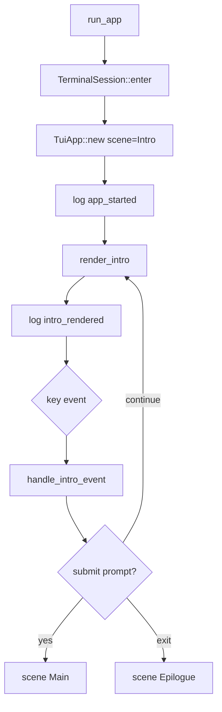

# tui-01 Intro Scene

## 설명

프로그램 시작 시 아름코드 인트로 화면을 보여준다. 인트로는 사용자가 첫 입력을 시작하기 전 제품 인상을 결정하는 화면이다.

## 주요 함수

| Function | Role |
| --- | --- |
| `run_app()` | terminal 진입, app 생성, event loop 시작 |
| `TerminalSession::enter()` | raw mode/alternate screen 진입 |
| `TuiApp::new()` | 초기 scene을 `Intro`로 설정 |
| `render_intro(frame, state)` | wordmark, 보조 표기, prompt box, hint, statusline 자리 렌더 |
| `handle_intro_event(event, state)` | 첫 입력, `/exit`, scene 전환 조건 처리 |
| `log_ui_event(event)` | `tui-01-intro-scene` log 기록 |

## 함수 연결 흐름

## 로그 이벤트

- `app_started`
- `terminal_entered`
- `intro_rendered`
- `prompt_focus_ready`

## 완료 기준

- 인트로가 실제 터미널에 표시된다.
- wordmark와 `아름코드 v1.0.0`이 지정 위치에 표시된다.
- prompt box와 statusline 자리가 보인다.
- 위 로그 이벤트가 `ui.jsonl`에 남는다.
