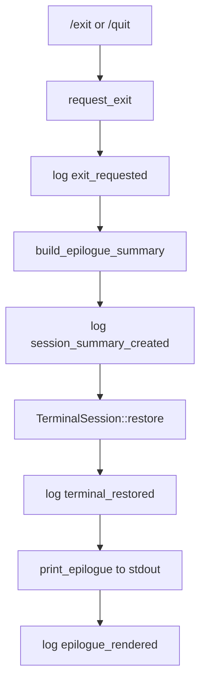

# tui-02 Epilogue Scene

## 설명

`/exit` 또는 `/quit` 요청 시 종료 에필로그를 일반 터미널 출력으로 남긴다. 에필로그는 작업 종료가 갑작스럽지 않게 session summary와 tip을 보여준다.

중요:

- 에필로그는 alternate screen 안의 별도 full-screen scene이 아니다.
- TUI terminal session을 먼저 복구한 뒤 stdout에 compact card를 출력한다.
- 출력된 에필로그는 Codex 종료 카드처럼 shell scrollback에 남아야 한다.

## 주요 함수

| Function | Role |
| --- | --- |
| `request_exit(state)` | exit intent를 기록하고 epilogue 전환 준비 |
| `build_epilogue_summary(state)` | workspace/model/mode/session summary 생성 |
| `TerminalSession::restore()` | terminal 상태 복구 |
| `print_epilogue(summary)` | restored terminal stdout에 compact card와 tip line 출력 |

## 함수 연결 흐름

## 로그 이벤트

- `exit_requested`
- `session_summary_created`
- `epilogue_rendered`
- `terminal_restored`

## 완료 기준

- exit 명령으로 epilogue card가 shell scrollback에 남는다.
- epilogue는 statusline 없이 표시된다.
- terminal 복구가 수행된다.
