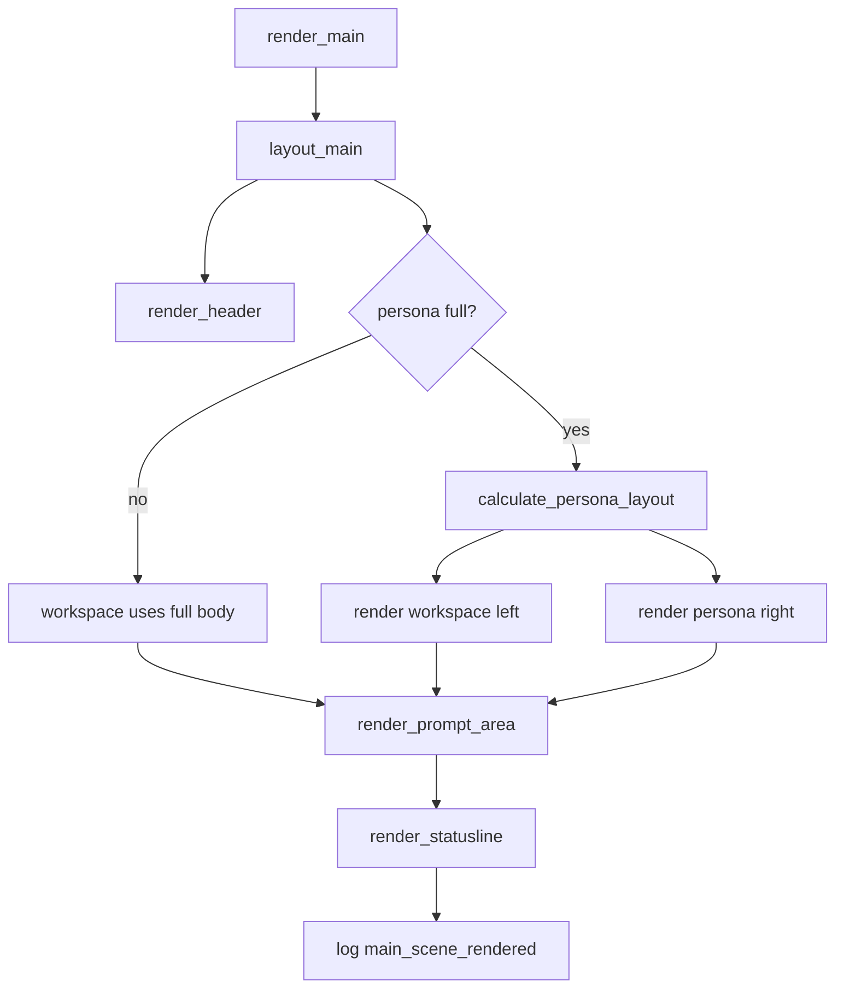

# tui-03 Main Scene Layout

## 설명

작업 화면의 큰 구조를 구성한다. header, workspace body, persona panel 후보 영역, prompt, command surface, statusline의 위치를 확정한다.

## 주요 함수

| Function | Role |
| --- | --- |
| `render_main(frame, state)` | main scene 전체 렌더 진입점 |
| `layout_main(area, persona_state)` | header/body/prompt/command/statusline 영역 계산 |
| `render_header(frame, area)` | `AhreumCode v1.0.0`와 실선 렌더 |
| `render_workspace(frame, area, workspace)` | workspace body 렌더 |
| `render_statusline(frame, area, statusline)` | mode/model/path/context/tokens/web/state 렌더 |
| `calculate_persona_layout(body, persona_state)` | persona off/full 폭 계산 |

## 함수 연결 흐름

## 로그 이벤트

- `main_scene_rendered`
- `layout_calculated`
- `persona_layout_absent`
- `statusline_positioned`

## 완료 기준

- header는 card가 아니다.
- header/body는 실선으로 구분된다.
- persona off일 때 workspace가 전체 폭을 쓴다.
- statusline은 최하단에 고정된다.
