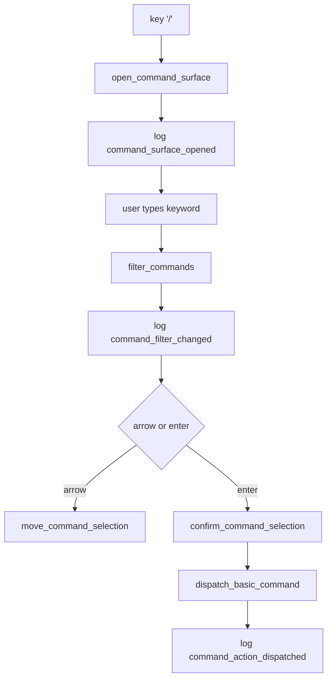

# tui-04 Command Area Basic Actions

## 설명

prompt 아래, statusline 위에 command surface를 표시하고 기본 command를 실행한다.

## 주요 함수

| Function | Role |
| --- | --- |
| `CommandRegistry::new()` | command metadata 등록 |
| `open_command_surface(state)` | `/` 입력 시 command surface 열기 |
| `filter_commands(query, registry)` | keyword 기반 command filtering |
| `move_command_selection(delta, state)` | 방향키 선택 이동 |
| `confirm_command_selection(state)` | 선택 command 확정 |
| `dispatch_basic_command(command, state)` | `/exit`, `/quit`, `/status`, persona shell 처리 |

## 함수 연결 흐름

## 로그 이벤트

- `command_surface_opened`
- `command_filter_changed`
- `command_selected`
- `command_action_dispatched`

## 완료 기준

- `/` 입력으로 command surface가 열린다.
- keyword filtering이 동작한다.
- 방향키와 Enter로 선택/실행한다.
- 기본 command가 state 전이를 만든다.
