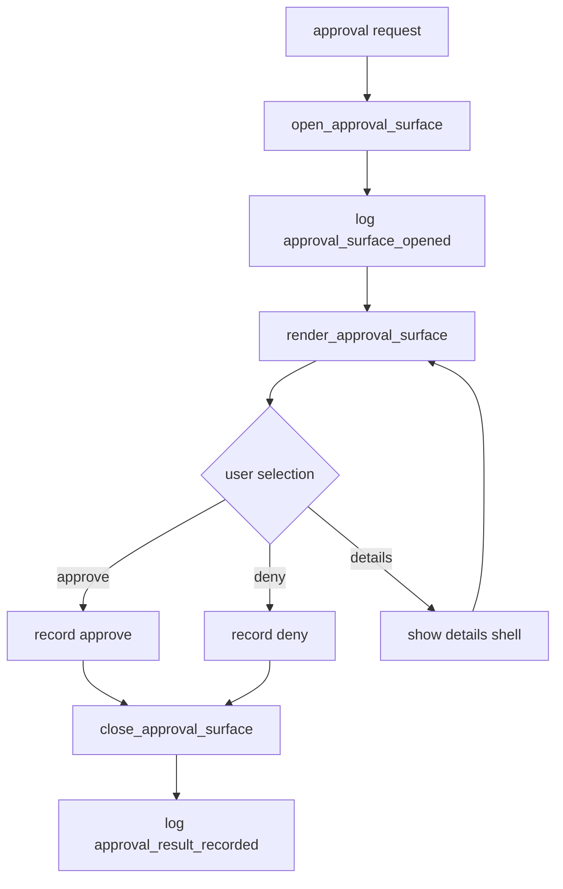

# tui-05 Approval Area

## 설명

사용자 승인이 필요한 작업을 prompt-adjacent decision surface로 표시한다. 초기에는 UI shell 중심이며 실제 policy engine은 이후 단계에서 연결한다.

## 주요 함수

| Function | Role |
| --- | --- |
| `open_approval_surface(request, state)` | 승인 surface 열기 |
| `render_approval_surface(frame, area, approval)` | approve/deny/view details 표시 |
| `handle_approval_event(event, state)` | 방향키/Enter로 선택 처리 |
| `record_approval_result(result, workspace)` | 승인 결과를 workspace에 남김 |
| `close_approval_surface(state)` | approval surface 닫기 |

## 함수 연결 흐름

## 로그 이벤트

- `approval_surface_opened`
- `approval_option_selected`
- `approval_result_recorded`

## 완료 기준

- approval surface가 prompt 근처에 표시된다.
- statusline을 밀어내지 않는다.
- 승인/거부 결과가 workspace에 남는다.
