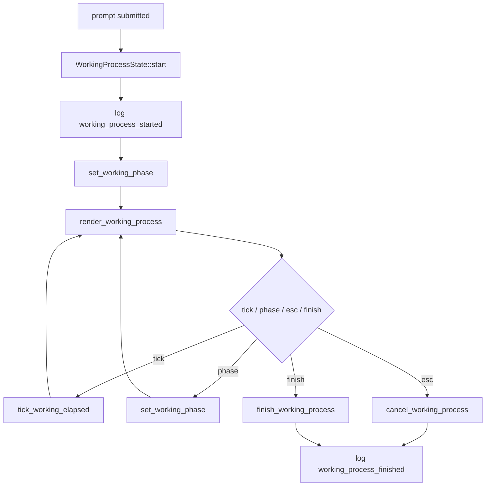

# tui-06 Working Process Area

## 설명

작업 진행 상태를 prompt 바로 위에 두 줄로 표시한다. 고정 6단계 skeleton을 유지한다.

## 주요 함수

| Function | Role |
| --- | --- |
| `WorkingProcessState::start()` | run 시작 시 working process 생성 |
| `set_working_phase(phase, detail)` | 현재 단계와 상세 문구 갱신 |
| `tick_working_elapsed(now)` | elapsed time 갱신 |
| `render_working_process(frame, area, state)` | 두 줄 progress 렌더 |
| `finish_working_process(state)` | 완료 시 strip 제거 |
| `cancel_working_process(state)` | Esc cancel 처리 |

## 함수 연결 흐름

## 로그 이벤트

- `working_process_started`
- `working_phase_changed`
- `working_process_cancel_hint_rendered`
- `working_process_finished`

## 완료 기준

- 6단계가 한 줄에 표시된다.
- 현재 단계만 강조된다.
- 두 번째 줄에 elapsed time과 esc 취소가 보인다.
- 완료 시 strip이 사라진다.
