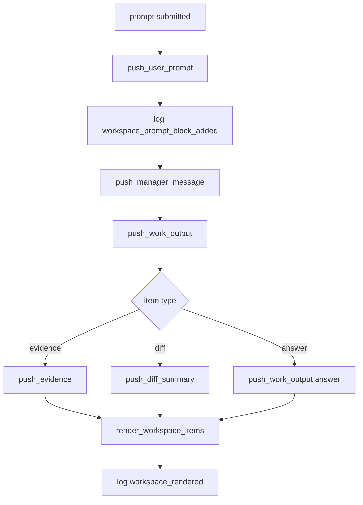

# tui-07 Workspace Output Layout

## 설명

workspace에 사용자 prompt, manager decision, work output, evidence, diff, result를 아래 방향으로 쌓는다.

## 주요 함수

| Function | Role |
| --- | --- |
| `WorkspaceBuffer::push_user_prompt(text)` | 사용자 prompt block 추가 |
| `WorkspaceBuffer::push_manager_message(text)` | 팀장/manager decision 추가 |
| `WorkspaceBuffer::push_work_output(item)` | activity output 추가 |
| `WorkspaceBuffer::push_evidence(item)` | read/search evidence block 추가 |
| `WorkspaceBuffer::push_diff_summary(summary)` | compact change summary 추가 |
| `WorkspaceView::scroll(delta)` | workspace scroll |
| `render_workspace_items(frame, area, view)` | workspace item 렌더 |

## 함수 연결 흐름

## 로그 이벤트

- `workspace_prompt_block_added`
- `workspace_output_added`
- `workspace_scroll_changed`
- `workspace_rendered`

## 완료 기준

- 사용자 prompt가 회색 block으로 먼저 표시된다.
- 이후 작업 출력이 아래로 쌓인다.
- scroll이 동작한다.
- diff/evidence shell은 workspace 안에 배치된다.
