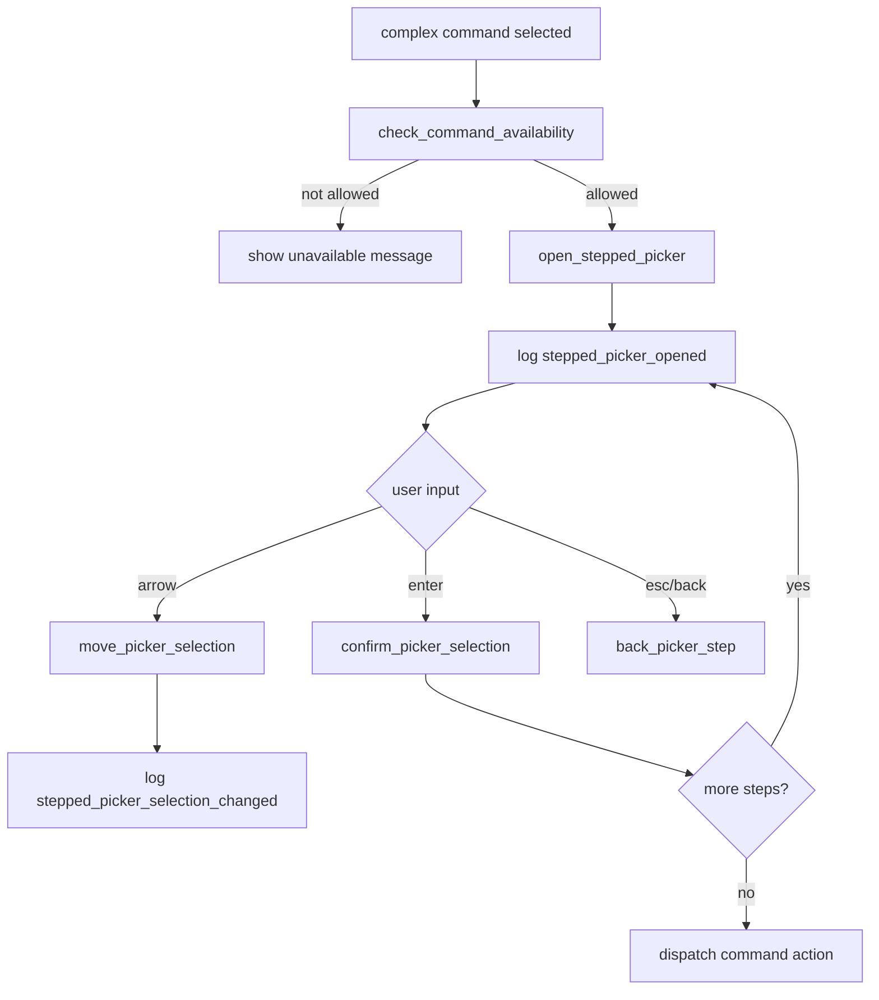

# tui-09 Complex Commands

## 설명

stepped picker가 필요한 command를 구현한다. `/mode`, `/provider`, `/model`, `/persona`, `/docs-init`, `/init`이 여기에 속한다.

## 주요 함수

| Function | Role |
| --- | --- |
| `open_stepped_picker(command, state)` | command별 picker 열기 |
| `SteppedPickerState::current_step()` | 현재 단계 반환 |
| `move_picker_selection(delta, state)` | 선택 이동 |
| `confirm_picker_selection(state)` | 단계 확정 또는 최종 action |
| `back_picker_step(state)` | picker 내부 back |
| `check_command_availability(command, runtime_state)` | 실행 가능 상태 확인 |

## 함수 연결 흐름

## 로그 이벤트

- `stepped_picker_opened`
- `stepped_picker_selection_changed`
- `stepped_picker_confirmed`
- `command_availability_checked`

## 완료 기준

- complex command가 next step picker로 전환된다.
- picker 내부 Esc/back이 command picker 안에서만 동작한다.
- command availability가 metadata로 평가된다.
