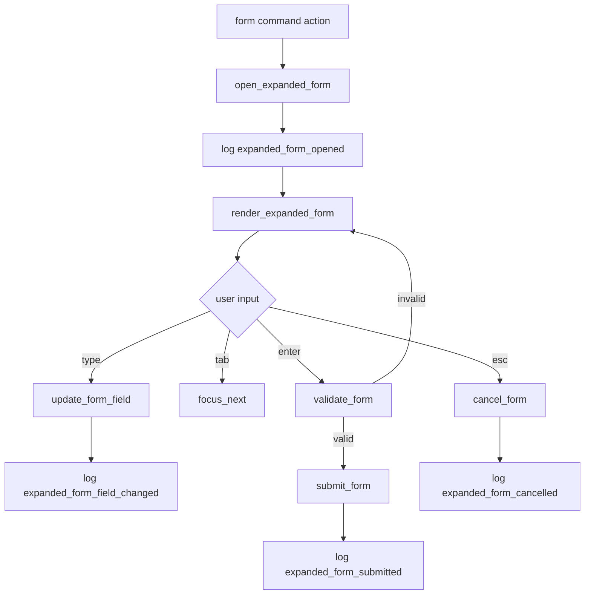

# tui-10 Modal Expanded Form

## 설명

사용자 정의 항목 추가나 긴 입력이 필요한 expanded form을 구현한다. command list를 대체하지 않고, 필요한 경우에만 열린다.

## 주요 함수

| Function | Role |
| --- | --- |
| `open_expanded_form(form_kind, state)` | form 열기 |
| `ExpandedFormState::focus_next()` | field focus 이동 |
| `update_form_field(field, value)` | field 값 갱신 |
| `validate_form(state)` | field validation |
| `submit_form(state)` | form 결과 제출 |
| `cancel_form(state)` | form 취소 |
| `render_expanded_form(frame, area, state)` | form 렌더 |

## 함수 연결 흐름

## 로그 이벤트

- `expanded_form_opened`
- `expanded_form_field_changed`
- `expanded_form_submitted`
- `expanded_form_cancelled`

## 완료 기준

- expanded form은 command list를 대체하지 않는다.
- local LLM provider/model form을 담을 수 있다.
- 입력/취소/확정 흐름이 명확하다.
